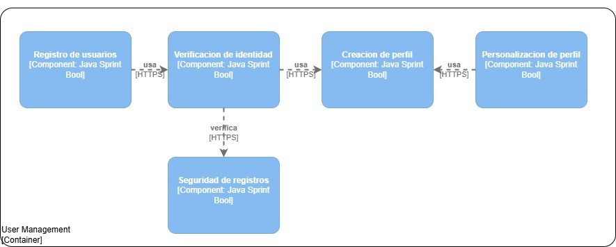
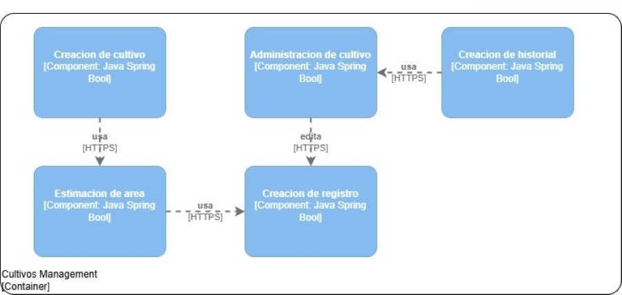
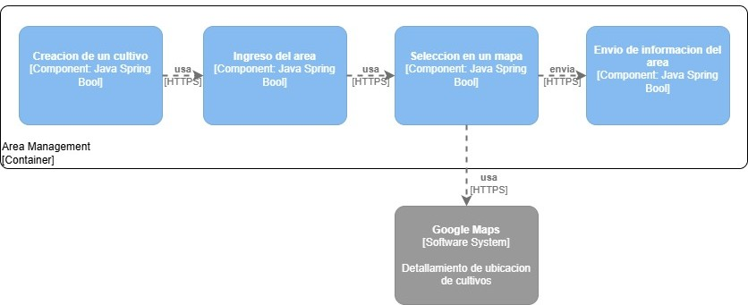
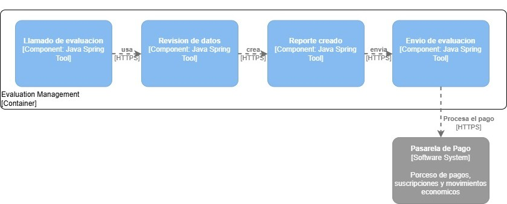

   

# 
Informe del Trabajo Final

    
   
Universidad Peruana de Ciencias Aplicadas

    
   

    
   
<b>Ingeniería de software</b>

    

   
<b>1ASI0729 Desarrollo de Aplicaciones Open Source</b>

    
   
<b>NRC:</b> 7351

    

   
<b>Profesor:</b> Rafael Oswaldo Castro Veramendi 

    
   
<b>Nombre del StartUp:</b> 

    

   
<b>Nombre del Producto:</b> AgroApp

   

    

   

   <table style="margin-left: auto; margin-right: auto;">
   <tr>
   <th>Nombre</th>
   <th>Código</th>
   </tr>
   <tr>
   <td>Chirito Torres, Jose Raul</td>
   <td>U20201A293</td>
   </tr>
   <tr>
   <td>Palomares Andrade, Sean Farith</td>
   <td>U202121947</td>
   </tr>
   <tr>
   <td>Ventosilla Trujillo, Anderson Ricardo</td>
   <td></td>
   </tr>
   <tr>
   <td>Via Luna, Bruce </td>
   <td>U202313403</td>
   </tr>
   <tr>
   <td>Yalán Zhang, Angie Christina</td>
   <td>U202312504</td>
   </tr>

   </table>
   

    
   
<b>Ciclo 2025-20</b>

    

# Registro de Versiones del Informe

| Version | Fecha | Autor | Descripción de modificación |
| ------- | ----- | ----- | --------------------------- |

# Project Report Collaboration Insights

URL del repositorio para el proyecto: https://github.com/AgroApp-UPC/Project-Report

**TB1**

Para el desarrollo del informe perteneciente a la entrega del TB1, se dividió la implementación de secciones de la siguiente forma para cada integrante del equipo:

| Integrantes         | Tareas Asignadas |
| ------------------- | ---------------- |
| José Chirito        |                  |
| Sean Palomares      |                  |
| Anderson Ventosilla |                  |
| Bruce Via           |                  |
| Angie Yalán         |                  |

# Contenido

1. [Capítulo I: Introducción](#capítulo-i-introducción) 
   1.1. [Startup Profile](#11-startup-profile) 
   1.1.1. [Descripción de la Startup](#111-descripción-de-la-startup) 
   1.1.2. [Perfiles de integrantes del equipo](#112-perfiles-de-integrantes-del-equipo) 
   1.2. [Solution Profile](#12-solution-profile) 
   1.2.1 [Antecedentes y problemática](#121-antecedentes-y-problemática) 
   1.2.2 [Lean UX Process](#122-lean-ux-process) 
   1.2.2.1. [Lean UX Problem Statements](#1221-lean-ux-problem-statements) 
   1.2.2.2. [Lean UX Assumptions](#1222-lean-ux-assumptions) 
   1.2.2.3. [Lean UX Hypothesis Statements](#1223-lean-ux-hypothesis-statements) 
   1.2.2.4. [Lean UX Canvas](#1224-lean-ux-canvas) 
   1.3. [Segmentos objetivo](#13-segmentos-objetivo) 
2. [Capítulo II: Requirements Elicitation & Analysis](#capítulo-ii-requirements-elicitation--analysis) 
   2.1. [Competidores](#21-competidores) 
   2.1.1. [Análisis competitivo](#211-análisis-competitivo) 
   2.1.2. [Estrategias y tácticas frente a competidores](#212-estrategias-y-tácticas-frente-a-competidores) 
   2.2. [Entrevistas](#22-entrevistas) 
   2.2.1. [Diseño de entrevistas](#221-diseño-de-entrevistas) 
   2.2.2. [Registro de entrevistas](#222-registro-de-entrevistas) 
   2.2.3. [Análisis de entrevistas](#223-análisis-de-entrevistas) 
   2.3. [Needfinding](#23-needfinding) 
   2.3.1. [User Personas](#231-user-personas) 
   2.3.2. [User Task Matrix](#232-user-task-matrix) 
   2.3.3. [User Journey Mapping](#232-user-task-matrix) 
   2.3.4. [Empathy Mapping](#234-empathy-mapping) 
   2.4. [Big Picture Event Storming](#24-big-picture-event-storming) 
   2.5. [Ubiquitous Language](#25-ubiquitous-language) 
3. [Capítulo III: Requirements Specification](#capítulo-iii-requirements-specification) 
   3.1. [User Stories](#31-user-stories) 
   3.2. [Impact Mapping](#32-impact-mapping) 
   3.3. [Product Backlog](#33-product-backlog) 
4. [Capítulo IV: Product Design](#capítulo-iv-product-design) 
   4.1. [Style Guidelines](#41-style-guidelines) 
   4.1.1. [General Style Guidelines](#411-general-style-guidelines) 
   4.1.2. [Web Style Guidelines](#412-web-style-guidelines) 
   4.2. [Information Architecture](#42-information-architecture) 
   4.2.1. [Organization Systems](#421-organization-systems) 
   4.2.2. [Labeling Systems](#422-labeling-systems) 
   4.2.3. [SEO Tags and Meta Tags](#423-seo-tags-and-meta-tags) 
   4.2.4. [Searching Systems](#424-searching-systems) 
   4.2.5. [Navigation Systems](#425-navigation-systems) 
   4.3. [Landing Page UI Design](#43-landing-page-ui-design) 
   4.3.1. [Landing Page Wireframe](#431-landing-page-wireframe) 
   4.3.2. [Landing Page Mock-up](#432-landing-page-mock-up) 
   4.4. [Web Applications UX/UI Design](#44-web-applications-uxui-design) 
   4.4.1. [Web Applications Wireframes](#441-web-applications-wireframes) 
   4.4.2. [Web Applications Wireflow Diagrams](#442-web-applications-wireflow-diagrams) 
   4.4.2. [Web Applications Mock-ups](#442-web-applications-mock-ups) 
   4.4.3. [Web Applications User Flow Diagrams](#443-web-applications-user-flow-diagrams) 
   4.5. [Web Applications Prototyping](#45-web-applications-prototyping) 
   4.6. [Domain-Driven Software Architecture](#46-domain-driven-software-architecture) 
   4.6.1. [Design-Level Event Storming](#461-design-level-event-storming) 
   4.6.2. [Software Architecture Context Diagram](#462-software-architecture-context-diagram) 
   4.6.3. [Software Architecture Container Diagrams](#463-software-architecture-container-diagrams) 
   4.6.4. [Software Architecture Components Diagrams](#464-software-architecture-components-diagrams) 
   4.7. [Software Object-Oriented Design](#47-software-object-oriented-design) 
   4.7.1. [Class Diagrams](#471-class-diagrams) 
   4.7.2. [Class Dictionary](#472-class-dictionary) 
   4.8. [Database Design](#48-database-design) 
   4.8.1. [Database Diagram](#481-database-diagram) 
5. [Capítulo V: Product Implementation, Validation & Deployment](#capítulo-v-product-implementation-validation--deployment) 
   5.1. [Software Configuration Management](#51-software-configuration-management) 
   5.1.1. [Software Development Environment Configuration](#511-software-development-environment-configuration) 
   5.1.2. [Source Code Management](#512-source-code-management) 
   5.1.3. [Source Code Style Guide & Conventions](#513-source-code-style-guide--conventions) 
   5.1.4. [Software Deployment Configuration](#514-software-deployment-configuration) 
   5.2. [Landing Page, Services & Applications Implementation](#52-landing-page-services--applications-implementation) 
   5.2.1. [Sprint 1](#521-sprint-1) 
   5.2.1.1. [Sprint Planning 1](#5211-sprint-planning-1) 
   5.2.1.2. [Aspect Leaders and Collaborators](#5212-aspect-leaders-and-collaborators) 
   5.2.1.3. [Sprint Backlog 1](#5213-sprint-backlog-1) 
   5.2.1.4. [Development Evidence for Sprint Review](#5214-development-evidence-for-sprint-review) 
   5.2.1.5. [Execution Evidence for Sprint Review](#5215-execution-evidence-for-sprint-review) 
   5.2.1.6. [Services Documentation Evidence for Sprint Review](#5216-services-documentation-evidence-for-sprint-review) 
   5.2.1.7. [Software Deployment Evidence for Sprint Review](#5217-software-deployment-evidence-for-sprint-review) 
   5.2.1.8. [Team Collaboration Insights during Sprint](#5218-team-collaboration-insights-during-sprint) 
   5.2.2. [Sprint 2](#522-sprint-2) 
   5.2.2.1. [Sprint Planning 2](#5221-sprint-planning-2) 
   5.2.2.2. [Aspect Leaders and Collaborators](#5222-aspect-leaders-and-collaborators) 
   5.2.2.3. [Sprint Backlog 2](#5223sprint-backlog-2) 
   5.2.2.4. [Development Evidence for Sprint Review](#5224development-evidence-for-sprint-review) 
   5.2.2.5. [Execution Evidence for Sprint Review](#5225execution-evidence-for-sprint-review) 
   5.2.2.6. [Services Documentation Evidence for Sprint Review](#5226services-documentation-evidence-for-sprint-review) 
   5.2.2.7. [Software Deployment Evidence for Sprint Review](#5227software-deployment-evidence-for-sprint-review) 
   5.2.2.8. [Team Collaboration Insights during Sprint](#5228team-collaboration-insights-during-sprint) 
   5.2.3. [Sprint 3](#523-sprint-3) 
   5.2.3.1. [Sprint Planning 3](#5231-sprint-planning) 
   5.2.3.2. [Aspect Leaders and Collaborators](#5232-aspect-leaders-and-collaborators) 
   5.2.3.3. [Sprint Backlog 3](#5223sprint-backlog-2) 
   5.2.3.4. [Development Evidence for Sprint Review](#5234-development-evidence-for-sprint-review) 
   5.2.3.5. [Execution Evidence for Sprint Review](#5235-execution-evidence-for-sprint-review) 
   5.2.3.6. [Services Documentation Evidence for Sprint Review](#5236-services-documentation-evidence-for-sprint-review) 
   5.2.3.7. [Software Deployment Evidence for Sprint Review](#5237-software-deployment-evidence-for-sprint-review) 
   5.2.3.8. [Team Collaboration Insights during Sprint](#5238-team-collaboration-insights-during--sprint) 
   5.3. [Validation Interviews](#53-validation-interviews) 
   5.3.1 [Diseño de Entrevistas](#531-diseño-de-entrevistas) 
   5.3.2 [Registro de Entrevistas](#532-registro-de-entrevistas) 
   5.3.3 [Evaluación según heurísticas](#533-evaluaciones-según-heurísticas) 
   5.4. [Video About-the-Product](#54-video-about-the-product) 
6. [Conclusiones](#conclusiones) 
   6.1 [Conclusiones y recomendaciones](#61-conclusiones-y-recomendaciones) 
   6.2. [Video About-the-Team](#62-video-about-the-team) 
7. [Bibliografía](#bibliografía) 
8. [Anexos](#anexos) 

# Student Outcome

| Criterio específico                                                   | Acciones realizadas                                                                                                                                                        | Conclusiones |
| --------------------------------------------------------------------- | -------------------------------------------------------------------------------------------------------------------------------------------------------------------------- | ------------ |
| Comunica oralmente con efectividad a diferentes rangos de audiencia   | **José Chirito**  TB1:    **Sean Palomares**  TB1:    **Anderson Ventosilla**  TB1:    **Bruce Via**  TB1: Mediante las entrevistas presentadas logra comunicar correctamente la diea de nuestro produto a los segmentos objetivos   **Angie Yalán**  TB1: |              |
| Comunica por escrito con efectividad a diferentes rangos de audiencia | **José Chirito**  TB1:    **Sean Palomares**  TB1:    **Anderson Ventosilla**  TB1:    **Bruce Via**  TB1: Gracias a la documentacion y correcta demostracion escrita, se muestra la efectividad de nuestra aplicacion mediante actividades como historias de usuario o diagramas de clase   **Angie Yalán**  TB1: |              |

# Capítulo I: Introducción

## 1.1. Startup Profile

### 1.1.1. Descripción de la Startup

AgroApp es una startup tecnológica orientada a la transformación digital del sector agrícola en el Perú. Nuestro principal producto, AgroApp, es una aplicación web responsive que busca empoderar a agricultores con poca o media experiencia, brindándoles recomendaciones inteligentes, soporte comunitario e integración con dispositivos IoT. Con agroApp, el agricultor podrá mejorar el rendimiento de sus cultivos gracias a un seguimiento personalizado y accesible desde cualquier dispositivo.

**Misión:**

Impulsar la transformación digital del sector agrícola brindando a los agricultores herramientas tecnológicas accesibles e inteligentes, que les permitan optimizar el rendimiento de sus cultivos mediante recomendaciones personalizadas, integración con IoT y un enfoque sostenible orientado a mejorar su calidad de vida.

**Visión:**

Ser la plataforma líder en soluciones digitales agrícolas en Latinoamérica, reconocida por democratizar el acceso a la tecnología en el campo y contribuir a la seguridad alimentaria a través de la innovación, la sostenibilidad y el fortalecimiento de los pequeños y medianos agricultores.

### 1.1.2. Perfiles de los integrantes del equipo

| Perfil                                                                                                                                                                                                                                                                                                                                                                                                                                                                  | Foto |
| ----------------------------------------------------------------------------------------------------------------------------------------------------------------------------------------------------------------------------------------------------------------------------------------------------------------------------------------------------------------------------------------------------------------------------------------------------------------------- | ---- |
|                                                                                                                                                                                                                                                                                                                                                                                                                                                                         |      |
| **Sean Palomares:** Mi nombre es Sean Palomares, tengo 22 años y estudio la carrera de Ingeniería de Software. Tengo conocimiento en lenguajes como C#, C++, Python y bases de datos en MySQL. Me considero una persona positiva, tolerante y creativa, cualidades que me permiten adaptarme con facilidad a diferentes entornos de trabajo. Disfruto colaborar en equipo, compartir ideas y contribuir con una visión común para alcanzar los objetivos propuestos. |      |
|**Bruce Via:**   Mi nombre es Bruce Via, tengo 20 años y soy estudiante de la carrera de ingenieria de Software. Me considero uan persona que muestra un interes desmedido cuando lo que hago resulta agradable, dispuesto a aprender nuevos conocimientos incluso si no es necesario, ademas de siempre intentar mejorar en lo que hago demostrando iniciativo||
|                                                                                                                                                                                                                                                                                                                                                                                                                                                                         |      |
| **Angie Yalán:**  Mi nombre es Angie Yalán. Soy estudiante de la carrera Ingeniería de Software y tengo 19 años. Me considero una persona proactiva que le gustan nuevas experiencias y aprender cosas diferentes. Sigo en el proceso de mejora en cuanto a la programación y cuento con toda la iniciativa para ser cada día mejor en ello.                                                                                                                         |      |

## 1.2. Solution Profile

AgroApp es una aplicación web diseñada para apoyar a agricultores de pequeña y mediana escala en la gestión de sus cultivos, mediante un sistema de recomendaciones inteligentes basadas en datos ingresados por el usuario, y más adelante, e información recolectada a través de sensores IoT de humedad y luz solar. La plataforma permite registrar cultivos, monitorear variables clave como riego, nutrientes y exposición solar, y recibir alertas clasificadas por nivel de riesgo (bajo, medio, alto). De esta manera, AgroApp busca democratizar el acceso a la tecnología agrícola, optimizar el rendimiento de los cultivos y contribuir a la sostenibilidad del sector agropecuario en el Perú.

### 1.2.1 Antecedentes y problemática

Los agricultores de pequeña y mediana escala enfrentan barreras tecnológicas y de acceso a información que limitan el rendimiento de sus cultivos y su competitividad en el mercado. La falta de herramientas digitales simples y adaptadas a su realidad conlleva a decisiones empíricas, baja eficiencia en el uso de recursos y pérdidas económicas significativas. AgroApp surge como una solución tecnológica accesible, que integra datos ingresados por el usuario y sensores IoT, para generar recomendaciones claras y prácticas que fortalezcan la sostenibilidad del sector agrícola.
  
Según Lean Construction México, la técnica de las 5W's y 2H's facilita la creación y desarrollo de un plan de acción o estrategia detallada (Alvarez, 2020). A raíz de esto, resultará útil para nuestro contexto dado que nos permitirá entender y analizar a mayor profundidad las necesidades de los usuarios. Por ende, se recopiló información mediante esta técnica, la cual se presentará a continuación.

**What(Qué)**

##### ¿Cuál es el problema?

Los agricultores de pequeña y mediana escala carecen de herramientas digitales para monitorear y gestionar adecuadamente sus cultivos, lo que ocasiona baja productividad, uso ineficiente de recursos (agua, nutrientes, luz solar) y pérdidas económicas.

##### ¿Cuál es la relación con la persona en cuestión?

El agricultor es el usuario principal afectado, ya que depende de la productividad de sus cultivos para garantizar su sustento y competitividad en el mercado.

**Who (Quién)**

##### ¿Quiénes están involucrados?

Agricultores de pequeña y mediana escala, familiares de los agricultores que participan en la producción, y organizaciones vinculadas al sector agrícola (cooperativas, asociaciones).

##### ¿A quiénes le sucede el problema?

Principalmente a agricultores con poca o media experiencia técnica que no cuentan con sistemas de gestión agrícola digitalizados y que dependen de prácticas tradicionales o empíricas.

**Where (Dónde)**

##### ¿En dónde ocurre el problema?

En zonas rurales y periurbanas del Perú (sierra, selva y valles interandinos), donde se concentra la agricultura familiar y la producción de alimentos básicos para el mercado nacional.

**When (Cuándo)**

##### ¿Cuándo sucede el problema?

A lo largo de todo el ciclo del cultivo (siembra, crecimiento, maduración y cosecha), siendo más crítico en las etapas de riego, fertilización y control de plagas.

##### ¿Cuándo utiliza el cliente el producto?

El cliente usa agroApp desde el inicio del registro de sus cultivos y de manera recurrente durante el crecimiento para recibir alertas, registrar datos y consultar recomendaciones.

**Why (Por qué)**

##### ¿Cuál es la causa del problema?

La falta de acceso a información confiable, el uso empírico de prácticas agrícolas y la ausencia de herramientas tecnológicas adaptadas a la realidad de pequeños y medianos agricultores, que permitan optimizar el uso de recursos y aumentar la productividad.

**How (Cómo)**

##### ¿En qué condiciones los clientes usan nuestro producto?

En campo, utilizando dispositivos móviles con acceso a internet móvil (3G/4G) o en sus hogares cuando tienen acceso a conexión WiFi. Usan agroApp de forma sencilla e intuitiva, adaptada a sus conocimientos básicos de tecnología.

**How much (Cuánto)**

##### Estadísticas que sustentan la problemática.

- El 97 % de las unidades agropecuarias en el Perú son de agricultura familiar (Castillo, 2021).
- El sector es responsable de cerca del 70 % de los alimentos consumidos en el país (Castillo,2021).
- "Las mayores pérdidas ocurren en la fase de producción 28%, cosecha y almacenamiento 22%, distribución 17%, procesamiento 6%" (Gob, 2019).
- Según la INEI (2023), "En el año 2022, el 3,8% del total de los/las productores/as manifestaron haber recibido asistencia técnica.
  Sin embargo, en el año 2014, el valor fue de 9,2% lo que evidencia una disminución de productores/as
  asistidos/as en el periodo de análisis"

### 1.2.2 Lean UX Process.

#### 1.2.2.1. Lean UX Problem Statements.

- **Domain (Dominio):**

  El sector agrícola en el Perú, enfocado en agricultores de pequeña y mediana escala que representan la mayoría de las unidades agropecuarias y son responsables de gran parte de la producción de alimentos.

* **Customer Segments (Segmentos de clientes):**
  - Agricultores de pequeña escala (subsistencia/autoconsumo).
  - Agricultores de mediana escala (producción comercial local/regional).

- **Pain Points (Puntos de dolor):**
  - Dificultad para tomar decisiones informadas sobre riego, nutrientes y cuidados del cultivo.
  - Pérdidas de rendimiento debido a prácticas empíricas o poco técnicas.
  - Falta de herramientas digitales simples, adaptadas a la realidad rural.
  - Baja adopción tecnológica por interfaces poco amigables o complejas.

* **Gap (Brecha):**

  Actualmente, no existen soluciones digitales ampliamente accesibles y adaptadas al contexto de pequeños y medianos agricultores peruanos que combinen registro de cultivos, recomendaciones personalizadas y alertas de riesgo en una sola plataforma.

- **Visión / Strategy (Visión / Estrategia):**

  Crear una aplicación web responsiva y accesible que brinde recomendaciones personalizadas y fáciles de entender, con base en datos ingresados por los agricultores, permitiendo mejorar la productividad de sus cultivos y optimizar el uso de recursos, contribuyendo así a la sostenibilidad del sector agrícola.

* **Initial Segment (Segmento inicial):**

  Agricultores de pequeña escala, y posteriormente, agricultores de mediana escala con mayores necesidades de gestión.

#### 1.2.2.2. Lean UX Assumptions.

##### 1.2.2.2.1. Features

- Registro de usuario con datos básicos (nombre, número celular, correo, contraseña).
- Registro de cultivos (especie, fecha de plantación, tipo de suelo, cantidad de agua, exposición solar).
- Recomendaciones personalizadas clasificadas por nivel de riesgo (bajo, medio, alto).
- Sistema de alertas y recordatorios automáticos (ejemplo: “riego insuficiente”, “suelo pobre en nutrientes”).
- Calendario de cultivo (recordatorios de riego, fertilización y fumigación).
- Comunidad interna con consejos y experiencias compartidas entre agricultores.
- Reportes básicos de rendimiento y uso de recursos (para agricultores medianos).
- Landing Page informativa y consistente con la Web Application.

##### 1.2.2.2.2. Business Outcomes

- Adopción inicial de la plataforma por agricultores pequeños, al ofrecer una app simple, visual y fácil de usar.
- Retención de usuarios gracias a las alertas y recordatorios que generan valor en la rutina agrícola.
- Escalabilidad del negocio con la incorporación de agricultores medianos interesados en funcionalidades avanzadas (reportes y gestión de datos).
- Generación de ingresos a futuro mediante planes premium para acceso a reportes detallados o funcionalidades adicionales.
- Posicionamiento de marca como una solución digital confiable y accesible para la agricultura familiar y comercial en el Perú.

##### 1.2.2.2.3. User Benefits

- Para agricultores de pequeña escala:
  - Recibir recomendaciones claras y fáciles de entender.
  - Anticiparse a problemas comunes (falta de agua, suelo pobre en nutrientes).
  - Tener un calendario sencillo que les recuerde las tareas agrícolas más importantes.
  - Mejorar el rendimiento de sus cultivos con prácticas simples y accesibles.

* Para agricultores de mediana escala:
  - Registrar y organizar datos de sus cultivos en un solo lugar.
  - Generar reportes básicos para tomar decisiones más informadas.
  - Optimizar el uso de recursos (agua, fertilizantes).
  - Reducir pérdidas y aumentar la rentabilidad de sus cosechas.

¿Quién es el usuario?

- Agricultores de pequeña escala (subsistencia/autoconsumo) que buscan recomendaciones simples y fáciles de aplicar.
- Agricultores de mediana escala (producción comercial/regional) que necesitan un mayor control de datos y reportes para optimizar la productividad de sus cultivos.

¿Dónde encaja nuestro producto en su trabajo o vida?

- En las tareas diarias de cultivo, como riego, fertilización y control básico de plagas.
- Como apoyo digital que complementa el conocimiento empírico, brindando alertas y recordatorios.
- En la planificación de cultivos, ya que permite organizar fechas de siembra, fertilización y cosecha.

¿Qué problemas tiene nuestro producto que resolver?

- La falta de información clara y personalizada sobre cómo cuidar cada cultivo.
- El manejo empírico y poco técnico que ocasiona pérdidas en la producción.
- La ausencia de herramientas accesibles para registrar y organizar información de forma digital.

¿Cuándo y cómo es nuestro producto usado?

- Cuándo: Durante todo el ciclo del cultivo, desde la siembra hasta la cosecha, especialmente en momentos críticos de riego y fertilización.

- Cómo:
  - Agricultores pequeños → ingresan datos básicos en la app y reciben recomendaciones simples y alertas visuales.
  - Agricultores medianos → registran datos con más detalle y consultan reportes para tomar decisiones productivas.

¿Qué características son importantes?

- Registro de cultivos y datos básicos (especie, suelo, agua, luz solar).
- Recomendaciones personalizadas clasificadas por nivel de riesgo.
- Alertas y recordatorios automáticos.
- Reportes básicos de rendimiento y recursos (para agricultores medianos).
- Interfaz sencilla, intuitiva y responsive para móvil y web.
- Comunidad de consejos y experiencias compartidas.

¿Cómo debe verse nuestro producto y comportarse?

- Diseño:
  - Minimalista, visual y fácil de usar.
  - Uso de colores asociados a estados de riesgo (verde, amarillo, rojo).
  - Adaptable a dispositivos móviles y de bajo costo.
- Comportamiento:
  - Rápido y fluido, con tiempos de carga mínimos.
  - Intuitivo: con pocos pasos para registrar un cultivo o ver recomendaciones.
  - Confiable: que no pierda datos aunque el acceso a internet sea intermitente.

#### 1.2.2.3. Lean UX Hypothesis Statements.

1. **Creemos que** proporcionar una aplicación simple y visual, con recomendaciones básicas y alertas claras clasificadas por nivel de riesgo (bajo, medio, alto), ayudará a los agricultores pequeños a cuidar mejor sus cultivos y evitar pérdidas por riego o nutrientes inadecuados.

   **Sabremos que** estamos bien cuando veamos que los agricultores ingresan sus datos al menos una vez por semana, reportan en encuestas que entienden fácilmente las alertas y / o se registra un aumento del 15% en la retención mensual de usuarios pequeños.

2. **Creemos que** ofrecer funciones de registro de datos y generación de reportes básicos permitirá a los agricultores medianos optimizar el uso de agua y nutrientes, mejorar el rendimiento de sus cultivos y aumentar su rentabilidad.

   **Sabremos que** estamos bien cuando veamos que los agricultores medianos generan al menos un reporte por mes, mencionan en encuestas que los reportes influyen en sus decisiones, y / o se registra un aumento del 20% en la productividad percibida en los primeros 6 meses de uso.

3. **Creemos que** una interfaz limpia, responsiva y optimizada para smartphones garantizará que tanto agricultores pequeños como medianos utilicen la aplicación de manera intuitiva durante sus actividades diarias en el campo.

   **Sabremos que** estamos bien cuando el feedback de usuarios describa la aplicación como “fácil de usar” o “rápida” en encuestas post-uso y / o la tasa de abandono sea menor al 10% y / o la calificación promedio supere 4.3 en las tiendas de apps.

4. **Creemos que** integrar un espacio comunitario donde agricultores compartan consejos y experiencias fomentará la confianza entre usuarios y aumentará la interacción dentro de la plataforma.

   **Sabremos que** estamos bien cuando veamos publicaciones de usuarios en la comunidad al menos una vez por semana y / o un 25% de los usuarios activos participen comentando o reaccionando en la comunidad y / o recibamos feedback positivo sobre el aprendizaje obtenido de otros agricultores.

#### 1.2.2.4. Lean UX Canvas.

## 1.3. Segmentos objetivo.

### Segmento objetivo #1: Agricultores de pequeña escala (subsistencia y autoconsumo)

Agricultores con terrenos menores a 5 hectáreas, generalmente familiares, que producen para autoconsumo y venta local en mercados.

#### Aspectos Demográficos:

- **Rango de edad:** 25 a 50 años
- **Sexo:** Hombres y mujeres (con ligera predominancia masculina en zonas rurales)
- **Nivel socioeconómico:** Bajo y medio-bajo

#### Aspectos Geográficos:

- **Nacionalidad:** Peruana
- **Zona geográfica de residencia:** Rural y periurbana
- **Departamento:** Principalmente en la Sierra (Ayacucho, Cusco, Cajamarca, Puno) y en zonas de la Selva (San Martín, Ucayali)

#### Aspectos Psicográficos

- Valoración de la tierra como principal fuente de sustento.
- Orientados al autoconsumo y a la venta en ferias o mercados locales.
- Limitada experiencia en el uso de aplicaciones digitales.
- Buscan soluciones prácticas, fáciles de entender y de bajo costo.
- Uso tecnológico: Acceso limitado a smartphones de gama media y conectividad 3G/4G.

### Segmento objetivo #2: Agricultores de mediana escala (producción comercial local y regional)

Agricultores con terrenos entre 5 y 20 hectáreas que producen cultivos para abastecer mercados regionales o cadenas de supermercados.

#### Aspectos Demográficos:

- **Rango de edad:** 30 a 55 años
- **Sexo:** Hombres y mujeres, con tendencia masculina en roles de decisión
- **Nivel socioeconómico:** Medio y medio-alto dentro del sector agrícola

#### Aspectos Geográficos:

- **Nacionalidad:** Peruana
- **Zona geográfica de residencia:** Zonas rurales y valles interandinos con acceso a mercados regionales
- **Departamento:** Principalmente en la Costa (La Libertad, Ica, Lambayeque, Piura) y valles de la Sierra (Arequipa, Junín)

#### Aspectos Psicográficos:

- Mayor orientación a la productividad y al mercado.
- Buscan optimizar el rendimiento de sus cultivos y reducir pérdidas.
- Tienen más apertura al uso de aplicaciones y tecnología digital.
- Interés en herramientas que les permitan organizar datos y tomar decisiones basadas en información.
- Uso tecnológico: Mayor acceso a dispositivos móviles modernos y disposición a usar apps para mejorar productividad.

# Capítulo II: Requirements Elicitation & Analysis

## 2.1. Competidores.

En el Perú existe distintos tipos de de startups y plataformas en desarrollo similares a Agroapp .
  
A continuacion se mostrará los competidores directos :

### 1. Sapce AG

Utiliza drones e intelingencia artificial para el desarrollo de sus cultivos e incluso los monitorea mediante imágenes satelitales.

### Segmento objetivo:

Agricultores de mediana y gran escala

### Aspectos Demograficos:

- **Rango de edad:** 35 a 60 años
- **Sexo:** Predomina las deciciones tomadas por sexo masculinon
- **Nivel socioeconómico:** Medio y medio-alto vinculados a agronegocios

#### Aspectos Geográficos:

- **Nacionalidad:** Peruana
- **Zona geográfica de residencia:** Zonas rurales , cerca de mercados de exportacion y agroindustrias
- **Departamento:** En la costa norte y sur (La Libertad, Ica, Lambayeque, Piura)

#### Aspectos Psicográficos:

- Mayor orientación eficiencia y rentabilidad
- Busca invertir tecnología avanzada para maximizar exportaciones
- Tienen presupuesto para pagar soluciones premium de alto valor agregado
- Apertura para nuevas innovaciones digitales
    

### 2. Agros

Conecta a agricultores con financiamiento , proveedores e incluso insumos agricolas

### Segmento objetivo:

Agricultores de pequeña y mediana escala

### Aspectos Demograficos:

- **Rango de edad:** 25 a 50 años
- **Sexo:** Hombres y mujeres con más participacion femenina
- **Nivel socioeconómico:** Bajo, medio-bajo y medio

#### Aspectos Geográficos:

- **Nacionalidad:** Peruana
- **Zona geográfica de residencia:** Zonas rurales, conectados con cooperativas agrícolas
- **Departamento:** En la sierra y selva (Cusco, Ayacucho, San Martin , Aucayali)

#### Aspectos Psicográficos:

- Interés con ingresos de financiamiento y capacitacion
- Buscan soluciones para mejorar la seguridada económica
- Uso tecnológico: Acceso limitado para dispositivos moviles
    

### 3. Yaku Solutions

Especializado en IoT para riego inteligente , con sistemas y sensores de humedad

### Segmento objetivo:

Agricultores de pequeña y mediana escala que buscan mejorar la eficiencia de riego y reducir costos

### Aspectos Demograficos:

- **Rango de edad:** 25 a 55 años
- **Sexo:** Hombres y mujeres
- **Nivel socioeconómico:** Medio-bajo y medio

#### Aspectos Geográficos:

- **Nacionalidad:** Peruana
- **Zona geográfica de residencia:** Zonas rurales con mayor actividad agricola
- **Departamento:** En la costa (Ica, Piura,Lambayeque, Arequipa )

#### Aspectos Psicográficos:

- Interésen tecnología que genere ahorro de agua y fertilizantes
- Buscan soluciones para mejorar la productividad y reducción de pérdidas
- Uso tecnológico: Mayor disposición de uso de sensores IoT conectados a aplicaciones webs de monitoreo

### 2.1.1. Análisis competitivo.

| Competitive Analysis Landscape |
| ------------------------------ |

| **¿Por qué llevar a cabo este análisis?** | Lograr identificar como se posiciona **AgroApp** frente a sus competidores en Perú, evaluadno el mercado objetivo y ventajas competitivas. |
| ----------------------------------------- | ------------------------------------------------------------------------------------------------------------------------------------------ |

| **Sección**                                | **AgroApp (Startup)**                                                                          | **Space AG**                                                   | **Agros**                                                                   | **Ritec**                                                                              |
| ------------------------------------------ | ---------------------------------------------------------------------------------------------- | -------------------------------------------------------------- | --------------------------------------------------------------------------- | -------------------------------------------------------------------------------------- |
| **Perfil**                                 |                                                                                                |                                                                |                                                                             |                                                                                        |
| **Overview**                               | App web con recomendaciones inteligentes y alertas de riesgo usando IoT básico (humedad, luz). | Monitoreo con drones, satélites e IA para agroexportación.     | Plataforma digital que conecta agricultores con crédito, seguros e insumos. | Startup peruana de IoT agrícola: sensores de clima y suelo, riego inteligente.         |
| **Ventaja competitiva / Valor al cliente** | Simple, accesible y pensada para pequeños agricultores con baja experiencia digital.           | Tecnología avanzada y escalable para grandes agroexportadores. | Democratiza el acceso a financiamiento agrícola.                            | Ahorro de agua y fertilizantes con sensores y automatización de riego.                 |
| **Perfil de Marketing**                    |                                                                                                |                                                                |                                                                             |                                                                                        |
| **Mercado objetivo**                       | Agricultores pequeños y medianos (1–20 ha), Sierra y Selva.                                    | Grandes agroexportadores de la Costa.                          | Agricultores pequeños y medianos organizados en cooperativas.               | Agricultores medianos en zonas de riego intensivo (Costa y Sierra).                    |
| **Estrategias de marketing**               | Alianzas con cooperativas, talleres rurales, educación digital.                                | Alianzas B2B con agroexportadoras y empresas grandes.          | Convenios con bancos, ONGs y asociaciones agrícolas.                        | Venta directa de hardware + acompañamiento técnico.                                    |
| **Perfil de Producto**                     |                                                                                                |                                                                |                                                                             |                                                                                        |
| **Productos & Servicios**                  | App web, alertas inteligentes, integración con IoT básico (humedad y luz).                     | Imágenes satelitales, drones e inteligencia artificial.        | Marketplace agrícola, créditos y seguros digitales.                         | Sensores de clima , de suelo , y sistemas de riego automatizado. |
| **Precios & Costos**                       | Freemium + planes accesibles.                                                                  | Premium (alto costo).                                          | Suscripción + comisiones sobre transacciones.                               | Venta de hardware + servicio de mantenimiento.                                         |
| **Canales de distribución (Web/Móvil)**    | Web responsive y móvil.                                                                        | Web SaaS corporativo.                                          | Web y aplicación móvil.                                                     | Hardware IoT conectado a plataforma web.                                               |
| **Análisis SWOT**                          |                                                                                                |                                                                |                                                                             |                                                                                        |
| **Fortalezas**                             | Fácil de usar, accesible, enfocado en pequeños agricultores.                                   | Alta tecnología y prestigio internacional.                     | Amplia red de aliados financieros.                                          | Tecnología propia peruana, impacto directo en ahorro de agua y fertilizantes.          |
| **Debilidades**                            | Requiere adopción digital en zonas rurales.                                                    | Costoso, inaccesible para pequeños agricultores.               | Poca innovación técnica en cultivos.                                        | Dependencia de hardware físico y costos iniciales altos.                               |
| **Oportunidades**                          | Expansión en Sierra y Selva; integración de más sensores IoT.                                  | Crecimiento sostenido de agroexportaciones.                    | Mayor demanda de servicios financieros agrícolas.                           | Escasez hídrica que impulsa soluciones de riego eficiente.                             |
| **Amenazas**                               | Competidores con más recursos tecnológicos.                                                    | Dependencia de grandes clientes corporativos.                  | Competencia de otras plataformas fintech agrícolas.                         | Competidores internacionales de IoT agrícola.                                          |

### 2.1.2. Estrategias y tácticas frente a competidores.

| Competidor | Fortalezas | Estrategia de AgroApp | Tácticas de AgroApp |
|------------|------------|------------------------|----------------------|
| **Space AG** | Imágenes satelitales y drones de alta precisión (costosas). | Ofrecer una solución simple, accesible y de bajo costo para agricultores pequeños y medianos. | - Modelo freemium o bajo costo. - Tecnología para todos. - Interfaz intuitiva sin conocimientos técnicos. |
| **Agros** | Acceso a financiamiento, seguros e insumos agrícolas. | Diferenciarse con un sistema de recomendaciones inteligentes e IoT para optimizar la producción. | - Alianzas con cooperativas. - Posicionar AgroApp como herramienta que convierte créditos en resultados productivos. |
| **Ritec** | IoT avanzado en riego y monitoreo (sensores especializados). | Integrar IoT básicos y económicos con alertas automáticas y lenguaje sencillo. | -Marketing educativo : Talleres virtuales y prácticos. - Alertas accionables  para facilitar la toma de decisiones. - Alianzas con ONG y gobiernos locales. |

  

## 2.2. Entrevistas.

### 2.2.1. Diseño de entrevistas.

**Segmento 1: Agricultores de pequeña escala (subsistencia/autoconsumo)**

Objetivo: Comprender cómo registran y cuidan sus cultivos actualmente, qué limitaciones tienen, y validar la utilidad de una app que les dé alertas simples y recomendaciones personalizadas.
  
Introducción:  
"Buenos días/tardes, gracias por aceptar esta entrevista. Somos de la startup AgroApp y estamos desarrollando una aplicación pensada especialmente para agricultores como usted, que buscan mejorar el cuidado de sus cultivos de manera práctica y sencilla. Queremos conocer más sobre cómo trabaja actualmente, cuáles son sus principales dificultades y qué tan útil sería una herramienta digital que le brinde recomendaciones y alertas para ayudarle a tomar mejores decisiones en el campo. Sus respuestas son muy valiosas y nos ayudarán a diseñar una aplicación que realmente se adapte a sus necesidades."
  
Preguntas:

- ¿Qué cultivos trabaja actualmente y en qué cantidad?
- ¿Cómo decide cuánta agua usar y cada cuánto regar?
- ¿Qué tipo de fertilizantes o nutrientes utiliza y cómo sabe cuándo aplicarlos?
- ¿Cuáles son las principales dificultades que enfrenta en el cuidado de sus cultivos?
- Si pudiera ingresar en una app datos como tipo de suelo, cantidad de agua o tiempo de luz solar, ¿le parecería útil recibir recomendaciones?
- ¿Qué tipo de alertas le resultarían más prácticas (ejemplo: “riego insuficiente”, “suelo poco nutritivo”)?
- ¿Le gustaría recibir recordatorios directamente en la aplicación?
- ¿Qué tan cómodo se siente usando aplicaciones en su celular?
- ¿Qué tanto tiempo estaría dispuesto a dedicar a registrar datos de sus cultivos?

**Segmento 2: Agricultores de mediana escala (producción comercial/local-regional)**

Objetivo: Identificar necesidades más avanzadas de gestión de cultivos, validar el valor de recomendaciones clasificadas por riesgo, y explorar interés en reportes de rendimiento básicos.
  
Introducción:  
"Buenos días/tardes, gracias por dedicar unos minutos a esta entrevista. Somos de la startup AgroApp y estamos diseñando una aplicación que busca ayudar a agricultores como usted a gestionar sus cultivos de forma más organizada y eficiente. Nos interesa conocer cómo maneja actualmente su producción, cuáles son sus principales retos y qué tipo de información o funcionalidades digitales podrían resultarle más útiles. Con su apoyo, podremos construir una herramienta que realmente aporte valor a su trabajo y mejore la productividad de sus cultivos."
  
Preguntas:

- ¿Qué cultivos maneja y en qué extensión de terreno?
- ¿Cómo controla actualmente el riego y los nutrientes en sus cultivos?
- ¿Qué métodos utiliza para registrar información sobre el estado de sus cultivos (ejemplo: cuadernos, hojas de cálculo, memoria)?
- ¿Cuáles son los mayores problemas que enfrenta en la gestión de sus cultivos?
- ¿Le sería útil recibir recomendaciones clasificadas por riesgo (bajo, medio, alto) según los datos que ingrese?
- ¿Qué tan valioso le resultaría poder generar reportes básicos con la información registrada (ejemplo: consumo de agua, rendimiento esperado)?
- ¿Con qué frecuencia estaría dispuesto a ingresar datos en la aplicación?
- ¿Qué tan importante considera contar con alertas preventivas para evitar pérdidas en sus cultivos?
- ¿Qué tanto valoraría que la aplicación ofrezca un calendario de tareas (riego, fertilización, fumigación)?
- ¿Estaría dispuesto a pagar una pequeña suscripción por acceder a reportes y recomendaciones más avanzadas?

### 2.2.2. Registro de entrevistas.

#### Segmento objetivo #1: Agricultores de pequeña escala (subsistencia y autoconsumo)

##### Datos del Entrevistado #1

- **Nombre completo:**
- **Segmento Objetivo:**
- **Edad:**
- **Distrito:**
- **Inicio de la entrevista:**
- **Duración:**
- **Screenshot del cuadro de video:** 
- **URL del video (Microsoft Stream):** _[Entrevista 01]()_

**Resumen:**

##### Datos del Entrevistado #2

- **Nombre completo:**
- **Segmento Objetivo:**
- **Edad:**
- **Distrito:**
- **Inicio de la entrevista:**
- **Duración:**
- **Screenshot del cuadro de video:** 
- **URL del video (Microsoft Stream):** _[Entrevista 02]()_

**Resumen:**

##### Datos del Entrevistado #3

- **Nombre completo:**
- **Segmento Objetivo:**
- **Edad:** 28 años
- **Distrito:** Cercado de Lima, Perú
- **Inicio de la entrevista:**
- **Duración:**
- **Screenshot del cuadro de video:** 
- **URL del video (Microsoft Stream):** _[Entrevista 03]()_

**Resumen:**

- Carmen Díaz, de 28 años, cuenta como quiere mejorar su salud incluyendo alimentos cultivados por ella misma a su dieta diaria. Mencionacomo mucha de la informacion que usa es de internet pero que no esta segura si se adapta al entorno de su ciudad. Nunca antes habia practicado la agricultura, pensando que solo era a gran escala en cultivos de hectarias de longitud, le interesa que la aplicacion le proporcione ayudas como fechas de regado o cambios de productos para un mejor cuidado y una cosecha mas productiva a futuro.

### Segmento objetivo #2: Agricultores de mediana escala (producción comercial local y regional)

##### Datos del Entrevistado #1

- **Nombre completo:**
- **Segmento Objetivo:**
- **Edad:** 52 años
- **Distrito:** Caraz, Ancash, Perú
- **Inicio de la entrevista:**
- **Duración:**
- **Screenshot del cuadro de video:** 
- **URL del video (Microsoft Stream):** _[Entrevista 01]()_

**Resumen:**
- Walter Sanchez, de 52 años, ingeniero agronomo al cuidado de diferentes cultivos de diferentes empresas, principalmente productoras de arandanos y sugar pees, menciona como su mayor problema es que mantener un registro de los diferentes cultivos en diferentes fechas resulta complicado debido a que no se suele manejar registros organizados, siendo muchas veces registros porco ortodoxos o informales lo cual desemboca en cosechas menos productivas. Sobre todo menciona como quisiera que esta posible aplicacion sea facil e intuitiva de usar para los agricultores, ya que un problema de trabajar en provincia, en sus palabras, es que la automatizacion resulta dificil debido a la falta de profesionales.

##### Datos del Entrevistado #2

- **Nombre completo:**
- **Segmento Objetivo:**
- **Edad:**
- **Distrito:**
- **Inicio de la entrevista:**
- **Duración:**
- **Screenshot del cuadro de video:** 
- **URL del video (Microsoft Stream):** _[Entrevista 02]()_

**Resumen:**

##### Datos del Entrevistado #3

- **Nombre completo:**
- **Segmento Objetivo:**
- **Edad:**
- **Distrito:**
- **Inicio de la entrevista:**
- **Duración:**
- **Screenshot del cuadro de video:** 
- **URL del video (Microsoft Stream):** _[Entrevista 03]()_

**Resumen:**

### 2.2.3. Análisis de entrevistas.

## 2.3. Needfinding.

Luego de realizar las entrevistas a ambos segmentos objetivos se obtuvo información relevante para poder identificar, comprender y priorizar las necesidades reales de los agricultores que usarán AgroApp. Las herramientas desarrolladas para el análisis del usuario: User Personas, User Task Matrix, User Journey Mapping y Empathy Mapping.

### 2.3.1. User Personas.

- User Persona del Segmento Objetivo 1:

<table>
  <colgroup>
    <col style="width:10%;">
    <col style="width:90%;">
  </colgroup>
  <tbody>
    <tr>
      <th>Nombre</th>
      <th>Miguel Gutiérrez</th>
    </tr>
    <tr>
      <th>Rol</th>
      <th>Agricultores de pequeña escala</th>
    </tr>
    <tr>
      <th>Edad</th>
      <th>25 años</th>
    </tr>
    <tr>
      <th>Ocupación</th>
      <th>Estudiante universitario</th>
    </tr>
    <tr>
      <th>Residencia</th>
      <th>Ayacucho</th>
    </tr>
    <tr>
      <th>Imagen</th>
      <th style="width:150px;height:150px">
            
      </th>
    <tr>
      <th>Biografía</th>
      <th>Miguel es un joven universitario que desde hace un año obtiene parte de sus alimentos mediante el trabajo que realiza en su chacra. Quiere aplicar lo que aprende en la universidad a su terreno, pero carece de herramientas prácticas para gestionar el riego y prevenir pérdidas. Usa un smartphone básico y está familiarizado con apps populares como WhatsApp, Facebook y YouTube.</th>
    </tr>
    <tr>
      <th>Motivaciones</th>
      <th>
      <ul>
      <li>Incentivo: 60 de 100</li>
      <li>Miedo: 30 de 100</li>
      <li>Crecimiento: 90 de 100</li>
      <li>Seguridad: 90 de 100</li>
      <li>Contribución: 60 de 100</li>
      </ul>
      </th>
    </tr>
    <tr>
      <th>Objetivos</th>
      <th>
      <ul>
      <li>Mejorar el rendimiento de sus cultivos.</li>
      <li>Aprender buenas prácticas agrícolas.</li>
      <li>Asegurar la estabilidad económica de su familia</li>
      </ul>
      </th>
    </tr>
    <tr>
      <th>Frustraciones</th>
      <th>
      <ul>
      <li>No tiene suficiente tiempo para estar pendiente de la chacra todos los días.</li>
      <li>Depende mucho de la experiencia de sus padres y vecinos.</li>
      <li>Duda sobre la cantidad correcta de agua y fertilizantes.</li>
      </ul>
      </th>
    </tr>
    <tr>
      <th>Personalidad</th>
      <th>
      <ul>
      <li>Extroversión: 60 de 100</li>
      <li>Innovador: 80 de 100</li>
      <li>Emocional: 70 de 100</li>
      <li>Planificador: 40 de 100</li>
      </ul>
      </th>
    </tr>
    <tr>
      <th>Tecnologías</th>
      <th>Smartphone</th>
    </tr>
  </tbody>
</table>

- User Persona del Segmento Objetivo 2:

<table>
  <colgroup>
    <col style="width:10%;">
    <col style="width:90%;">
  </colgroup>
  <tbody>
    <tr>
      <th>Nombre</th>
      <th>Gustavo Cárdenas</th>
    </tr>
    <tr>
      <th>Rol</th>
      <th>Agricultores de mediana escala</th>
    </tr>
    <tr>
      <th>Edad</th>
      <th>40 años</th>
    </tr>
    <tr>
      <th>Ocupación</th>
      <th>Productor agrícola</th>
    </tr>
    <tr>
      <th>Residencia</th>
      <th>Arequipa</th>
    </tr>
    <tr>
      <th>Imagen</th>
      <th style="width:150px;height:200px;">
            
      </th>
    </tr>
    <tr>
      <th>Biografía</th>
      <th>Gustavo depende de su producción para mantener a su familia. Tiene experiencia, pero no suele llevar registros detallados. Suele confiar en su memoria y en recomendaciones de técnicos agrícolas que visita de vez en cuando. Usa un smartphone básico, está familiarizado con apps populares como WhatsApp, Facebook y YouTube, pero no apps complejas.</th>
    </tr>
    <tr>
      <th>Motivaciones</th>
      <th>
      <ul>
      <li>Incentivo: 60 de 100</li>
      <li>Miedo: 90 de 100</li>
      <li>Crecimiento: 60 de 100</li>
      <li>Seguridad: 90 de 100</li>
      <li>Contribución: 60 de 100</li>
      </ul>
      </th>
    </tr>
    <tr>
      <th>Objetivos</th>
      <th>
      <ul>
      <li>Reducir pérdidas por plagas y cambios de clima.</li>
      <li>Aprender y aplicar prácticas más modernas y sostenibles en sus cultivos.</li>
      <li>Tener mayor control de gastos en agua, fertilizantes e insumos.</li>
      </ul>
      </th>
    </tr>
    <tr>
      <th>Frustraciones</th>
      <th>
      <ul>
      <li>No puede predecir con exactitud cuánto gastará ni cuánto rendirá cada cosecha.</li>
      <li>Siente que no siempre detecta a tiempo las plagas.</li>
      <li>No tiene las herramientas para mejorar su producción.</li>
      </ul>
      </th>
    </tr>
    <tr>
      <th>Personalidad</th>
      <th>
      <ul>
      <li>Extroversión: 60 de 100</li>
      <li>Innovador: 30 de 100</li>
      <li>Emocional: 30 de 100</li>
      <li>Planificador: 60 de 100</li>
      </ul>
      </th>
    </tr>
    <tr>
      <th>Tecnologías</th>
      <th>Smartphone</th>
    </tr>
  </tbody>
</table>

### 2.3.2. User Task Matrix.

<table>
  <thead>
    <tr>
      <th>Tarea</th>
      <th>Miguel - Frecuencia</th>
      <th>Miguel - Importacia</th>
      <th>Gustavo - Frecuencia</th>
      <th>Gustavo - Importancia</th>
    </tr>
  </thead>
  <tbody>
    <tr>
      <th>Registrar datos del terreno</th>
      <th>Muy Baja</th>
      <th>Baja</th>
      <th>Media</th>
      <th>Media</th>
    </tr>
    <tr>
      <th>Controlar gastos de insumos</th>
      <th>Media</th>
      <th>Alta</th>
      <th>Alta</th>
      <th>Muy Alta</th>
    </tr>
    <tr>
      <th>Siembra</th>
      <th>Baja</th>
      <th>Muy Alta</th>
      <th>Baja</th>
      <th>Muy Alta</th>
    </tr>
    <tr>
      <th>Regar cultivos</th>
      <th>Alta</th>
      <th>Muy Alta</th>
      <th>Alta</th>
      <th>Muy Alta</th>
    </tr>
    <tr>
      <th>Aplicar fertilizantes</th>
      <th>Media</th>
      <th>Alta</th>
      <th>Alta</th>
      <th>Muy Alta</th>
    </tr>
    <tr>
      <th>Controlar plagas</th>
      <th>Alta</th>
      <th>Alta</th>
      <th>Media</th>
      <th>Muy Alta</th>
    </tr>
    <tr>
      <th>Aprender nuevas técnicas agrícolas</th>
      <th>Alta</th>
      <th>Alta</th>
      <th>Media</th>
      <th>Media</th>
    </tr>
    <tr>
      <th>Planificar calendario de tareas</th>
      <th>Baja</th>
      <th>Media</th>
      <th>Baja</th>
      <th>Media</th>
    </tr>
    <tr>
      <th>Cosecha</th>
      <th>Baja</th>
      <th>Muy Alta</th>
      <th>Media</th>
      <th>Muy Alta</th>
    </tr>
  </tbody>
</table>

Conclusiones:

- Miguel tiene poca experiencia y trabaja a nivel de autoconsumo por lo que sus tareas son más manuales y frecuentes.
- Gustavo maneja una producción comercial local por lo que necesita mejores opciones de gestión de datos para poder tomar decisiones estratégicas que aumenten su rentabilidad.
- Para ambos la siembra y cosecha es de baja frecuencia pero de máxima importancia por lo que las funcionalidades que aseguren el cumplimiento oportuno de estas tareas tendrán mucha importancia.
- Ambas personas priorizan la siembra, riego de cultivos, el control de plagas y la cosecha. Lo que valida que las funcionalidades de la plataforma ligadas a estas necesidades serán fundamentales.

### 2.3.3. User Journey Mapping.

- User Journey: Miguel - Agricultores de pequeña escala.

<table>
  <thead>
    <tr>
      <th>Fase</th>
      <th>Acciones</th>
      <th>Emociones</th>
      <th>Puntos de dolor</th>
      <th>Oportunidades de mejora</th>
    </tr>
  </thead>
  <tbody>
    <tr>
      <th>Concientización</th>
      <th>Escucha de AgroApp por una campaña de aprendizaje o por otro agricultor de su comunidad.</th>
      <th>Curiosidad</th>
      <th>No siempre tiene acceso a internet. En su comunidad hay zonas donde no llega la cobertura.</th>
      <th>Difusión en centros de estudios y comunidades.</th>
    </tr>
    <tr>
      <th>Consideración</th>
      <th>Revisa si tiene los medios para usar la aplicación y si es fácil de usar.</th>
      <th>Duda y expectativa</th>
      <th>Temor a que la aplicación sea dificil de usar</th>
      <th>Garantizar una interfaz intuitiva y fácil de usar. Optimizar la aplicación para dispositivos de bajos recursos.</th>
    </tr>
    <tr>
      <th>Adopción</th>
      <th>Descarga la aplicación, se registra e ingresa los datos de su terreno de cultivo.</th>
      <th>Entusiasmo</th>
      <th>No le gusta llenar formularios extensos.</th>
      <th>Asegurarse que el proceso de adopción sea simple y con tutoriales paso a paso.</th>
    </tr>
    <tr>
      <th>Planificación</th>
      <th>Configura recordatorios básicos de siembra, riego, fertilización y cosecha.</th>
      <th>Esperanza</th>
      <th>No está seguro de ingresar correctamente los datos.</th>
      <th>Plantillas rápidas según tipo de cultivo.</th>
    </tr>
    <tr>
      <th>Monitoreo</th>
      <th>Consulta alertas sobre riego y estadísticas de las plantas.</th>
      <th>Confianza</th>
      <th>Olvida registrar algunas tareas.</th>
      <th>Alertas simples sobre tareas diarias.</th>
    </tr>
    <tr>
      <th>Cosecha</th>
      <th>Registra cuanto logró cosechar y compara con cosechas anteriores.</th>
      <th>Satisfacción</th>
      <th>Dificultad para medir el rendimiento.</th>
      <th>Comparación visual de cosechas usando gráficos simples.</th>
    </tr>
    <tr>
      <th>Fidelización</th>
      <th>Cuenta su experiencia a amigos o familiares. Sigue utilizando la aplicación.</th>
      <th>Motivación</th>
      <th>Si no se mantiene un canal de ayuda ante problemas de la aplicación puede sentirse abandonado y buscar otras soluciones.</th>
      <th>Mantener un canal de soporte.</th>
    </tr>
  </tbody>
</table>

- User Journey: Gustavo - Agricultores de mediana escala.

<table>
  <thead>
    <tr>
      <th>Fase</th>
      <th>Acciónes</th>
      <th>Emociones</th>
      <th>Puntos de dolor</th>
      <th>Oportunidades de mejora</th>
    </tr>
  </thead>
  <tbody>
    <tr>
      <th>Concientización</th>
      <th>Escucha de AgroApp en una feria agrícola o por recomendación de otro agricultor.</th>
      <th>Curiosidad</th>
      <th>Hay muchas aplicaciones en el mercado y duda de su valor real.</th>
      <th>Difusión en ferias agrícolas, asociaciones de productores y programas estatales.</th>
    </tr>
    <tr>
      <th>Consideración</th>
      <th>Evalúa si la aplicación le puede ahorrar tiempo y mejorar su rentabilidad.</th>
      <th>Expectativa</th>
      <th>No quiere invertir tiempo en algo que no tenga retorno claro.</th>
      <th>Demostrar casos de éxito y beneficios económicos concretos.</th>
    </tr>
    <tr>
      <th>Adopción</th>
      <th>Descarga la app, registra su terreno de cultivo y principales cosechas.</th>
      <th>Esperanza</th>
      <th>Le puede parecer tedioso tener que registrar tantos datos al inicio.</th>
      <th>Permitir la importación de datos de cultivo.</th>
    </tr>
    <tr>
      <th>Planificación</th>
      <th>Configura calendario de siembra, riego, fertilización y control de plagas.</th>
      <th>Enfocado</th>
      <th>Necesita que la app se ajuste a varios cultivos distintos.</th>
      <th>Ofrecer un calendario agrícola visual y personalizable.</th>
    </tr>
    <tr>
      <th>Monitoreo</th>
      <th>Revisa alertas y genera reportes de consumo de agua y rendimiento esperado.</th>
      <th>Confianza</th>
      <th>Puede frustrarse si el reporte no es claro o detallado.</th>
      <th>Reportes claros y recomendaciones clasificadas por riesgo.</th>
    </tr>
    <tr>
      <th>Cosecha</th>
      <th>Compara costos vs. ganancias y rendimiento de la cosecha.</th>
      <th>Satisfacción</th>
      <th>Dificultad en traducir datos a decisiones económicas claras.</th>
      <th>KPI simples de rentabilidad y productividad por hectárea.</th>
    </tr>
    <tr>
      <th>Fidelización</th>
      <th>Considera pagar plan premium y recomienda la aplicación a otros productores.</th>
      <th>Lealtad</th>
      <th>Puede abandonar el plan premium si siente que no justifica el costo.</th>
      <th>Plan premium con reportes avanzados y asesorías.</th>
    </tr>
  </tbody>
</table>

### 2.3.4. Empathy Mapping.

- Empathy Map: Miguel - Agricultores de pequeña escala.

- Empathy Map: Gustavo - Agricultores de mediana escala.

[Enlace al Empathy Map de ambos segmentos](https://www.canva.com/design/DAGym1XDCOM/f4WrAIG_4ahN6e6Wt7Bgrg/edit)

### 2.3.1. User Personas.

### 2.3.2. User Task Matrix.

### 2.3.3. User Journey Mapping.

### 2.3.4. Empathy Mapping.

## 2.4. Big Picture Event Storming.

En esta sección, presentamos el ejercicio de Big Picture Event Storming realizado para nuestro proyecto AgroApp. Esta dinámica nos permitió explorar de manera colaborativa los procesos clave del dominio, identificar eventos relevantes y descubrir oportunidades de mejora. Gracias a este enfoque, logramos una visión compartida entre los distintos actores involucrados, lo que asegura que las necesidades del negocio y de los usuarios estén claramente representadas

## 2.5. Ubiquitous Language.

<table>
  <thead>
    <tr>
      <th> Término (Ingles)</th>
      <th> Término (Español)</th>
      <th> Descripción (Español)</th>
    </tr>
  </thead>
  <tbody>
    <tr>
      <th> Farmers</th>
      <th> Agricultores </th>
      <th> Persona que se dedica o trabaja en el ambito de plantar, cuidar y cultivar alimentos </th>
    </tr>
    <tr>
      <th> Crop</th>
      <th> Cultivo </th>
      <th> Area de trabajo de los agricultores donde realizan su labor de plantar y cosechar sus alimentos </th>
    </tr>
    <tr>
      <th> Cultivation cycle</th>
      <th> Ciclo de Cultivo </th>
      <th> Eventos durante del proceso de un cultivo desde la siembra hasta la cosecha de este mismo </th>
    </tr>
    <tr>
      <th> Organizations</th>
      <th> Organizaciones </th>
      <th> Empresas interesadas en brindar sus servicios dentro de la aplicacion teniendo una paga de por medio. </th>
    </tr>
    <tr>
      <th> Harvest</th>
      <th> Cosecha </th>
      <th> Producto de extraccion de un cultivo en el momento indicado. </th>
    </tr>
    <tr>
      <th> Sustainability</th>
      <th> Sostenibilidad </th>
      <th> Capacidad de gastar menos recursos de los que se generan para el bien ambiental del cultivo. </th>
    </tr>
    <tr>
      <th> Cultivation history</th>
      <th> Historial de cultivo </th>
      <th> Registro actualizado que guarda la informacion de los estados y cuidados del cultivo. </th>
    </tr>
    <tr>
      <th> Adviser</th>
      <th> Asesor </th>
      <th> Persona enviada por la empresa a evaluar los cultivos registrado en el momento que es necesario. </th>
    </tr>
    <tr>
      <th> Payment gateway</th>
      <th> Pasarela de pago </th>
      <th> Proceso de verificacion que presta su servicio para transacciones dentro de la aplicacion. </th>
    </tr>
    <tr>
      <th> Platform</th>
      <th> Plataforma </th>
      <th> Sistema digital donde los agricultores y asesores interactúan y  comparten información. </th>
    </tr>
    <tr>
      <th> Alert system</th>
      <th> Sistema de alertas </th>
      <th> Mecanismo digital de notificaciones que recuerdan el estado y necesidades del cultivo. </th>
    </tr>
    <tr>
      <th> Cultivation status</th>
      <th> Estado de cultivo </th>
      <th> Mecanismo digital de notificaciones que recuerdan el estado y necesidades del cultivo. </th>
    </tr>
    <tr>
      <th> Resources</th>
      <th> Recursos </th>
      <th> Medios fisicos que sirven para el mantenimiento correcto de un cultivo. </th>
    </tr>
    <tr>
      <th> Crop evaluation</th>
      <th> Evaluacion de cultivo </th>
      <th> Evaluacion de expertos que muestra el estado del cultivo y si es necesario modificar sus caracteristicas. </th>
    </tr>
    <tr>
      <th> Irrigation schedule</th>
      <th> Calendario de riego </th>
      <th> Recordatorio apropiado de la cantidad de dias que faltan para que un cultivo sea regado. </th>
    </tr>
    <tr>
      <th> Cultivation area </th>
      <th> Area de cultivo </th>
      <th> Limites medidos del cultivo para su evaluacion y delimitacion.</th>
    </tr>
    <tr>
      <th> Performance reports</th>
      <th> Reportes de rendimiento</th>
      <th> Analisis documentados de todo la cosecha del cultivo y como puede mejorar. </th>
    </tr>
    <tr>
      <th> Digital Profile</th>
      <th> Perfil digital</th>
      <th> Perfil publico en la aplicacion con la informacion del agricultor, caracteristicas, fotos, cultivos registrados visibles para los usuarios. </th>
    </tr>
  </tbody>
</table>

# Capítulo III: Requirements Specification

## 3.1. User Stories

**Epicas para AgroApp**

<table>
  <thead>
    <tr>
      <th> EPIC (ID)</th>
      <th> Titulo</th>
      <th> Descripción</th>
    </tr>
  </thead>
  <tbody>
    <tr>
      <th> 01</th>
      <th> Gestion de usuarios </th>
      <th> Como usuario de AgroApp, quiero crear un perfil, modificarlo, abrir y cerrar sension en cualquier dispositivo y recuperar la contraseña de mi cuenta para crear mi identidad dentro de la aplicacion y acceder a sus funcionalidades. </th>
    </tr>
    <tr>
      <th> 02</th>
      <th> Publicacion de Cultivos </th>
      <th> Como usuario de AgroApp, quier crear, eliminar y editar cultivos para tener un control de ellos en tiempo real y actualizado usando las funcionalidades de AgroApp.  </th>
    </tr>
    <tr>
      <th> 03</th>
      <th> Evaluaciones de cultivos </th>
      <th> Como usuario a AgroApp, quiero pedir y recibir evaluaciones de los cultivos que sienta que puedan mejorar para evitar perdidas o una posible muerte de los cultivos por un mal cuidado del que no sepa. </th>
    </tr>
    <tr>
      <th> 04</th>
      <th> Mantenimiento de cultivos </th>
      <th> Como usuario de AgroApp, quiero señalar y recibir señales de datos que necesiten mantenimiento en mi cultivo para asi enfocarme en mejorar y revisar evitando perdidas. </th>
    </tr>
    <tr>
      <th> 05</th>
      <th> Notificaciones de estado del cultivo</th>
      <th> Como usuario de AgroApp, quiero recibir notificaciones personalizadas y adaptadas a mis cultivos para no olvidar los cuidados o si muchos de sus datos estan desactualizados antes de perdir una evaluacion. </th>
    </tr>
    <tr>
      <th> 06</th>
      <th> Seguridad de informacion </th>
      <th> Como administrador de AgroApp, quiero gestionar y cuidar el perfil de mis usuario, para asegurar su estadia dentro de la aplicacion y no sientan un riesgo de ssu datos al navegar dentro de ella. </th>
    </tr>
    <tr>
      <th> 07</th>
      <th> Historial de cultivo </th>
      <th> Como usuario de AgroApp, quiero tener un historial actualizado de los cambios y modificaciones que pueda hacerle a mi cultivo, para saber en que paso pudo cambiar el rendimiento de mi cultivo. </th>
    </tr>
    <tr>
      <th> 08</th>
      <th> Verificacion de identidad </th>
      <th> Como administrador de AgroApp, quiero un sistema de verificacion de identidades de mis usuarios, para asegurarme de que no existan cuentas duplicadas o falsificadores de identidad. </th>
    </tr>
    <tr>
      <th> 09</th>
      <th> Accesibilidad  </th>
      <th> Como usuario de AgroApp, quiero funcionalidades que ayuden a que la aplicacion sea mas accesible en aspectos como color, configuracion y optimizacion para no tener problemas durante su uso. </th>
    </tr>
    <tr>
      <th> 10</th>
      <th> User Experience en la Landing Page </th>
      <th> Como usuario de AgroApp, quiero navegar por una Landing Page con una experiencia de usuario fluida y agil, para verificar y experimentar sus funcionalidades y el acceso a la informacion util del producto. </th>
    </tr>
  </tbody>
</table>

**Historias de Usuario para AgroApp**

<table>
  <thead>
    <tr>
      <th> Storie ID</th>
      <th> Titulo</th>
      <th> Descripción</th>
      <th> Acceptance Criteria</th> 
      <th> Epic ID</th>
    </tr>
  </thead>
  <tbody>
    <tr>
      <th> 01</th>
      <th> Registro de cuenta </th>
      <th> Como usuario, quiero registrarme en la aplicacion, para acceder a sus funciones</th>
      <th> Scenario 1: Registro correcto  
      Given el usuario ha ingresado los datos  
      When el usuario presiona el boton "Create Account"  
      Then la cuenta es creada exitosamente y se accede a la aplicacion  
       
      Scenario 2: Registro incorrecto 
      Given el usuario no ha ingresado ningun dato  
      When el usuario presiona el boton "Create Account"  
      Then el sistema muestra un mensaje de campos incompletos   
      </th>
      <th>01</th>
    </tr>
    <tr>
      <th> 02</th>
      <th> Inicio de Sesión </th>
      <th> Como usuario, quiero iniciar sesion, para acceder a mi cuenta</th>
      <th> Scenario 1: Login Exitoso  
      Given el usuario ingrese sus datos de cuenta correctamente 
      When el usuario presione el boton "Iniciar Sesión"  
      Then el sistema abrira la sesion del usuario con sus datos  
       
      Scenario 2: Login Fallido  
      Given el usuario ingrese datos incorrectos  
      When el usuario presione el boton "Inciar Sesion" 
      Then el sistema negara el acceso e indicara un mensaje de datos erroneos  
      Scenario 3: Cerrar sesion 
      Given el usuario ingrese a su perfil 
      When el usuario presione el boton "Cerrar Sesion" 
      Then el sistema cerrar la sesion del usuario
      <th>01</th>
      </th>
    </tr>
    <tr>
      <th> 03</th>
      <th> Recuperar Contraseña </th>
      <th> Como usuario, quiero recuperar la contraseña de mi cuenta, para recuperar el acceso a ella en caso se me olvide </th>
      <th>Scenario 1: Pedir contraseña  
      Given el usuario no recuerde la contraseña de su cuenta 
      When el usuario presione el boton de "Recuperar contraseña" 
      Then el sustema iniciaria el proceso para recuperar o reemplazar su anterior contraseña 
      </th>
      <th>01</th>
    </tr>
    <tr>
      <th> 04</th>
      <th> Editar perfil </th>
      <th> Como usuario, quiero modificar mi perfil, para mantenerlo actualizado todo el tiempo </th>
      <th>Scenario 1: Acceso a la ediion 
      Given el usuario esta en al seccion "Mi Perfil" 
      When el usuario presione el boton "Editar Perfil" 
      Then el sistema iniciara el formulario de datos editables del perfil de usuario  
      Scenario 2: Edicion de Perfil 
      Given el usuario esta en el formulario de editar perfil 
      When el usuario modifique los datos que desee 
      Then el sistema lo actualizara y su perfil mostrara los nuevos datos 
      </th>
      <th>01</th>
    </tr>
    <tr>
      <th> 05</th>
      <th> Registrar cultivos</th>
      <th> Como agricultor, quiero registrar diferentes cultivos, para mantener un registro a mi alcance </th>
      <th>Scenario 1: Registrar cultivo 
      Given el agricultor quiere registrar un ultivo en la aplicacion  
      When el agricultor seleccione el boton "Agregar Cultivo" 
      Then el sistema abrira un formulario para llenar con los datos de su cultivo 
      </th>
      <th>02</th>
    </tr>
    <tr>
      <th> 06</th>
      <th> Eliminar cultivos</th>
      <th> Como agricultor, quiero eliminar los cultivos que desee, para mantener un registro actualizado </th>
      <th>Scenario 1: Eliminar cultivo 
      Given el agricultor desee eliminar un ultivo previamente registrado  
      When el agricultor este en el cultivo que desee eliminar 
      When el agricultor presione el boton "Elimar Cultivo" 
      Then el sistema eliminara el registro del cultivo con toda su informacion 
      </th>
      <th>02</th>
    <tr>
      <th> 07</th>
      <th> Editar cultivos</th>
      <th> Como agricultor, quiero editar los cultivos que tenga registrados, para asegurarme que siempre esten actualizados </th>
      <th>Scenario 1: Formulario de edicion 
      Given el agricultor se encuentre en el registro del cultivo deseado  
      When el agricultor presione el boton "Editar Cultivo" 
      Then el sistema abrira un registro para editar datos del cultivo 
       
      Scenario 2: Edicion de cultivo
      Given el agricultor se encuentre en el formulario de edicion  
      When el agricultor cambie los datos que desee 
      When el agricultor presione el boton "Actualizar Cultivo"
      Then el sistema actualizara los datos 
      </th>
      <th>02</th>
    </tr>
    <tr>
      <th> 08</th>
      <th> Peticion de evaluacion </th>
      <th> Como agricultor, quiero pedir una revision, para comprobar si el estado de mis cultivos es el adecuado </th>
      <th>Scenario 1: Llamado de evaluacion 
      Given el agricultor este en el cultivo que desee pedir una revision 
      When el agricultor presione el boton "Pedir Revision" 
      Then el sistema iniciara una proceso de evaluacion con un asesor
      </th>
      <th>03</th>
    <tr>
      <th> 09</th>
      <th> Recepción de evaluación </th>
      <th> Como agricultor, quiero recibir una evaluacion de mi cultivo, para identificar problemas de mi cultivo</th>
      <th>Scenario 1: Llegada de evaluación 
      Given el usuario pidio una evaluacion de forma previa 
      When el sistema envie una evaluaion acorde al cultivo que el agricultor haya seleccionado 
      Then el usuario podra ver la evaluacion  
      </th>
      <th>03</th>
    </tr>
    <tr>
      <th>10</th>
      <th> Pago por evaluaciones </th>
      <th> Como usuario, quiero pagar por una evaluacion de mi cultivo para asegurar un trabajo de calidad </th>
      <th>Scenario 1: Pago realizado 
      Given el usuario pidio una evaluacion previamente 
      When el sistema informe que la evaluacion ya esta lista 
      Then el sistema mostrara metodos de pago para recibir la evaluacion 
      </th>
      <th>03</th>
    </tr>
    <tr>
      <th> 11</th>
      <th> Señalaciones </th>
      <th> Como agricultor, quiero ver la señalaciones en mis cultivos, para saber si algo puede estar mal</th>
      <th>Scenario 1: Visualizacion de señales 
      Given el usuario ya recibio una evaluacion de su cultivo 
      When el usuario acceda a su cultivo 
      Then el sistema mostrara señalaciones en partes de su registro que puedan necesitar cambios
      </th>
      <th>04</th>
    </tr>
    <tr>
      <th> 12</th>
      <th> Datos adicionales </th>
      <th> Como agricultor, quiero señalar si mi cultivo tiene caracteristias adicionales, para recibir mejor informacion </th>
      <th>Scenario 1: Señalar datos  
      Given el agricultor esta registrando su cultivo 
      When el agriculto presione el boton "Cuidados Adicionales" 
      Then el sistema abrira una formulario que permita señalar nuevos datos 
       
      Scenario 2: Eleccion de datos 
      Given el agriculto señalo la opcion "Cuidados adicionales" 
      When el sistema muestre formularios adiionales 
      Then el agriultor podra señalar que cuidados necesitara 
      </th>
      <th>04</th>
    </tr>
    <tr>
      <th> 13</th>
      <th> Notificacion de riego </th>
      <th> Como agricultor, quiero recibir recordatorios en forma de mensajes, para saber cuando regar mis cultivos </th>
      <th>Scenario 1: Activar recordatorios 
      Given el agricultor registro en los datos los dias de cultivo 
      When el sistema detecte el dia de riego 
      Then el sistema mandara recordatorios mediante señalando el dia de riego 
       
      Scenario 2: Desactivar recordatorios 
      Given el agricultor registro en los datos los dias de cultivo 
      When el usuario no quiera recibir recordatorios 
      And el usuario marque la opcion "No recibir recordatorio" 
      Then el sistema no enviara recordatorios 
      </th>
      <th>05</th>
    </tr>
    <tr>
      <th> 14</th>
      <th> Recordatorio de datos del cultivo</th>
      <th> Como agricultor, quiero recibir recordatorios de los datos de mi cultivo, en caso necesite actualizarlos </th>
      <th>Scenario 1: Recordatorio de datos 
      Given el usuario ya registro su cultivo 
      When el sistema detecte que ha pasado demasiado tiempo 
      Then el sistema enviara un recordatorio sobre los datos del cultivo en caso necesiten un cambio 
      </th>
      <th>05</th>
    </tr>
    <tr>
      <th> 15</th>
      <th> Gestionar usuarios </th>
      <th> Como administrador, quiero verifiar y gestionar a los usuarios registrados, para una correcta administracion de la aplicacion </th>
      <th>Scenario 1: Acceso a gestion 
      Given el adminitrador ingrese al sistema  
      And el administrador inicie la sesion 
      When el administrador entre al modulo de gestion de usuarios 
      Then el sistema mostrara una lista de todos los usuarios registrados 
      </th>
      <th>06</th>
    </tr>
    <tr>
      <th> 16</th>
      <th> Bloqueo de cuenta </th>
      <th> Como administrador, quiero asegurar el acceso al perfil de los usuarios, para mantener su informacion segura </th>
      <th>Scenario 1: Acceso bloqueado 
      Given el sistema detecta un ingreso fallido a una cuenta 
      When el sistema detecte mas de 10 intentos fallidos de aeder a una cuenta 
      Then el sistema bloqueara el acceso a la cuenta por un tiempo definido 
      </th>
      <th>06</th>
    </tr>
    <tr>
      <th> 17</th>
      <th> Creacion de historial </th>
      <th> Como agricultor, quiero acceder a un historial de los cambios del cultivo para mantener un registro detallado </th>
      <th>Scenario 1: Historial creado 
      Given el agricultor realizo una edicion de su cultivo en la aplicacion 
      When el agricultor este por guardar el cambio  
      Then el sistema creara un historial y lo enviara al agricultor
      </th>
      <th>07</th>
    </tr>
    <tr>
      <th> 18</th>
      <th> Atajos sencillos </th>
      <th> Como usuario, quiero tener acceso a atajos de organización para
      una mejor navegación dentro de la aplicacion </th>
      <th>Scenario 1: Regreso al inicio 
      Given el usuario quiere regresar a la sección de “Inicio” 
      When el usuario presione el logo del producto 
      Then se regresará a la sección de “Inicio” nuevamente cargada 
      </th>
      <th>09</th>
    </tr>
    <tr>
      <th> 19</th>
      <th> Disponibilidad de sistema </th>
      <th> Como usuario, quiero un sistema que esté disponible en cualquier
      hora para acceder cuando quiero sin problema de disponibilidad o
      mantenimiento</th>
      <th>Scenario 1: Uso del sistema 
      Given el usuario necesite usar el sistema 
      When el usuario ingrese a la página del producto 
      Then entrara con normalidad sin problemas de coneccion o
      soporte 
      </th>
      <th>09</th>
    </tr>
    <tr>
      <th> 20</th>
      <th> Visualizar página de inicio </th>
      <th> Como usuario, quiero visualizar una página de inicio clara para
      comprender rápidamente de qué trata AgroApp. </th>
      <th>Scenario 1: Acceso a la página principal 
      Given  el usuario accede al landing page de AgroApp 
      When el sistema cargue la página  
      Then el sistema mostrara el nombre del producto, una descripción
      breve y una pagina correctamente diseñada. 
      </th>
      <th>10</th>
    </tr>
    <tr>
      <th> 21</th>
      <th> Navegación desde el footer </th>
      <th> Como usuario, quiero acceder a enlaces de navegación en el footer
      para moverme entre secciones fácilmente </th>
      <th>Scenario 1: Acceso a secciones desde el footer 
      Given el usuario está visualizando el footer 
      When haga clic en un enlace de sección (Inicio, Características, etc) 
      Then será desplazado automáticamente a la sección correspondiente del landing.
      </th>
      <th>10</th>
    </tr>
  </tbody>
</table>

## 3.2. Impact Mapping.

## 3.3. Product Backlog.

<table>
  <thead>
    <tr>
      <th> #Orden</th>
      <th> User Story ID</th>
      <th> Título</th>
      <th> Descripción</th>
      <th> Story Points (1/2/3/5/8)</th>
      <th> Epic ID</th>
    </tr>
  </thead>
  <tbody>
    <tr>
      <th> EP01</th>
      <th> Gestion de usuarios </th>
      <th></th>
      <th>Como usuario de AgroApp, quiero crear un perfil, modificarlo, abrir y cerrar sension en cualquier dispositivo y recuperar la contraseña de mi cuenta para crear mi identidad dentro de la aplicacion y acceder a sus funcionalidades.</th>
      <th></th>
      <th>01</th>
    </tr>
    <tr>
      <th> 1</th>
      <th> US01 </th>
      <th>Registro de cuenta</th>
      <th>Como usuario, quiero registrarme en la aplicacion, para acceder a sus funciones</th>
      <th>2</th>
      <th>01</th>
    </tr>
    <tr>
      <th> 2</th>
      <th> US02 </th>
      <th>Inicio de Sesión</th>
      <th>Como usuario, quiero iniciar sesion, para acceder a mi cuenta</th>
      <th>1</th>
      <th>01</th>
    </tr>
    <tr>
      <th> 3</th>
      <th> US03 </th>
      <th>Recuperar Contraseña</th>
      <th>Como usuario, quiero recuperar la contraseña de mi cuenta, para recuperar el acceso a ella en caso se me olvide</th>
      <th>3</th>
      <th>01</th>
    </tr>
    <tr>
      <th> 4</th>
      <th> US04 </th>
      <th>Editar perfil</th>
      <th>Como usuario, quiero modificar mi perfil, para mantenerlo actualizado todo el tiempo</th>
      <th>1</th>
      <th>01</th>
    </tr>
    <tr>
      <th> EP02</th>
      <th> Publicacion de Cultivos </th>
      <th></th>
      <th> Como usuario de AgroApp, quier crear, eliminar y editar cultivos para tener un control de ellos en tiempo real y actualizado usando las funcionalidades de AgroApp.  </th>
      <th></th>
      <th>02</th>
    </tr>
    <tr>
      <th> 5</th>
      <th> US05 </th>
      <th>Registrar cultivos</th>
      <th>Como agricultor, quiero registrar diferentes cultivos, para mantener un registro a mi alcance</th>
      <th>3</th>
      <th>02</th>
    </tr>
    <tr>
      <th> 6</th>
      <th> US06 </th>
      <th>Eliminar cultivos</th>
      <th>Como agricultor, quiero eliminar los cultivos que desee, para mantener un registro actualizado</th>
      <th>2</th>
      <th>02</th>
    </tr>
    <tr>
      <th> 7</th>
      <th> US07 </th>
      <th>Editar cultivos</th>
      <th>Como agricultor, quiero editar los cultivos que tenga registrados, para asegurarme que siempre esten actualizados</th>
      <th>1</th>
      <th>02</th>
    </tr>
    <tr>
      <th> EP03</th>
      <th> Evaluaciones de cultivos </th>
      <th></th>
      <th> Como usuario a AgroApp, quiero pedir y recibir evaluaciones de los cultivos que sienta que puedan mejorar para evitar perdidas o una posible muerte de los cultivos por un mal cuidado del que no sepa. </th>
      <th></th>
      <th>03</th>
    </tr>
    <tr>
      <th> 8</th>
      <th> US08 </th>
      <th>Peticion de evaluacion</th>
      <th>Como agricultor, quiero pedir una revision, para comprobar si el estado de mis cultivos es el adecuado</th>
      <th>3</th>
      <th>03</th>
    </tr>
    <tr>
      <th> 9</th>
      <th> US09 </th>
      <th>Recepción de evaluación</th>
      <th>Como agricultor, quiero reibir una evaluacion de mi cultivo, para identificar problemas de mi cultivo</th>
      <th>5</th>
      <th>03</th>
    </tr>
    <tr>
      <th> 10</th>
      <th> US10 </th>
      <th>Pago por evaluaciones</th>
      <th>Como usuario, quiero pagar por una evaluacion de mi cultivo para asegurar un trabajo de calidad</th>
      <th>5</th>
      <th>03</th>
    </tr>
    <tr>
      <th> EP04</th>
      <th> Mantenimiento de cultivos </th>
      <th></th>
      <th> Como usuario de AgroApp, quiero señalar y recibir señales de datos que necesiten mantenimiento en mi cultivo para asi enfocarme en mejorar y revisar evitando perdidas. </th>
      <th></th>
      <th>04</th>
    </tr>
    <tr>
      <th> 11</th>
      <th> US11 </th>
      <th>Señalaciones</th>
      <th>Como agricultor, quiero ver la señalaciones en mis cultivos, para saber si algo puede estar mal</th>
      <th>2</th>
      <th>04</th>
    </tr>
      <th> 12</th>
      <th> US12 </th>
      <th>Datos adicionales</th>
      <th>Como agricultor, quiero señalar si mi cultivo tiene características adicionales, para recibir mejor informacion</th>
      <th>2</th>
      <th>04</th>
    </tr>
    <tr>
      <th> EP05</th>
      <th> Notificaciones de estado del cultivo</th>
      <th></th>
      <th> Como usuario de AgroApp, quiero recibir notificaciones personalizadas y adaptadas a mis cultivos para no olvidar los cuidados o si muchos de sus datos estan desactualizados antes de perdir una evaluacion. </th>
      <th></th>
      <th>05</th>
    </tr>
    </tr>
      <th> 13</th>
      <th> US13 </th>
      <th>Notificacion de riego</th>
      <th>Como agriultor, quiero reibir recordatorios en forma de mensajes, para saber cuando regar mis cultivos</th>
      <th>1</th>
      <th>05</th>
    </tr>
    </tr>
      <th> 14</th>
      <th> US14 </th>
      <th>Recordatorio de datos del cultivo</th>
      <th>Como agricultor, quiero recibir recordatios de los datos de mi cultivo, en caso necesite actualizarlos</th>
      <th>2</th>
      <th>05</th>
    </tr>
    <tr>
      <th> EP06</th>
      <th> Seguridad de informacion </th>
      <th></th>
      <th> Como administrador de AgroApp, quiero gestionar y cuidar el perfil de mis usuario, para asegurar su estadia dentro de la aplicacion y no sientan un riesgo de ssu datos al navegar dentro de ella. </th>
      <th></th>
      <th>06</th>
    </tr>
    </tr>
      <th> 15</th>
      <th> US15 </th>
      <th>Gestionar usuarios</th>
      <th>Como administrador, quiero verificar y gestionar a los usuarios registrados, para una correcta administracion de la aplicacion</th>
      <th>5</th>
      <th>06</th>
    </tr>
    </tr>
      <th> 16</th>
      <th> US16 </th>
      <th>Bloqueo de cuenta</th>
      <th>Como administrador, quiero asegurar el acceso al perfil de los usuarios, para mantener su informacion segura</th>
      <th>3</th>
      <th>06</th>
    </tr>
    <tr>
      <th> EP07</th>
      <th> Historial de cultivo </th>
      <th></th>
      <th> Como usuario de AgroApp, quiero tener un historial actualizado de los cambios y modificaciones que pueda hacerle a mi cultivo, para saber en que paso pudo cambiar el rendimiento de mi cultivo. </th>
      <th></th>
      <th>07</th>
    </tr>
    </tr>
      <th> 17</th>
      <th> US17 </th>
      <th>Creacion de historial</th>
      <th>Como agricultor, quiero acceder a un historial de los cambios del cultivo para mantener un registro detallado</th>
      <th>3</th>
      <th>07</th>
    </tr>
    <tr>
      <th> EP09</th>
      <th> Accesibilidad  </th>
      <th></th>
      <th> Como usuario de AgroApp, quiero funcionalidades que ayuden a que la aplicacion sea mas accesible en aspectos como color, configuracion y optimizacion para no tener problemas durante su uso. </th>
      <th></th>
      <th>09</th>
    </tr>
    </tr>
      <th> 18</th>
      <th> US18 </th>
      <th>Atajos sencillos</th>
      <th>Como usuario, quiero tener acceso a atajos de organización para
      una mejor navegación dentro de la aplicacion</th>
      <th>2</th>
      <th>09</th>
    </tr>
    </tr>
      <th> 19</th>
      <th> US19 </th>
      <th>Disponibilidad de sistema</th>
      <th>Como usuario, quiero un sistema que esté disponible en cualquier
      hora para acceder cuando quiero sin problema de disponibilidad o
      mantenimiento</th>
      <th>1</th>
      <th>09</th>
    </tr>
    <tr>
      <th> EP10</th>
      <th> User Experience en la Landing Page </th>
      <th></th>
      <th> Como usuario de AgroApp, quiero navegar por una Landing Page con una experiencia de usuario fluida y agil, para verificar y experimentar sus funcionalidades y el acceso a la informacion util del producto. </th>
      <th></th>
      <th>10</th>
    </tr>
    </tr>
      <th> 20</th>
      <th> US20 </th>
      <th>Visualizar página de inicio</th>
      <th>Como usuario, quiero visualizar una página de inicio clara para
      comprender rápidamente de qué trata AgroApp</th>
      <th>3</th>
      <th>10</th>
    </tr>
    </tr>
      <th> 21</th>
      <th> US21 </th>
      <th>Navegación desde el footer</th>
      <th>Como usuario, quiero acceder a enlaces de navegación en el footer
      para moverme entre secciones fácilmente</th>
      <th>2</th>
      <th>10</th>
    </tr>
  </tbody>
</table>

# Capítulo IV: Product Design

## 4.1. Style Guidelines.

### 4.1.1. General Style Guidelines.

### 4.1.2. Web Style Guidelines.

## 4.2. Information Architecture.

### 4.2.1. Organization Systems.

### 4.2.2. Labeling Systems.

### 4.2.3. SEO Tags and Meta Tags

### 4.2.4. Searching Systems.

### 4.2.5. Navigation Systems.

## 4.3. Landing Page UI Design.

### 4.3.1. Landing Page Wireframe.

### 4.3.2. Landing Page Mock-up.

## 4.4. Web Applications UX/UI Design.

### 4.4.1. Web Applications Wireframes.

### 4.4.2. Web Applications Wireflow Diagrams.

### 4.4.2. Web Applications Mock-ups.

### 4.4.3. Web Applications User Flow Diagrams.

## 4.5. Web Applications Prototyping.

## 4.6. Domain-Driven Software Architecture.

En esta parte se expone la arquitectura de software del proyecto AgroApp. La propuesta fue elaborada con un enfoque orientado al dominio, de manera que los elementos más relevantes de la plataforma estén correctamente representados y respondan a los requerimientos de los usuarios. Seguidamente, se incluyen diagramas esenciales que ilustran la interacción entre los distintos componentes del sistema y los actores externos.

### 4.6.1. Design-Level Event Storming.

En esta sección, presentamos el Design Level Event Storming desarrollado para nuestro proyecto AgroApp. Esta actividad nos permitió profundizar en los detalles del dominio, definiendo de manera clara los eventos, comandos, agregados y políticas que guían el comportamiento del sistema. El objetivo fue transformar la visión general en un diseño más estructurado, asegurando que los límites contextuales y las interacciones entre componentes quedaran bien definidos

- Bounded Context User Management

- Bounded Context Cultivos Management

- Bounded Context Area Management

- Bounded Context Evaluation Management

### 4.6.2. Software Architecture Context Diagram.

El diagrama de contexto de AgroApp ofrece una visión global de las interacciones principales entre el sistema central y los actores externos que lo rodean. La plataforma está orientada a simplificar la gestión y supervisión de cultivos por parte de los usuarios. En este nivel, se identifican actores clave como el Agricultor, encargado de registrar y administrar sus cultivos, y la Asociación, que envía las evaluaciones correspondientes. Asimismo, se muestran las integraciones externas más relevantes: la Pasarela de Pago para procesar transacciones con las asociaciones, el Servicio de Mapas para visualizar la ubicación de los cultivos y las Redes Sociales para compartir información de manera pública. Esta representación de alto nivel permite entender de manera clara cómo AgroApp se relaciona y coopera con su ecosistema digital y humano.

### 4.6.3. Software Architecture Container Diagrams.

El diagrama de contenedores detalla la organización interna de AgroApp, mostrando cómo los diferentes componentes de software trabajan en conjunto para brindar la funcionalidad de la plataforma. La Aplicación Web, implementada en React, sirve como punto de interacción donde los usuarios pueden registrar y gestionar sus cultivos. Esta interfaz se conecta con una API en Node.js, que cumple el rol de enlace entre la capa de presentación y los servicios del backend. La información esencial de usuarios, cultivos, registros, evaluaciones y pagos se almacena en una Base de Datos PostgreSQL. Asimismo, se integran contenedores adicionales como el Servicio de Mapas (basado en Google Maps API) para la visualización de ubicaciones y la Pasarela de Pago (Stripe), destinada a la gestión de transacciones. En conjunto, este nivel del modelo permite comprender cómo se estructuran y comunican las partes técnicas del sistema.

### 4.6.4. Software Architecture Components Diagrams.

El diagrama de componentes pone el foco en la arquitectura interna de la API de AgroApp, encargada de coordinar la lógica de negocio central de la plataforma. Esta API, desarrollada en Node.js, se organiza en distintos componentes especializados, cada uno orientado a un dominio concreto. El Componente de Gestión de Usuarios administra la autenticación y los perfiles; Gestión de Cultivos permite realizar operaciones sobre los cultivos registrados; Control de Cultivos abarca el ciclo completo de cuidado de cada cultivo; Ubicaciones y Terrenos gestiona la localización de los cultivos registrados; y Reporte de Evaluaciones procesa tanto los informes como los pagos asociados a dichas evaluaciones. La interacción entre estos módulos sigue un flujo funcional definido: los agricultores administran cultivos, estos se asocian a cuentas y pueden ser evaluados. Esta separación de responsabilidades refleja un diseño guiado por el dominio, donde cada componente encapsula una función específica y colabora con los demás para dar soporte integral a la plataforma junto a los Bounded Countext desarrollados que explicacion de forma aun mas detallada la funcionalidad de cada componente existente de la plataforma AgroApp.

## 4.7. Software Object-Oriented Design.

### 4.7.1. Class Diagrams.
- Diagrama de clases del proyecto AgroApp

## 4.8. Database Design.

### 4.8.1. Database Diagrams.
- Diagrama de la base de datos del proyecto AgroApp

# Capítulo V: Product Implementation, Validation & Deployment

## 5.1. Software Configuration Management.

### 5.1.1. Software Development Environment Configuration.

### 5.1.2. Source Code Management.

### 5.1.3. Source Code Style Guide & Conventions.

### 5.1.4. Software Deployment Configuration.

## 5.2. Landing Page, Services & Applications Implementation.

### 5.2.X. Sprint n

#### 5.2.X.1. Sprint Planning n.

#### 5.2.X.2. Aspect Leaders and Collaborators.

#### 5.2.X.3. Sprint Backlog n.

#### 5.2.X.4. Development Evidence for Sprint Review.

#### 5.2.X.5. Execution Evidence for Sprint Review.

#### 5.2.X.6. Services Documentation Evidence for Sprint Review.

#### 5.2.X.7. Software Deployment Evidence for Sprint Review.

#### 5.2.X.8. Team Collaboration Insights during Sprint.

## 5.3. Validation Interviews.

### 5.3.1. Diseño de Entrevistas.

### 5.3.2. Registro de Entrevistas.

### 5.3.3. Evaluaciones según heurísticas.

## 5.4. Video About-the-Product.

# Conclusiones

# Conclusiones y recomendaciones.

# Video About-the-Team.

# Bibliografía

Castillo, M. (2021). _LA AGRICULTURA PERUANA, Situación Post COVID-19 y Perspectivas_. https://library.fes.de/pdf-files/bueros/peru/18971.pdf  
Castillo, P. (2021). _Perú. Informe país de la agricultura familiar campesina e indígena._ https://www.fao.org/family-farming/detail/es/c/1644367/  
Gob. (2019). _Minagri alista reglamento que promueve reducción y prevención de pérdidas y desperdicios de alimentos_. https://www.gob.pe/institucion/midagri/noticias/51904-minagri-alista-reglamento-que-promueve-reduccion-y-prevencion-de-perdidas-y-desperdicios-de-alimentos  
Instituto Nacional de Estadística e Informática. (2023). _Encuesta Nacional Agropecuaria 2022_. https://www.inei.gob.pe/media/MenuRecursivo/publicaciones_digitales/Est/Lib1912/libro.pdf  

# Anexos

Repositorio en GitHub - AgroApp (AgroTech) - Documento:
https://github.com/AgroApp-UPC/Project-Report
