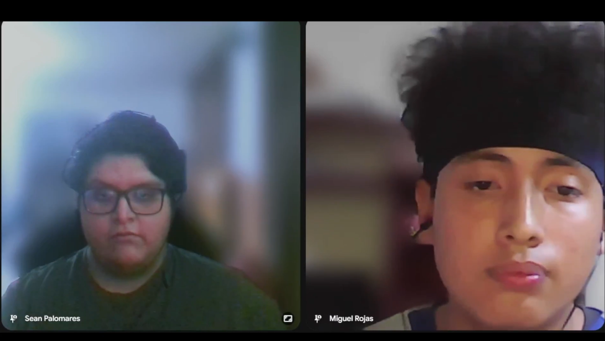
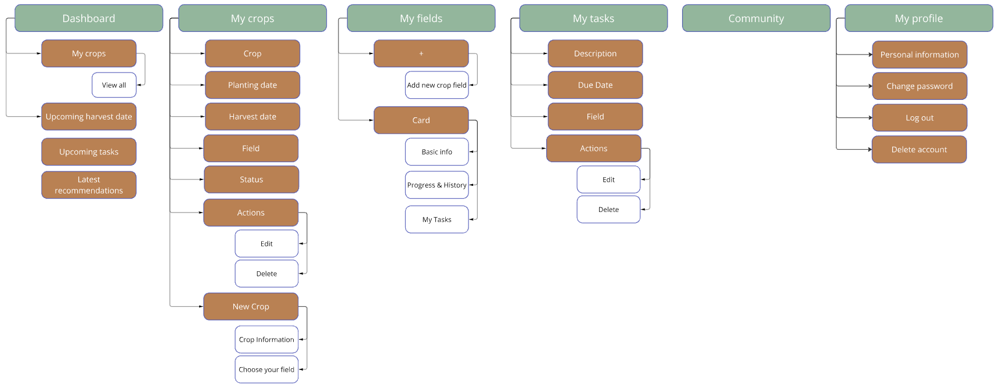
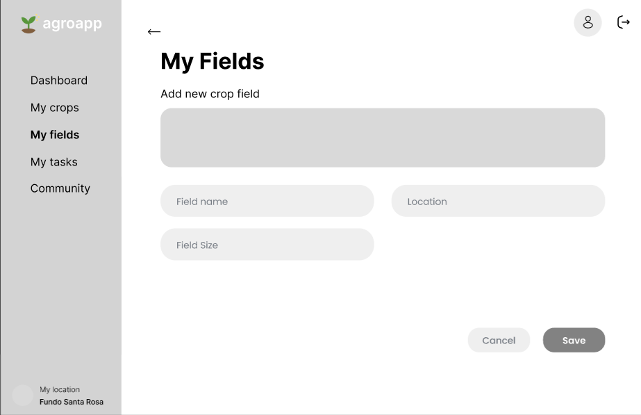

   

# 
Informe del Trabajo Final

    
   
Universidad Peruana de Ciencias Aplicadas

    
   

    
   
<b>Ingeniería de software</b>

    

   
<b>1ASI0729 Desarrollo de Aplicaciones Open Source</b>

    
   
<b>NRC:</b> 7351

    

   
<b>Profesor:</b> Rafael Oswaldo Castro Veramendi 

    
   
<b>Nombre del StartUp:</b> 

    

   
<b>Nombre del Producto:</b> AgroApp

   

    

   

   <table style="margin-left: auto; margin-right: auto;">
   <tr>
   <th>Nombre</th>
   <th>Código</th>
   </tr>
   <tr>
   <td>Chirito Torres, Jose Raul</td>
   <td>U20201A293</td>
   </tr>
   <tr>
   <td>Palomares Andrade, Sean Farith</td>
   <td>U202121947</td>
   </tr>
   <tr>
   <td>Ventosilla Trujillo, Anderson Ricardo</td>
   <td></td>
   </tr>
   <tr>
   <td>Via Luna, Bruce </td>
   <td>U202313403</td>
   </tr>
   <tr>
   <td>Yalán Zhang, Angie Christina</td>
   <td>U202312504</td>
   </tr>

   </table>
   

    
   
<b>Ciclo 2025-20</b>

    

# Registro de Versiones del Informe

| Version | Fecha | Autor | Descripción de modificación |
| ------- | ----- | ----- | --------------------------- |

# Project Report Collaboration Insights

URL del repositorio para el proyecto: https://github.com/AgroApp-UPC/Project-Report

**TB1**

Para el desarrollo del informe perteneciente a la entrega del TB1, se dividió la implementación de secciones de la siguiente forma para cada integrante del equipo:

| Integrantes         | Tareas Asignadas |
| ------------------- | ---------------- |
| José Chirito        |  Competidores, tabla comparativa de análisis competitivo y estrategias y tácticas de la startup.|
| Sean Palomares      |                  |
| Anderson Ventosilla |                  |
| Bruce Via           |                  |
| Angie Yalán         |                  |

# Contenido

1. [Capítulo I: Introducción](#capítulo-i-introducción) 
   1.1. [Startup Profile](#11-startup-profile) 
   1.1.1. [Descripción de la Startup](#111-descripción-de-la-startup) 
   1.1.2. [Perfiles de integrantes del equipo](#112-perfiles-de-integrantes-del-equipo) 
   1.2. [Solution Profile](#12-solution-profile) 
   1.2.1 [Antecedentes y problemática](#121-antecedentes-y-problemática) 
   1.2.2 [Lean UX Process](#122-lean-ux-process) 
   1.2.2.1. [Lean UX Problem Statements](#1221-lean-ux-problem-statements) 
   1.2.2.2. [Lean UX Assumptions](#1222-lean-ux-assumptions) 
   1.2.2.3. [Lean UX Hypothesis Statements](#1223-lean-ux-hypothesis-statements) 
   1.2.2.4. [Lean UX Canvas](#1224-lean-ux-canvas) 
   1.3. [Segmentos objetivo](#13-segmentos-objetivo) 
2. [Capítulo II: Requirements Elicitation & Analysis](#capítulo-ii-requirements-elicitation--analysis) 
   2.1. [Competidores](#21-competidores) 
   2.1.1. [Análisis competitivo](#211-análisis-competitivo) 
   2.1.2. [Estrategias y tácticas frente a competidores](#212-estrategias-y-tácticas-frente-a-competidores) 
   2.2. [Entrevistas](#22-entrevistas) 
   2.2.1. [Diseño de entrevistas](#221-diseño-de-entrevistas) 
   2.2.2. [Registro de entrevistas](#222-registro-de-entrevistas) 
   2.2.3. [Análisis de entrevistas](#223-análisis-de-entrevistas) 
   2.3. [Needfinding](#23-needfinding) 
   2.3.1. [User Personas](#231-user-personas) 
   2.3.2. [User Task Matrix](#232-user-task-matrix) 
   2.3.3. [User Journey Mapping](#232-user-task-matrix) 
   2.3.4. [Empathy Mapping](#234-empathy-mapping) 
   2.4. [Big Picture Event Storming](#24-big-picture-event-storming) 
   2.5. [Ubiquitous Language](#25-ubiquitous-language) 
3. [Capítulo III: Requirements Specification](#capítulo-iii-requirements-specification) 
   3.1. [User Stories](#31-user-stories) 
   3.2. [Impact Mapping](#32-impact-mapping) 
   3.3. [Product Backlog](#33-product-backlog) 
4. [Capítulo IV: Product Design](#capítulo-iv-product-design) 
   4.1. [Style Guidelines](#41-style-guidelines) 
   4.1.1. [General Style Guidelines](#411-general-style-guidelines) 
   4.1.2. [Web Style Guidelines](#412-web-style-guidelines) 
   4.2. [Information Architecture](#42-information-architecture) 
   4.2.1. [Organization Systems](#421-organization-systems) 
   4.2.2. [Labeling Systems](#422-labeling-systems) 
   4.2.3. [SEO Tags and Meta Tags](#423-seo-tags-and-meta-tags) 
   4.2.4. [Searching Systems](#424-searching-systems) 
   4.2.5. [Navigation Systems](#425-navigation-systems) 
   4.3. [Landing Page UI Design](#43-landing-page-ui-design) 
   4.3.1. [Landing Page Wireframe](#431-landing-page-wireframe) 
   4.3.2. [Landing Page Mock-up](#432-landing-page-mock-up) 
   4.4. [Web Applications UX/UI Design](#44-web-applications-uxui-design) 
   4.4.1. [Web Applications Wireframes](#441-web-applications-wireframes) 
   4.4.2. [Web Applications Wireflow Diagrams](#442-web-applications-wireflow-diagrams) 
   4.4.2. [Web Applications Mock-ups](#442-web-applications-mock-ups) 
   4.4.3. [Web Applications User Flow Diagrams](#443-web-applications-user-flow-diagrams) 
   4.5. [Web Applications Prototyping](#45-web-applications-prototyping) 
   4.6. [Domain-Driven Software Architecture](#46-domain-driven-software-architecture) 
   4.6.1. [Design-Level Event Storming](#461-design-level-event-storming) 
   4.6.2. [Software Architecture Context Diagram](#462-software-architecture-context-diagram) 
   4.6.3. [Software Architecture Container Diagrams](#463-software-architecture-container-diagrams) 
   4.6.4. [Software Architecture Components Diagrams](#464-software-architecture-components-diagrams) 
   4.7. [Software Object-Oriented Design](#47-software-object-oriented-design) 
   4.7.1. [Class Diagrams](#471-class-diagrams) 
   4.7.2. [Class Dictionary](#472-class-dictionary) 
   4.8. [Database Design](#48-database-design) 
   4.8.1. [Database Diagram](#481-database-diagram) 
5. [Capítulo V: Product Implementation, Validation & Deployment](#capítulo-v-product-implementation-validation--deployment) 
   5.1. [Software Configuration Management](#51-software-configuration-management) 
   5.1.1. [Software Development Environment Configuration](#511-software-development-environment-configuration) 
   5.1.2. [Source Code Management](#512-source-code-management) 
   5.1.3. [Source Code Style Guide & Conventions](#513-source-code-style-guide--conventions) 
   5.1.4. [Software Deployment Configuration](#514-software-deployment-configuration) 
   5.2. [Landing Page, Services & Applications Implementation](#52-landing-page-services--applications-implementation) 
   5.2.1. [Sprint 1](#521-sprint-1) 
   5.2.1.1. [Sprint Planning 1](#5211-sprint-planning-1) 
   5.2.1.2. [Aspect Leaders and Collaborators](#5212-aspect-leaders-and-collaborators) 
   5.2.1.3. [Sprint Backlog 1](#5213-sprint-backlog-1) 
   5.2.1.4. [Development Evidence for Sprint Review](#5214-development-evidence-for-sprint-review) 
   5.2.1.5. [Execution Evidence for Sprint Review](#5215-execution-evidence-for-sprint-review) 
   5.2.1.6. [Services Documentation Evidence for Sprint Review](#5216-services-documentation-evidence-for-sprint-review) 
   5.2.1.7. [Software Deployment Evidence for Sprint Review](#5217-software-deployment-evidence-for-sprint-review) 
   5.2.1.8. [Team Collaboration Insights during Sprint](#5218-team-collaboration-insights-during-sprint) 
   5.2.2. [Sprint 2](#522-sprint-2) 
   5.2.2.1. [Sprint Planning 2](#5221-sprint-planning-2) 
   5.2.2.2. [Aspect Leaders and Collaborators](#5222-aspect-leaders-and-collaborators) 
   5.2.2.3. [Sprint Backlog 2](#5223sprint-backlog-2) 
   5.2.2.4. [Development Evidence for Sprint Review](#5224development-evidence-for-sprint-review) 
   5.2.2.5. [Execution Evidence for Sprint Review](#5225execution-evidence-for-sprint-review) 
   5.2.2.6. [Services Documentation Evidence for Sprint Review](#5226services-documentation-evidence-for-sprint-review) 
   5.2.2.7. [Software Deployment Evidence for Sprint Review](#5227software-deployment-evidence-for-sprint-review) 
   5.2.2.8. [Team Collaboration Insights during Sprint](#5228team-collaboration-insights-during-sprint) 
   5.2.3. [Sprint 3](#523-sprint-3) 
   5.2.3.1. [Sprint Planning 3](#5231-sprint-planning) 
   5.2.3.2. [Aspect Leaders and Collaborators](#5232-aspect-leaders-and-collaborators) 
   5.2.3.3. [Sprint Backlog 3](#5223sprint-backlog-2) 
   5.2.3.4. [Development Evidence for Sprint Review](#5234-development-evidence-for-sprint-review) 
   5.2.3.5. [Execution Evidence for Sprint Review](#5235-execution-evidence-for-sprint-review) 
   5.2.3.6. [Services Documentation Evidence for Sprint Review](#5236-services-documentation-evidence-for-sprint-review) 
   5.2.3.7. [Software Deployment Evidence for Sprint Review](#5237-software-deployment-evidence-for-sprint-review) 
   5.2.3.8. [Team Collaboration Insights during Sprint](#5238-team-collaboration-insights-during--sprint) 
   5.3. [Validation Interviews](#53-validation-interviews) 
   5.3.1 [Diseño de Entrevistas](#531-diseño-de-entrevistas) 
   5.3.2 [Registro de Entrevistas](#532-registro-de-entrevistas) 
   5.3.3 [Evaluación según heurísticas](#533-evaluaciones-según-heurísticas) 
   5.4. [Video About-the-Product](#54-video-about-the-product) 
6. [Conclusiones](#conclusiones) 
   6.1 [Conclusiones y recomendaciones](#61-conclusiones-y-recomendaciones) 
   6.2. [Video About-the-Team](#62-video-about-the-team) 
7. [Bibliografía](#bibliografía) 
8. [Anexos](#anexos) 

# Student Outcome

| Criterio específico                                                   | Acciones realizadas                                                                                                                                                        | Conclusiones |
| --------------------------------------------------------------------- | -------------------------------------------------------------------------------------------------------------------------------------------------------------------------- | ------------ |
| Comunica oralmente con efectividad a diferentes rangos de audiencia   | **José Chirito**  TB1: De manera efectiva realicé los hallazgos del análisis competitivo de AgroApp frente a otros competidores, según la audiencia.     **Sean Palomares**  TB1:    **Anderson Ventosilla**  TB1:    **Bruce Via**  TB1:    **Angie Yalán**  TB1: |              |
| Comunica por escrito con efectividad a diferentes rangos de audiencia | **José Chirito**  TB1: Mediante escrito comuniqué de manera clara y estructurada el análisis competitivo a distinto público.    **Sean Palomares**  TB1:    **Anderson Ventosilla**  TB1:    **Bruce Via**  TB1:    **Angie Yalán**  TB1: |              |

# Capítulo I: Introducción

## 1.1. Startup Profile

### 1.1.1. Descripción de la Startup

AgroTech es una startup tecnológica orientada a la transformación digital del sector agrícola en el Perú. Nuestro principal producto, AgroApp, es una aplicación web responsive que busca empoderar a agricultores con poca o media experiencia, brindándoles recomendaciones inteligentes, soporte comunitario e integración con dispositivos IoT. Con agroApp, el agricultor podrá mejorar el rendimiento de sus cultivos gracias a un seguimiento personalizado y accesible desde cualquier dispositivo.

**Misión:**

Impulsar la transformación digital del sector agrícola brindando a los agricultores herramientas tecnológicas accesibles e inteligentes, que les permitan optimizar el rendimiento de sus cultivos mediante recomendaciones personalizadas, integración con IoT y un enfoque sostenible orientado a mejorar su calidad de vida.

**Visión:**

Ser la plataforma líder en soluciones digitales agrícolas en Latinoamérica, reconocida por democratizar el acceso a la tecnología en el campo y contribuir a la seguridad alimentaria a través de la innovación, la sostenibilidad y el fortalecimiento de los pequeños y medianos agricultores.

### 1.1.2. Perfiles de los integrantes del equipo

| Perfil                                                                                                                                                                                                                                                                                                                                                                                                                                                                  | Foto                                                                          |
| ----------------------------------------------------------------------------------------------------------------------------------------------------------------------------------------------------------------------------------------------------------------------------------------------------------------------------------------------------------------------------------------------------------------------------------------------------------------------- | ----------------------------------------------------------------------------- |
|                                                                                                                                                                                                                                                                                                                                                                                                                                                                         |                                                                               |
| **Sean Palomares:** Mi nombre es Sean Palomares, tengo 22 años y estudio la carrera de Ingeniería de Software. Tengo conocimiento en lenguajes como C#, C++, Python y bases de datos en MySQL. Me considero una persona positiva, tolerante y creativa, cualidades que me permiten adaptarme con facilidad a diferentes entornos de trabajo. Disfruto colaborar en equipo, compartir ideas y contribuir con una visión común para alcanzar los objetivos propuestos. |                                                                               |
| **Jose Chirito:**   Mi nombre es Jose Chirito, tengo 23 años y estudio la carrera de Ingeniería de Software.También tengo conocimiento en varios lenguajes de programación. Y considero que aprendo rápido los temas y el trabajo grupal.                                                                                                                                                                                                                                                                                                                                                          |                                                                               |
|                                                                                                                                                                                                                                                                                                                                                                                                                                                                         |                                                                               |
| **Angie Yalán:**  Mi nombre es Angie Yalán. Soy estudiante de la carrera Ingeniería de Software y tengo 19 años. Me considero una persona proactiva que le gustan nuevas experiencias y aprender cosas diferentes. Sigo en el proceso de mejora en cuanto a la programación y cuento con toda la iniciativa para ser cada día mejor en ello.                                                                                                                         |  |

## 1.2. Solution Profile

AgroApp es una aplicación web diseñada para apoyar a agricultores de pequeña y mediana escala en la gestión de sus cultivos, mediante un sistema de recomendaciones inteligentes basadas en datos ingresados por el usuario, y más adelante, e información recolectada a través de sensores IoT de humedad y luz solar. La plataforma permite registrar cultivos, monitorear variables clave como riego, nutrientes y exposición solar, y recibir alertas clasificadas por nivel de riesgo (bajo, medio, alto). De esta manera, AgroApp busca democratizar el acceso a la tecnología agrícola, optimizar el rendimiento de los cultivos y contribuir a la sostenibilidad del sector agropecuario en el Perú.

### 1.2.1 Antecedentes y problemática

Los agricultores de pequeña y mediana escala enfrentan barreras tecnológicas y de acceso a información que limitan el rendimiento de sus cultivos y su competitividad en el mercado. La falta de herramientas digitales simples y adaptadas a su realidad conlleva a decisiones empíricas, baja eficiencia en el uso de recursos y pérdidas económicas significativas. AgroApp surge como una solución tecnológica accesible, que integra datos ingresados por el usuario y sensores IoT, para generar recomendaciones claras y prácticas que fortalezcan la sostenibilidad del sector agrícola.
  
Según Lean Construction México, la técnica de las 5W's y 2H's facilita la creación y desarrollo de un plan de acción o estrategia detallada (Alvarez, 2020). A raíz de esto, resultará útil para nuestro contexto dado que nos permitirá entender y analizar a mayor profundidad las necesidades de los usuarios. Por ende, se recopiló información mediante esta técnica, la cual se presentará a continuación.

**What(Qué)**

##### ¿Cuál es el problema?

Los agricultores de pequeña y mediana escala carecen de herramientas digitales para monitorear y gestionar adecuadamente sus cultivos, lo que ocasiona baja productividad, uso ineficiente de recursos (agua, nutrientes, luz solar) y pérdidas económicas.

##### ¿Cuál es la relación con la persona en cuestión?

El agricultor es el usuario principal afectado, ya que depende de la productividad de sus cultivos para garantizar su sustento y competitividad en el mercado.

**Who (Quién)**

##### ¿Quiénes están involucrados?

Agricultores de pequeña y mediana escala, familiares de los agricultores que participan en la producción, y organizaciones vinculadas al sector agrícola (cooperativas, asociaciones).

##### ¿A quiénes le sucede el problema?

Principalmente a agricultores con poca o media experiencia técnica que no cuentan con sistemas de gestión agrícola digitalizados y que dependen de prácticas tradicionales o empíricas.

**Where (Dónde)**

##### ¿En dónde ocurre el problema?

En zonas rurales y periurbanas del Perú (sierra, selva y valles interandinos), donde se concentra la agricultura familiar y la producción de alimentos básicos para el mercado nacional.

**When (Cuándo)**

##### ¿Cuándo sucede el problema?

A lo largo de todo el ciclo del cultivo (siembra, crecimiento, maduración y cosecha), siendo más crítico en las etapas de riego, fertilización y control de plagas.

##### ¿Cuándo utiliza el cliente el producto?

El cliente usa agroApp desde el inicio del registro de sus cultivos y de manera recurrente durante el crecimiento para recibir alertas, registrar datos y consultar recomendaciones.

**Why (Por qué)**

##### ¿Cuál es la causa del problema?

La falta de acceso a información confiable, el uso empírico de prácticas agrícolas y la ausencia de herramientas tecnológicas adaptadas a la realidad de pequeños y medianos agricultores, que permitan optimizar el uso de recursos y aumentar la productividad.

**How (Cómo)**

##### ¿En qué condiciones los clientes usan nuestro producto?

En campo, utilizando dispositivos móviles con acceso a internet móvil (3G/4G) o en sus hogares cuando tienen acceso a conexión WiFi. Usan agroApp de forma sencilla e intuitiva, adaptada a sus conocimientos básicos de tecnología.

**How much (Cuánto)**

##### Estadísticas que sustentan la problemática.

- El 97 % de las unidades agropecuarias en el Perú son de agricultura familiar (Castillo, 2021).
- El sector es responsable de cerca del 70 % de los alimentos consumidos en el país (Castillo,2021).
- "Las mayores pérdidas ocurren en la fase de producción 28%, cosecha y almacenamiento 22%, distribución 17%, procesamiento 6%" (Gob, 2019).
- Según la INEI (2023), "En el año 2022, el 3,8% del total de los/las productores/as manifestaron haber recibido asistencia técnica.
  Sin embargo, en el año 2014, el valor fue de 9,2% lo que evidencia una disminución de productores/as
  asistidos/as en el periodo de análisis"

### 1.2.2 Lean UX Process.

#### 1.2.2.1. Lean UX Problem Statements.

- **Domain (Dominio):**

  El sector agrícola en el Perú, enfocado en agricultores de pequeña y mediana escala que representan la mayoría de las unidades agropecuarias y son responsables de gran parte de la producción de alimentos.

* **Customer Segments (Segmentos de clientes):**
  - Agricultores de pequeña escala (subsistencia/autoconsumo).
  - Agricultores de mediana escala (producción comercial local/regional).

- **Pain Points (Puntos de dolor):**
  - Dificultad para tomar decisiones informadas sobre riego, nutrientes y cuidados del cultivo.
  - Pérdidas de rendimiento debido a prácticas empíricas o poco técnicas.
  - Falta de herramientas digitales simples, adaptadas a la realidad rural.
  - Baja adopción tecnológica por interfaces poco amigables o complejas.

* **Gap (Brecha):**

  Actualmente, no existen soluciones digitales ampliamente accesibles y adaptadas al contexto de pequeños y medianos agricultores peruanos que combinen registro de cultivos, recomendaciones personalizadas y alertas de riesgo en una sola plataforma.

- **Visión / Strategy (Visión / Estrategia):**

  Crear una aplicación web responsiva y accesible que brinde recomendaciones personalizadas y fáciles de entender, con base en datos ingresados por los agricultores, permitiendo mejorar la productividad de sus cultivos y optimizar el uso de recursos, contribuyendo así a la sostenibilidad del sector agrícola.

* **Initial Segment (Segmento inicial):**

  Agricultores de pequeña escala, y posteriormente, agricultores de mediana escala con mayores necesidades de gestión.

#### 1.2.2.2. Lean UX Assumptions.

##### 1.2.2.2.1. Features

- Registro de usuario con datos básicos (nombre, número celular, correo, contraseña).
- Registro de cultivos (especie, fecha de plantación, tipo de suelo, cantidad de agua, exposición solar).
- Recomendaciones personalizadas clasificadas por nivel de riesgo (bajo, medio, alto).
- Sistema de alertas y recordatorios automáticos (ejemplo: “riego insuficiente”, “suelo pobre en nutrientes”).
- Calendario de cultivo (recordatorios de riego, fertilización y fumigación).
- Comunidad interna con consejos y experiencias compartidas entre agricultores.
- Reportes básicos de rendimiento y uso de recursos (para agricultores medianos).
- Landing Page informativa y consistente con la Web Application.

##### 1.2.2.2.2. Business Outcomes

- Adopción inicial de la plataforma por agricultores pequeños, al ofrecer una app simple, visual y fácil de usar.
- Retención de usuarios gracias a las alertas y recordatorios que generan valor en la rutina agrícola.
- Escalabilidad del negocio con la incorporación de agricultores medianos interesados en funcionalidades avanzadas (reportes y gestión de datos).
- Generación de ingresos a futuro mediante planes premium para acceso a reportes detallados o funcionalidades adicionales.
- Posicionamiento de marca como una solución digital confiable y accesible para la agricultura familiar y comercial en el Perú.

##### 1.2.2.2.3. User Benefits

- Para agricultores de pequeña escala:
  - Recibir recomendaciones claras y fáciles de entender.
  - Anticiparse a problemas comunes (falta de agua, suelo pobre en nutrientes).
  - Tener un calendario sencillo que les recuerde las tareas agrícolas más importantes.
  - Mejorar el rendimiento de sus cultivos con prácticas simples y accesibles.

* Para agricultores de mediana escala:
  - Registrar y organizar datos de sus cultivos en un solo lugar.
  - Generar reportes básicos para tomar decisiones más informadas.
  - Optimizar el uso de recursos (agua, fertilizantes).
  - Reducir pérdidas y aumentar la rentabilidad de sus cosechas.

¿Quién es el usuario?

- Agricultores de pequeña escala (subsistencia/autoconsumo) que buscan recomendaciones simples y fáciles de aplicar.
- Agricultores de mediana escala (producción comercial/regional) que necesitan un mayor control de datos y reportes para optimizar la productividad de sus cultivos.

¿Dónde encaja nuestro producto en su trabajo o vida?

- En las tareas diarias de cultivo, como riego, fertilización y control básico de plagas.
- Como apoyo digital que complementa el conocimiento empírico, brindando alertas y recordatorios.
- En la planificación de cultivos, ya que permite organizar fechas de siembra, fertilización y cosecha.

¿Qué problemas tiene nuestro producto que resolver?

- La falta de información clara y personalizada sobre cómo cuidar cada cultivo.
- El manejo empírico y poco técnico que ocasiona pérdidas en la producción.
- La ausencia de herramientas accesibles para registrar y organizar información de forma digital.

¿Cuándo y cómo es nuestro producto usado?

- Cuándo: Durante todo el ciclo del cultivo, desde la siembra hasta la cosecha, especialmente en momentos críticos de riego y fertilización.

- Cómo:
  - Agricultores pequeños → ingresan datos básicos en la app y reciben recomendaciones simples y alertas visuales.
  - Agricultores medianos → registran datos con más detalle y consultan reportes para tomar decisiones productivas.

¿Qué características son importantes?

- Registro de cultivos y datos básicos (especie, suelo, agua, luz solar).
- Recomendaciones personalizadas clasificadas por nivel de riesgo.
- Alertas y recordatorios automáticos.
- Reportes básicos de rendimiento y recursos (para agricultores medianos).
- Interfaz sencilla, intuitiva y responsive para móvil y web.
- Comunidad de consejos y experiencias compartidas.

¿Cómo debe verse nuestro producto y comportarse?

- Diseño:
  - Minimalista, visual y fácil de usar.
  - Uso de colores asociados a estados de riesgo (verde, amarillo, rojo).
  - Adaptable a dispositivos móviles y de bajo costo.
- Comportamiento:
  - Rápido y fluido, con tiempos de carga mínimos.
  - Intuitivo: con pocos pasos para registrar un cultivo o ver recomendaciones.
  - Confiable: que no pierda datos aunque el acceso a internet sea intermitente.

#### 1.2.2.3. Lean UX Hypothesis Statements.

1. **Creemos que** proporcionar una aplicación simple y visual, con recomendaciones básicas y alertas claras clasificadas por nivel de riesgo (bajo, medio, alto), ayudará a los agricultores pequeños a cuidar mejor sus cultivos y evitar pérdidas por riego o nutrientes inadecuados.

   **Sabremos que** estamos bien cuando veamos que los agricultores ingresan sus datos al menos una vez por semana, reportan en encuestas que entienden fácilmente las alertas y / o se registra un aumento del 15% en la retención mensual de usuarios pequeños.

2. **Creemos que** ofrecer funciones de registro de datos y generación de reportes básicos permitirá a los agricultores medianos optimizar el uso de agua y nutrientes, mejorar el rendimiento de sus cultivos y aumentar su rentabilidad.

   **Sabremos que** estamos bien cuando veamos que los agricultores medianos generan al menos un reporte por mes, mencionan en encuestas que los reportes influyen en sus decisiones, y / o se registra un aumento del 20% en la productividad percibida en los primeros 6 meses de uso.

3. **Creemos que** una interfaz limpia, responsiva y optimizada para smartphones garantizará que tanto agricultores pequeños como medianos utilicen la aplicación de manera intuitiva durante sus actividades diarias en el campo.

   **Sabremos que** estamos bien cuando el feedback de usuarios describa la aplicación como “fácil de usar” o “rápida” en encuestas post-uso y / o la tasa de abandono sea menor al 10% y / o la calificación promedio supere 4.3 en las tiendas de apps.

4. **Creemos que** integrar un espacio comunitario donde agricultores compartan consejos y experiencias fomentará la confianza entre usuarios y aumentará la interacción dentro de la plataforma.

   **Sabremos que** estamos bien cuando veamos publicaciones de usuarios en la comunidad al menos una vez por semana y / o un 25% de los usuarios activos participen comentando o reaccionando en la comunidad y / o recibamos feedback positivo sobre el aprendizaje obtenido de otros agricultores.

#### 1.2.2.4. Lean UX Canvas.

## 1.3. Segmentos objetivo.

### Segmento objetivo #1: Agricultores de pequeña escala (subsistencia y autoconsumo)

Agricultores con terrenos menores a 5 hectáreas, generalmente familiares, que producen para autoconsumo y venta local en mercados.

#### Aspectos Demográficos:

- **Rango de edad:** 25 a 50 años
- **Sexo:** Hombres y mujeres (con ligera predominancia masculina en zonas rurales)
- **Nivel socioeconómico:** Bajo y medio-bajo

#### Aspectos Geográficos:

- **Nacionalidad:** Peruana
- **Zona geográfica de residencia:** Rural y periurbana
- **Departamento:** Principalmente en la Sierra (Ayacucho, Cusco, Cajamarca, Puno) y en zonas de la Selva (San Martín, Ucayali)

#### Aspectos Psicográficos

- Valoración de la tierra como principal fuente de sustento.
- Orientados al autoconsumo y a la venta en ferias o mercados locales.
- Limitada experiencia en el uso de aplicaciones digitales.
- Buscan soluciones prácticas, fáciles de entender y de bajo costo.
- Uso tecnológico: Acceso limitado a smartphones de gama media y conectividad 3G/4G.

### Segmento objetivo #2: Agricultores de mediana escala (producción comercial local y regional)

Agricultores con terrenos entre 5 y 20 hectáreas que producen cultivos para abastecer mercados regionales o cadenas de supermercados.

#### Aspectos Demográficos:

- **Rango de edad:** 30 a 55 años
- **Sexo:** Hombres y mujeres, con tendencia masculina en roles de decisión
- **Nivel socioeconómico:** Medio y medio-alto dentro del sector agrícola

#### Aspectos Geográficos:

- **Nacionalidad:** Peruana
- **Zona geográfica de residencia:** Zonas rurales y valles interandinos con acceso a mercados regionales
- **Departamento:** Principalmente en la Costa (La Libertad, Ica, Lambayeque, Piura) y valles de la Sierra (Arequipa, Junín)

#### Aspectos Psicográficos:

- Mayor orientación a la productividad y al mercado.
- Buscan optimizar el rendimiento de sus cultivos y reducir pérdidas.
- Tienen más apertura al uso de aplicaciones y tecnología digital.
- Interés en herramientas que les permitan organizar datos y tomar decisiones basadas en información.
- Uso tecnológico: Mayor acceso a dispositivos móviles modernos y disposición a usar apps para mejorar productividad.

# Capítulo II: Requirements Elicitation & Analysis

## 2.1. Competidores.

En el Perú existe distintos tipos de de startups y plataformas en desarrollo similares a Agroapp .
  
A continuacion se mostrará los competidores directos :

### 1. Sapce AG

Utiliza drones e intelingencia artificial para el desarrollo de sus cultivos e incluso los monitorea mediante imágenes satelitales.

### Segmento objetivo:

Agricultores de mediana y gran escala

### Aspectos Demograficos:

- **Rango de edad:** 35 a 60 años
- **Sexo:** Predomina las deciciones tomadas por sexo masculinon
- **Nivel socioeconómico:** Medio y medio-alto vinculados a agronegocios

#### Aspectos Geográficos:

- **Nacionalidad:** Peruana
- **Zona geográfica de residencia:** Zonas rurales , cerca de mercados de exportacion y agroindustrias
- **Departamento:** En la costa norte y sur (La Libertad, Ica, Lambayeque, Piura)

#### Aspectos Psicográficos:

- Mayor orientación eficiencia y rentabilidad
- Busca invertir tecnología avanzada para maximizar exportaciones
- Tienen presupuesto para pagar soluciones premium de alto valor agregado
- Apertura para nuevas innovaciones digitales
    

### 2. Agros

Conecta a agricultores con financiamiento , proveedores e incluso insumos agricolas

### Segmento objetivo:

Agricultores de pequeña y mediana escala

### Aspectos Demograficos:

- **Rango de edad:** 25 a 50 años
- **Sexo:** Hombres y mujeres con más participacion femenina
- **Nivel socioeconómico:** Bajo, medio-bajo y medio

#### Aspectos Geográficos:

- **Nacionalidad:** Peruana
- **Zona geográfica de residencia:** Zonas rurales, conectados con cooperativas agrícolas
- **Departamento:** En la sierra y selva (Cusco, Ayacucho, San Martin , Aucayali)

#### Aspectos Psicográficos:

- Interés con ingresos de financiamiento y capacitacion
- Buscan soluciones para mejorar la seguridada económica
- Uso tecnológico: Acceso limitado para dispositivos moviles
    

### 3. Yaku Solutions

Especializado en IoT para riego inteligente , con sistemas y sensores de humedad

### Segmento objetivo:

Agricultores de pequeña y mediana escala que buscan mejorar la eficiencia de riego y reducir costos

### Aspectos Demograficos:

- **Rango de edad:** 25 a 55 años
- **Sexo:** Hombres y mujeres
- **Nivel socioeconómico:** Medio-bajo y medio

#### Aspectos Geográficos:

- **Nacionalidad:** Peruana
- **Zona geográfica de residencia:** Zonas rurales con mayor actividad agricola
- **Departamento:** En la costa (Ica, Piura,Lambayeque, Arequipa )

#### Aspectos Psicográficos:

- Interésen tecnología que genere ahorro de agua y fertilizantes
- Buscan soluciones para mejorar la productividad y reducción de pérdidas
- Uso tecnológico: Mayor disposición de uso de sensores IoT conectados a aplicaciones webs de monitoreo

### 2.1.1. Análisis competitivo.

| Competitive Analysis Landscape |
| ------------------------------ |

| **¿Por qué llevar a cabo este análisis?** | Lograr identificar como se posiciona **AgroApp** frente a sus competidores en Perú, evaluadno el mercado objetivo y ventajas competitivas. |
| ----------------------------------------- | ------------------------------------------------------------------------------------------------------------------------------------------ |

| **Sección**                                | **AgroApp (Startup)**                                                                          | **Space AG**                                                   | **Agros**                                                                   | **Ritec**                                                                      |
| ------------------------------------------ | ---------------------------------------------------------------------------------------------- | -------------------------------------------------------------- | --------------------------------------------------------------------------- | ------------------------------------------------------------------------------ |
| **Perfil**                                 |                                                                                                |                                                                |                                                                             |                                                                                |
| **Overview**                               | App web con recomendaciones inteligentes y alertas de riesgo usando IoT básico (humedad, luz). | Monitoreo con drones, satélites e IA para agroexportación.     | Plataforma digital que conecta agricultores con crédito, seguros e insumos. | Startup peruana de IoT agrícola: sensores de clima y suelo, riego inteligente. |
| **Ventaja competitiva / Valor al cliente** | Simple, accesible y pensada para pequeños agricultores con baja experiencia digital.           | Tecnología avanzada y escalable para grandes agroexportadores. | Democratiza el acceso a financiamiento agrícola.                            | Ahorro de agua y fertilizantes con sensores y automatización de riego.         |
| **Perfil de Marketing**                    |                                                                                                |                                                                |                                                                             |                                                                                |
| **Mercado objetivo**                       | Agricultores pequeños y medianos (1–20 ha), Sierra y Selva.                                    | Grandes agroexportadores de la Costa.                          | Agricultores pequeños y medianos organizados en cooperativas.               | Agricultores medianos en zonas de riego intensivo (Costa y Sierra).            |
| **Estrategias de marketing**               | Alianzas con cooperativas, talleres rurales, educación digital.                                | Alianzas B2B con agroexportadoras y empresas grandes.          | Convenios con bancos, ONGs y asociaciones agrícolas.                        | Venta directa de hardware + acompañamiento técnico.                            |
| **Perfil de Producto**                     |                                                                                                |                                                                |                                                                             |                                                                                |
| **Productos & Servicios**                  | App web, alertas inteligentes, integración con IoT básico (humedad y luz).                     | Imágenes satelitales, drones e inteligencia artificial.        | Marketplace agrícola, créditos y seguros digitales.                         | Sensores de clima , de suelo , y sistemas de riego automatizado.               |
| **Precios & Costos**                       | Freemium + planes accesibles.                                                                  | Premium (alto costo).                                          | Suscripción + comisiones sobre transacciones.                               | Venta de hardware + servicio de mantenimiento.                                 |
| **Canales de distribución (Web/Móvil)**    | Web responsive y móvil.                                                                        | Web SaaS corporativo.                                          | Web y aplicación móvil.                                                     | Hardware IoT conectado a plataforma web.                                       |
| **Análisis SWOT**                          |                                                                                                |                                                                |                                                                             |                                                                                |
| **Fortalezas**                             | Fácil de usar, accesible, enfocado en pequeños agricultores.                                   | Alta tecnología y prestigio internacional.                     | Amplia red de aliados financieros.                                          | Tecnología propia peruana, impacto directo en ahorro de agua y fertilizantes.  |
| **Debilidades**                            | Requiere adopción digital en zonas rurales.                                                    | Costoso, inaccesible para pequeños agricultores.               | Poca innovación técnica en cultivos.                                        | Dependencia de hardware físico y costos iniciales altos.                       |
| **Oportunidades**                          | Expansión en Sierra y Selva; integración de más sensores IoT.                                  | Crecimiento sostenido de agroexportaciones.                    | Mayor demanda de servicios financieros agrícolas.                           | Escasez hídrica que impulsa soluciones de riego eficiente.                     |
| **Amenazas**                               | Competidores con más recursos tecnológicos.                                                    | Dependencia de grandes clientes corporativos.                  | Competencia de otras plataformas fintech agrícolas.                         | Competidores internacionales de IoT agrícola.                                  |

### 2.1.2. Estrategias y tácticas frente a competidores.

| Competidor   | Fortalezas                                                   | Estrategia de AgroApp                                                                            | Tácticas de AgroApp                                                                                                                                              |
| ------------ | ------------------------------------------------------------ | ------------------------------------------------------------------------------------------------ | ---------------------------------------------------------------------------------------------------------------------------------------------------------------- |
| **Space AG** | Imágenes satelitales y drones de alta precisión (costosas).  | Ofrecer una solución simple, accesible y de bajo costo para agricultores pequeños y medianos.    | - Modelo freemium o bajo costo. - Tecnología para todos. - Interfaz intuitiva sin conocimientos técnicos.                                                  |
| **Agros**    | Acceso a financiamiento, seguros e insumos agrícolas.        | Diferenciarse con un sistema de recomendaciones inteligentes e IoT para optimizar la producción. | - Alianzas con cooperativas. - Posicionar AgroApp como herramienta que convierte créditos en resultados productivos.                                          |
| **Ritec**    | IoT avanzado en riego y monitoreo (sensores especializados). | Integrar IoT básicos y económicos con alertas automáticas y lenguaje sencillo.                   | -Marketing educativo : Talleres virtuales y prácticos. - Alertas accionables para facilitar la toma de decisiones. - Alianzas con ONG y gobiernos locales. |

## 2.2. Entrevistas.

### 2.2.1. Diseño de entrevistas.

**Segmento 1: Agricultores de pequeña escala (subsistencia/autoconsumo)**

Objetivo: Comprender cómo registran y cuidan sus cultivos actualmente, qué limitaciones tienen, y validar la utilidad de una app que les dé alertas simples y recomendaciones personalizadas.
  
Introducción:  
"Buenos días/tardes, gracias por aceptar esta entrevista. Somos de la startup AgroTech y estamos desarrollando una aplicación pensada especialmente para agricultores como usted, que buscan mejorar el cuidado de sus cultivos de manera práctica y sencilla. Queremos conocer más sobre cómo trabaja actualmente, cuáles son sus principales dificultades y qué tan útil sería una herramienta digital que le brinde recomendaciones y alertas para ayudarle a tomar mejores decisiones en el campo. Sus respuestas son muy valiosas y nos ayudarán a diseñar una aplicación que realmente se adapte a sus necesidades."
  
Preguntas:

- ¿Qué cultivos trabaja actualmente y en qué cantidad?
- ¿Cómo decide cuánta agua usar y cada cuánto regar?
- ¿Qué tipo de fertilizantes o nutrientes utiliza y cómo sabe cuándo aplicarlos?
- ¿Cuáles son las principales dificultades que enfrenta en el cuidado de sus cultivos?
- Si pudiera ingresar en una app datos como tipo de suelo, cantidad de agua o tiempo de luz solar, ¿le parecería útil recibir recomendaciones?
- ¿Qué tipo de alertas le resultarían más prácticas (ejemplo: “riego insuficiente”, “suelo poco nutritivo”)?
- ¿Le gustaría recibir recordatorios directamente en la aplicación?
- ¿Qué tan cómodo se siente usando aplicaciones en su celular?
- ¿Qué tanto tiempo estaría dispuesto a dedicar a registrar datos de sus cultivos?

**Segmento 2: Agricultores de mediana escala (producción comercial/local-regional)**

Objetivo: Identificar necesidades más avanzadas de gestión de cultivos, validar el valor de recomendaciones clasificadas por riesgo, y explorar interés en reportes de rendimiento básicos.
  
Introducción:  
"Buenos días/tardes, gracias por dedicar unos minutos a esta entrevista. Somos de la startup AgroTech y estamos diseñando una aplicación que busca ayudar a agricultores como usted a gestionar sus cultivos de forma más organizada y eficiente. Nos interesa conocer cómo maneja actualmente su producción, cuáles son sus principales retos y qué tipo de información o funcionalidades digitales podrían resultarle más útiles. Con su apoyo, podremos construir una herramienta que realmente aporte valor a su trabajo y mejore la productividad de sus cultivos."
  
Preguntas:

- ¿Qué cultivos maneja y en qué extensión de terreno?
- ¿Cómo controla actualmente el riego y los nutrientes en sus cultivos?
- ¿Qué métodos utiliza para registrar información sobre el estado de sus cultivos (ejemplo: cuadernos, hojas de cálculo, memoria)?
- ¿Cuáles son los mayores problemas que enfrenta en la gestión de sus cultivos?
- ¿Le sería útil recibir recomendaciones clasificadas por riesgo (bajo, medio, alto) según los datos que ingrese?
- ¿Qué tan valioso le resultaría poder generar reportes básicos con la información registrada (ejemplo: consumo de agua, rendimiento esperado)?
- ¿Con qué frecuencia estaría dispuesto a ingresar datos en la aplicación?
- ¿Qué tan importante considera contar con alertas preventivas para evitar pérdidas en sus cultivos?
- ¿Qué tanto valoraría que la aplicación ofrezca un calendario de tareas (riego, fertilización, fumigación)?
- ¿Estaría dispuesto a pagar una pequeña suscripción por acceder a reportes y recomendaciones más avanzadas?

### 2.2.2. Registro de entrevistas.

#### Segmento objetivo #1: Agricultores de pequeña escala (subsistencia y autoconsumo)

##### Datos del Entrevistado #1

- **Nombre completo:** Rosa Chavez
- **Segmento Objetivo:** Agricultores de pequeña escala
- **Edad:**
- **Distrito:**
- **Inicio de la entrevista:** 00:18
- **Duración:** 31:26
- **Screenshot del cuadro de video:** 
- **URL del video (Microsoft Stream):** _[Entrevista 01](https://upcedupe-my.sharepoint.com/:v:/g/personal/u202312504_upc_edu_pe/EeafUKILLfdHpZwk0nw2p34BgPkvxITk_-EUY3ugoWZoDA?nav=eyJyZWZlcnJhbEluZm8iOnsicmVmZXJyYWxBcHAiOiJPbmVEcml2ZUZvckJ1c2luZXNzIiwicmVmZXJyYWxBcHBQbGF0Zm9ybSI6IldlYiIsInJlZmVycmFsTW9kZSI6InZpZXciLCJyZWZlcnJhbFZpZXciOiJNeUZpbGVzTGlua0NvcHkifX0&e=BJ4UUe)_

**Resumen:**

##### Datos del Entrevistado #2

- **Nombre completo:** Miguel Rojas
- **Segmento Objetivo:** Agricultores de pequeña escala
- **Edad:**
- **Distrito:**
- **Inicio de la entrevista:** 05:20
- **Duración:** 31:26
- **Screenshot del cuadro de video:** 
- **URL del video (Microsoft Stream):** _[Entrevista 02](https://upcedupe-my.sharepoint.com/:v:/g/personal/u202312504_upc_edu_pe/EeafUKILLfdHpZwk0nw2p34BgPkvxITk_-EUY3ugoWZoDA?nav=eyJyZWZlcnJhbEluZm8iOnsicmVmZXJyYWxBcHAiOiJPbmVEcml2ZUZvckJ1c2luZXNzIiwicmVmZXJyYWxBcHBQbGF0Zm9ybSI6IldlYiIsInJlZmVycmFsTW9kZSI6InZpZXciLCJyZWZlcnJhbFZpZXciOiJNeUZpbGVzTGlua0NvcHkifX0&e=BJ4UUe)_

**Resumen:**

##### Datos del Entrevistado #3

- **Nombre completo:** Carmen Díaz
- **Segmento Objetivo:** Agricultores de pequeña escala
- **Edad:**
- **Distrito:**
- **Inicio de la entrevista:** 08:49
- **Duración:** 31:26
- **Screenshot del cuadro de video:** 
- **URL del video (Microsoft Stream):** _[Entrevista 03](https://upcedupe-my.sharepoint.com/:v:/g/personal/u202312504_upc_edu_pe/EeafUKILLfdHpZwk0nw2p34BgPkvxITk_-EUY3ugoWZoDA?nav=eyJyZWZlcnJhbEluZm8iOnsicmVmZXJyYWxBcHAiOiJPbmVEcml2ZUZvckJ1c2luZXNzIiwicmVmZXJyYWxBcHBQbGF0Zm9ybSI6IldlYiIsInJlZmVycmFsTW9kZSI6InZpZXciLCJyZWZlcnJhbFZpZXciOiJNeUZpbGVzTGlua0NvcHkifX0&e=BJ4UUe)_

**Resumen:**

### Segmento objetivo #2: Agricultores de mediana escala (producción comercial local y regional)

##### Datos del Entrevistado #1

- **Nombre completo:** Walter Sanchez
- **Segmento Objetivo:** Agricultor de mediana escala
- **Edad:**
- **Distrito:**
- **Inicio de la entrevista:** 13:09
- **Duración:** 31:26
- **Screenshot del cuadro de video:** 
- **URL del video (Microsoft Stream):** _[Entrevista 01](https://upcedupe-my.sharepoint.com/:v:/g/personal/u202312504_upc_edu_pe/EeafUKILLfdHpZwk0nw2p34BgPkvxITk_-EUY3ugoWZoDA?nav=eyJyZWZlcnJhbEluZm8iOnsicmVmZXJyYWxBcHAiOiJPbmVEcml2ZUZvckJ1c2luZXNzIiwicmVmZXJyYWxBcHBQbGF0Zm9ybSI6IldlYiIsInJlZmVycmFsTW9kZSI6InZpZXciLCJyZWZlcnJhbFZpZXciOiJNeUZpbGVzTGlua0NvcHkifX0&e=BJ4UUe)_

**Resumen:**

##### Datos del Entrevistado #2

- **Nombre completo:** Victor Otto Reinoso Díaz
- **Segmento Objetivo:** Agricultor de mediana escala
- **Edad:** 30
- **Distrito:** Lurigancho-Chosica
- **Inicio de la entrevista:** 19:44
- **Duración:** 31:26
- **Screenshot del cuadro de video:** 
- **URL del video (Microsoft Stream):** _[Entrevista 02](https://upcedupe-my.sharepoint.com/:v:/g/personal/u202312504_upc_edu_pe/EeafUKILLfdHpZwk0nw2p34BgPkvxITk_-EUY3ugoWZoDA?nav=eyJyZWZlcnJhbEluZm8iOnsicmVmZXJyYWxBcHAiOiJPbmVEcml2ZUZvckJ1c2luZXNzIiwicmVmZXJyYWxBcHBQbGF0Zm9ybSI6IldlYiIsInJlZmVycmFsTW9kZSI6InZpZXciLCJyZWZlcnJhbFZpZXciOiJNeUZpbGVzTGlua0NvcHkifX0&e=BJ4UUe)_

**Resumen:**
El entrevistado administra 14 hectáreas en total: 8 de palta, 4 de maíz y 2 de maracuyá, siendo la palta el cultivo más relevante por su alta demanda comercial en supermercados. Recibe apoyo ocasional de un ingeniero agrónomo para la gestión de los cultivos. Actualmente lleva el control mediante registros en Excel (gastos, inventario y seguimiento de cultivos). Su principal dificultad es la falta de información estructurada sobre el uso de recursos y estadísticas comparativas de otros periodos, lo que limita su capacidad de análisis y planificación. Considera muy valioso contar con recomendaciones automatizadas, notificaciones y un calendario agrícola que facilite la gestión y optimización de sus cultivos.

##### Datos del Entrevistado #3

- **Nombre completo:** Thiago Paucar
- **Segmento Objetivo:** Agricultor de mediana escala
- **Edad:**
- **Distrito:**
- **Inicio de la entrevista:** 27:13
- **Duración:** 31:26
- **Screenshot del cuadro de video:** 
- **URL del video (Microsoft Stream):** _[Entrevista 03](https://upcedupe-my.sharepoint.com/:v:/g/personal/u202312504_upc_edu_pe/EeafUKILLfdHpZwk0nw2p34BgPkvxITk_-EUY3ugoWZoDA?nav=eyJyZWZlcnJhbEluZm8iOnsicmVmZXJyYWxBcHAiOiJPbmVEcml2ZUZvckJ1c2luZXNzIiwicmVmZXJyYWxBcHBQbGF0Zm9ybSI6IldlYiIsInJlZmVycmFsTW9kZSI6InZpZXciLCJyZWZlcnJhbFZpZXciOiJNeUZpbGVzTGlua0NvcHkifX0&e=BJ4UUe)_

**Resumen:**

### 2.2.3. Análisis de entrevistas.

## 2.3. Needfinding.

Luego de realizar las entrevistas a ambos segmentos objetivos se obtuvo información relevante para poder identificar, comprender y priorizar las necesidades reales de los agricultores que usarán AgroTech. Las herramientas desarrolladas para el análisis del usuario: User Personas, User Task Matrix, User Journey Mapping y Empathy Mapping.

### 2.3.1. User Personas.

- User Persona del Segmento Objetivo 1:

- User Persona del Segmento Objetivo 2:

### 2.3.2. User Task Matrix.

<table>
  <thead>
    <tr>
      <th>Tarea</th>
      <th>Miguel - Frecuencia</th>
      <th>Miguel - Importacia</th>
      <th>Gustavo - Frecuencia</th>
      <th>Gustavo - Importancia</th>
    </tr>
  </thead>
  <tbody>
    <tr>
      <th>Registrar datos del terreno</th>
      <th>Muy Baja</th>
      <th>Baja</th>
      <th>Media</th>
      <th>Media</th>
    </tr>
    <tr>
      <th>Controlar gastos de insumos</th>
      <th>Media</th>
      <th>Alta</th>
      <th>Alta</th>
      <th>Muy Alta</th>
    </tr>
    <tr>
      <th>Siembra</th>
      <th>Baja</th>
      <th>Muy Alta</th>
      <th>Baja</th>
      <th>Muy Alta</th>
    </tr>
    <tr>
      <th>Regar cultivos</th>
      <th>Alta</th>
      <th>Muy Alta</th>
      <th>Alta</th>
      <th>Muy Alta</th>
    </tr>
    <tr>
      <th>Aplicar fertilizantes</th>
      <th>Media</th>
      <th>Alta</th>
      <th>Alta</th>
      <th>Muy Alta</th>
    </tr>
    <tr>
      <th>Controlar plagas</th>
      <th>Alta</th>
      <th>Alta</th>
      <th>Media</th>
      <th>Muy Alta</th>
    </tr>
    <tr>
      <th>Aprender nuevas técnicas agrícolas</th>
      <th>Alta</th>
      <th>Alta</th>
      <th>Media</th>
      <th>Media</th>
    </tr>
    <tr>
      <th>Planificar calendario de tareas</th>
      <th>Baja</th>
      <th>Media</th>
      <th>Baja</th>
      <th>Media</th>
    </tr>
    <tr>
      <th>Cosecha</th>
      <th>Baja</th>
      <th>Muy Alta</th>
      <th>Media</th>
      <th>Muy Alta</th>
    </tr>
  </tbody>
</table>

Conclusiones:

- Miguel tiene poca experiencia y trabaja a nivel de autoconsumo por lo que sus tareas son más manuales y frecuentes.
- Gustavo maneja una producción comercial local por lo que necesita mejores opciones de gestión de datos para poder tomar decisiones estratégicas que aumenten su rentabilidad.
- Para ambos la siembra y cosecha es de baja frecuencia pero de máxima importancia por lo que las funcionalidades que aseguren el cumplimiento oportuno de estas tareas tendrán mucha importancia.
- Ambas personas priorizan la siembra, riego de cultivos, el control de plagas y la cosecha. Lo que valida que las funcionalidades de la plataforma ligadas a estas necesidades serán fundamentales.

### 2.3.3. User Journey Mapping.

- User Journey: Miguel - Agricultores de pequeña escala.

- User Journey: Gustavo - Agricultores de mediana escala.

### 2.3.4. Empathy Mapping.

- Empathy Map: Miguel - Agricultores de pequeña escala.

- Empathy Map: Gustavo - Agricultores de mediana escala.

## 2.4. Big Picture Event Storming.

- Big Picture Event Storming del proyecto AgroTech

## 2.5. Ubiquitous Language.

<table>
  <thead>
    <tr>
      <th> Término (Ingles)</th>
      <th> Término (Español)</th>
      <th> Descripción (Español)</th>
    </tr>
  </thead>
  <tbody>
    <tr>
      <th> Farmers</th>
      <th> Agricultores </th>
      <th> Persona que se dedica o trabaja en el ambito de plantar, cuidar y cultivar alimentos </th>
    </tr>
    <tr>
      <th> Crop</th>
      <th> Cultivo </th>
      <th> Area de trabajo de los agricultores donde realizan su labor de plantar y cosechar sus alimentos </th>
    </tr>
    <tr>
      <th> Cultivation cycle</th>
      <th> Ciclo de Cultivo </th>
      <th> Eventos durante del proceso de un cultivo desde la siembra hasta la cosecha de este mismo </th>
    </tr>
    <tr>
      <th> Organizations</th>
      <th> Organizaciones </th>
      <th> Empresas interesadas en brindar sus servicios dentro de la aplicacion teniendo una paga de por medio </th>
    </tr>
    <tr>
      <th> Harvest</th>
      <th> Cosecha </th>
      <th> Producto extraido de un cultivo en el momento indicado </th>
    </tr>
    <tr>
      <th> Sustainability</th>
      <th> Sostenibilidad </th>
      <th> Producto extraido de un cultivo en el momento indicado </th>
    </tr>
    <tr>
  </tbody>
</table>

# Capítulo III: Requirements Specification

## 3.1. User Stories

## 3.2. Impact Mapping.

## 3.3. Product Backlog.

# Capítulo IV: Product Design

## 4.1. Style Guidelines.

### 4.1.1. General Style Guidelines.

La identidad visual de AgroApp se fundamenta en transmitir confianza, simplicidad y cercanía hacia agricultores de pequeña y mediana escala. Se optó por un estilo sereno pero entusiasta, con un tono de comunicación formal-casual: respetuoso en el lenguaje pero accesible, claro y amigable.
  
El sistema visual se inspira en Design Systems modernos, pero adaptado a la realidad agrícola, priorizando la legibilidad, el contraste y la claridad de los elementos.

#### 4.1.1.1. Tipografía

##### 4.1.1.1.1. Tipografía del logo

  

El logotipo utiliza la fuente Inter en estilo SemiBold, en minúsculas. Esta decisión transmite modernidad, cercanía y simplicidad, evitando un aspecto corporativo rígido. La elección en minúsculas aporta accesibilidad, mientras que el grosor SemiBold garantiza buena presencia visual en pantallas grandes y pequeñas.

##### 4.1.1.1.2. Tipografía del texto regular

Para todo el contenido textual se utiliza también la familia tipográfica Inter, que ofrece una amplia gama de grosores desde ExtraLight hasta Bold. Esto asegura consistencia en el sistema y flexibilidad para jerarquizar títulos, subtítulos y párrafos.

- Títulos principales: Inter Bold, tamaño 24–32px en web.
- Subtítulos y secciones: Inter Medium, tamaño 18–20px.
- Texto regular y descripciones: Inter Regular, tamaño 14–16px.
- Notas o textos secundarios: Inter Light, tamaño 12px.

La tipografía Inter fue elegida por su legibilidad en dispositivos móviles y su neutralidad estética, lo que permite destacar el contenido agrícola por encima del diseño.

#### 4.1.1.2. Colores

  

La paleta de colores se compone de tonos inspirados en la naturaleza agrícola del Perú:

**Paleta principal:**

- Verde claro (#A5BDA6) → representa crecimiento y frescura.
- Verde medio (#577C61) → transmite confianza, estabilidad y conexión con el campo.
- Negro (#000000) → usado para contraste y textos principales.

**Paleta secundaria:**

- Arena claro (#E3D3C3) → aporta calidez y neutralidad.
- Blanco (#FFFFFF) → usado para fondos limpios y legibles.
- Verde pálido (#C2D6B9) → soporte para resaltar recomendaciones o alertas suaves.
- Marrón tierra (#826450) → conecta con el suelo, las raíces y la agricultura tradicional.

La combinación de verdes y marrones evoca naturaleza, confianza y sustentabilidad, mientras que los neutros (blanco y arena) aseguran una interfaz limpia y ligera.

#### 4.1.1.3. Iconografía

  

Los íconos siguen un estilo lineal, minimalista y de trazo uniforme, basados en un grid de 24px y con grosor de 2px–4px según el tamaño. Se emplean íconos de uso universal (hogar, usuario, añadir, editar, eliminar) para garantizar intuitividad y consistencia.

- El ícono de inicio (home) es la referencia central, diseñado en distintos tamaños (30–90px) manteniendo proporción y grosor.
- Íconos adicionales (agregar, usuario, tareas, comunidad) se alinean con el estilo lineal, asegurando coherencia visual.
- La paleta de iconografía se mantiene en tonos oscuros (negro/gris) para máxima legibilidad sobre fondos claros, aunque puede incorporar acentos de verde en casos de estados activos.

#### 4.1.1.4. Tono de comunicación y lenguaje aplicado

El tono de comunicación de AgroApp busca ser cercano, claro y motivador, evitando tecnicismos innecesarios que puedan generar confusión en agricultores con poca o media experiencia. Se definió como un estilo formal-casual:

- Formal en el respeto, claridad y precisión de la información técnica (ej. recomendaciones de riego, fertilización o riesgos).
- Casual en la forma de dirigirse al usuario, utilizando mensajes breves, fáciles de entender y amigables.

### 4.1.2. Web Style Guidelines.

La experiencia web de AgroApp ha sido diseñada con un enfoque centrado en la funcionalidad, simplicidad y accesibilidad para agricultores de pequeña y mediana escala. La interfaz prioriza la claridad visual mediante una estructura jerarquizada, con menús laterales intuitivos, navegación fluida y componentes fáciles de identificar. Se emplean botones destacados, íconos representativos y etiquetas claras que facilitan la interacción, incluso para usuarios con poca experiencia en tecnología. Cada sección del sistema —desde el panel de campos hasta la comunidad— mantiene coherencia gráfica, asegurando una experiencia sin fricciones. Además, el diseño es completamente responsive, adaptándose automáticamente a distintos tamaños de pantalla, garantizando una experiencia óptima tanto en desktop como en dispositivos móviles de uso cotidiano. En conjunto, las Web Style Guidelines de AgroApp buscan crear una plataforma visual consistente, confiable y centrada en el usuario, optimizada para el entorno digital agrícola.
  
**Estructura de navegación**

La estructura de navegación en AgroApp está pensada para ofrecer acceso rápido y organizado a las funcionalidades principales de la plataforma. El menú lateral fijo permite desplazarse entre secciones sin perder el contexto, con el soporte de íconos claros y etiquetas breves para reforzar la comprensión. En pantallas reducidas, este menú se transforma en un menú desplegable tipo hamburguesa, manteniendo todas las funciones accesibles. Se integran breadcrumbs (rutas de navegación) y botones de retroceso en secciones más profundas, asegurando que el usuario siempre tenga presente dónde se encuentra dentro del sistema.

**Jerarquía visual**

AgroApp establece una jerarquía visual clara que permite a los agricultores identificar con rapidez las áreas más relevantes. Los títulos de sección se diferencian con mayor tamaño y peso tipográfico, mientras que las acciones principales se destacan mediante botones con colores contrastantes. El uso del color cumple también una función informativa: verde para estados saludables, amarillo para riesgo medio y rojo para riesgo alto. Esta jerarquía visual favorece tanto a usuarios experimentados como a quienes utilizan la plataforma por primera vez, reduciendo la curva de aprendizaje.

**Componentes de interfaz**

La plataforma hace uso de componentes reutilizables y consistentes como tarjetas (cards), formularios, botones, tablas y modales, diseñados con un estilo minimalista y funcional. Los botones cuentan con distintos estilos según su propósito (primarios para acciones principales, secundarios para soporte, de alerta para situaciones críticas). Las tablas presentan espaciado suficiente para mejorar la legibilidad, y los formularios están acompañados de etiquetas claras y estados visuales para cada interacción (activo, hover, error, éxito). Estos componentes se adaptan a diferentes escenarios agrícolas y aseguran una interacción intuitiva en todo momento.

**Responsive design**

El diseño de AgroApp se adapta de forma fluida a cualquier dispositivo. Se implementan grids flexibles que reorganizan los elementos de acuerdo al ancho de pantalla, manteniendo la claridad y accesibilidad en todo momento. En versiones móviles, el menú lateral se convierte en menú desplegable, y los componentes como tarjetas o tablas se presentan en formato apilado para favorecer la legibilidad. Esta adaptabilidad es clave para agricultores que acceden desde teléfonos inteligentes en zonas rurales, donde la pantalla suele ser el dispositivo principal de interacción.

**Accesibilidad y claridad**

AgroApp se ha diseñado bajo principios de inclusión y accesibilidad. El contraste entre textos y fondos sigue estándares mínimos de accesibilidad (WCAG AA), asegurando una lectura cómoda incluso en condiciones de baja iluminación. Los íconos cuentan con etiquetas o tooltips que refuerzan su significado, y los formularios incluyen mensajes breves y legibles para guiar al usuario. El lenguaje empleado es claro, directo y respetuoso, evitando tecnicismos innecesarios. De esta forma, AgroApp minimiza la curva de aprendizaje y maximiza la eficiencia de cada acción realizada por el agricultor.

## 4.2. Information Architecture.

### 4.2.1. Organization Systems.

- **Landing page Diagram:**

  

- **Homepage Diagram:**

  

- **Dashboard Diagram:**

  

### 4.2.2. Labeling Systems.

El sistema de etiquetado de AgroApp se basa en principios de claridad, brevedad y consistencia, asegurando que los agricultores puedan interpretar la información sin ambigüedades. Cada etiqueta está diseñada con un mínimo número de palabras y se utiliza de manera uniforme en toda la plataforma para evitar duplicidades o confusión.

**Principios generales**

- **Lenguaje claro y directo:** etiquetas fáciles de comprender, sin tecnicismos innecesarios.
- **Consistencia:** las mismas palabras se usan en todos los módulos (ej. “My Fields” nunca cambia a “Crop Areas”).
- **Brevity first:** máximo 1–2 palabras por etiqueta siempre que sea posible.
- **Asociación intuitiva:** cada etiqueta se vincula directamente con la acción o dato representado.

**Etiquetas principales (Navegación Global)**

- Dashboard → Vista general de recomendaciones, tareas y estado de los cultivos.
- My Crops → Lista y gestión de cultivos registrados.
- My Fields → Información y detalles de los campos agrícolas.
- My Tasks → Registro de tareas pendientes, en curso o completadas.
- Community → Sección de intercambio de consejos y experiencias con otros agricultores.
- Profile → Configuración de cuenta e información personal.

**Etiquetas secundarias (Dentro de cada sección)**

- Field Name → Nombre del campo.
- Location → Ubicación (distrito, provincia, región).
- Size → Tamaño del campo (ha o categorías: pequeño, mediano, grande).
- Crop → Tipo de cultivo.
- Variety → Variedad del cultivo.
- Planting Date → Fecha de siembra.
- Harvest Date → Fecha estimada de cosecha.
- Soil Type → Tipo de suelo.
- Watering → Registro de riego.
- Sunlight → Horas de sol.
- Status → Estado actual (Healthy, Medium Risk, High Risk).
- Recommendation → Sugerencia generada por el sistema.
- History → Registro de actividades realizadas.

**Etiquetas para estados y acciones**

- Add Field → Registrar nuevo campo.
- Add Crop → Agregar cultivo a un campo.
- Healthy → Estado óptimo del cultivo.
- Attention → Requiere atención moderada.
- Critical → Requiere atención urgente.
- Save → Confirmar y guardar cambios.
- Edit → Modificar.
- Delete → Eliminar.

**Asociaciones entre etiquetas**

- Fields ↔ Crops: cada campo puede tener múltiples cultivos.
- Crops ↔ Tasks: cada cultivo se vincula con tareas específicas (riego, fertilización, cosecha).
- Crops ↔ Status/Recommendations: cada cultivo tiene un estado y recomendaciones asociadas.
- Community ↔ Tips: los usuarios publican consejos asociados a cultivos o tareas.

### 4.2.3. SEO Tags and Meta Tags

La estrategia de SEO y metaetiquetado de AgroApp busca optimizar la visibilidad del sitio en buscadores y mejorar la experiencia de descubrimiento tanto de la Landing Page (atracción y captación de usuarios) como de la Web Application (uso recurrente y valor agregado).

Se definen las siguientes etiquetas base:

- **Title:** breve, descriptivo y único por página.
- **Meta Description:** entre 140–160 caracteres, explicando el propósito de la página.
- **Meta Keywords:** términos clave relacionados con agricultura, cultivos y tecnología.
- **Meta Author:** autoría del proyecto.

#### 4.2.3.1. Landing Page (Sitio estático)

- Title:

        <title>AgroApp | Smart Farming for Small and Medium-Scale Farmers</title>

- Meta Description:

        <meta name="description" content="AgroApp is the digital companion for small and medium-scale farmers. Register your crops, track soil and water, and receive simple, personalized recommendations to grow smarter and harvest better.">

- Meta Keywords:

        <meta name="keywords" content="AgroApp, smart farming, agriculture Peru, crop management, sustainable farming, farm technology, farmers app, digital agriculture">

- Meta Author:

        <meta name="author" content="AgroTech Startup Team">

#### 4.2.3.2. Web Application (Plataforma)

**Dashboard**

- Title:

        <title>AgroApp Dashboard | Your Crops at a Glance</title>

- Meta Description:

        <meta name="description" content="View your fields, tasks, and crop recommendations in one simple dashboard. Stay on top of your farming with AgroApp.">

- Meta Keywords:

      <meta name="keywords" content="AgroApp dashboard, crop monitoring, farmer assistant, field management">

- Meta Author:
  <meta name="author" content="AgroTech Startup Team">

**My Fields**

- Title:

      <title>AgroApp | My Fields</title>

- Meta Description:

        <meta name="description" content="Register and manage your agricultural fields. Add crops, track soil, water, and sunlight data easily with AgroApp.">

- Meta Keywords:

        <meta name="keywords" content="AgroApp fields, register crops, farm fields management, soil tracking">

- Meta Author:

        <meta name="author" content="AgroTech Startup Team">

**My Crops**

- Title:

        <title>AgroApp | My Crops</title>

- Meta Description:

        <meta name="description" content="Organize and monitor your crops by species, planting date, and current status. AgroApp helps you optimize every harvest.">

- Meta Keywords:

        <meta name="keywords" content="AgroApp crops, crop monitoring, harvest planning, agricultural app">

- Meta Author:

        <meta name="author" content="AgroTech Startup Team">

**Community**

- Title:

        <title>AgroApp | Community</title>

- Meta Description:

        <meta name="description" content="Connect with other farmers, share experiences, and learn tips to improve your farming practices with AgroApp community.">

- Meta Keywords:

        <meta name="keywords" content="AgroApp community, farmer tips, agriculture forum, farming collaboration">

- Meta Author:

        <meta name="author" content="AgroTech Startup Team">

### 4.2.4. Searching Systems.

El sistema de búsqueda en AgroApp tiene como objetivo facilitar el acceso rápido a la información dentro de la plataforma, evitando que los agricultores se sientan abrumados por el volumen de datos registrados (campos, cultivos, tareas y publicaciones de la comunidad).

**Filtros**

- Campos: tamaño (pequeño, mediano, grande), región.
- Cultivos: estado (Healthy, Medium Risk, High Risk), fecha de siembra.
- Tareas: urgencia (Hoy, Esta semana, Próximas), estado (pendiente, completada).

### 4.2.5. Navigation Systems.

El sistema de navegación de AgroApp está diseñado para guiar a los usuarios de forma simple, predecible y eficiente, asegurando que puedan cumplir sus metas con el menor número de pasos posibles.

**Landing Page:**

- La navegación se estructura en un menú superior fijo con accesos directos a: Home, Plans, Contact Us, Sign up y Sign in.
- Los call-to-action (CTA) en botones destacados redirigen a la vista correspondiente en la Web Application (ej. “Dashboard” → Login).
- El contenido se presenta en scroll vertical progresivo, con secciones claras.

**Web Application:**

- La aplicación cuenta con un menú lateral persistente que incluye las secciones clave: Dashboard, My Fields, My Crops, My Tasks, Community y Profile.
- En dispositivos móviles, este menú se repliega en un menú hamburguesa para mantener la funcionalidad sin sacrificar espacio.
- Se integran breadcrumbs (rutas de navegación) en vistas más profundas, como el detalle de un campo o cultivo, para que el usuario nunca pierda el contexto.
- Botones de retroceso y accesos rápidos en el encabezado facilitan regresar a la vista anterior.

En conjunto, estas decisiones permiten que el usuario recorra la experiencia desde la Landing Page hasta la Web Application con continuidad visual y lógica, asegurando una interacción fluida.

## 4.3. Landing Page UI Design.

La propuesta de UI del Landing Page de AgroApp traduce las decisiones de diseño del Design System en una interfaz clara, moderna y alineada con la identidad visual del producto.

La arquitectura de información se organiza en bloques:

1. Hero section con slogan central y botones de acción (Join now / Dashboard), destacando la propuesta de valor.
2. Features section, que explica de manera resumida los beneficios principales (registro de cultivos, alertas claras, calendario agrícola, comunidad).
3. Audience section, segmentando a los usuarios (pequeños agricultores y agricultores medianos) con tarjetas diferenciadas, cada una con features adaptados.
4. Contact section, que integra íconos de redes sociales, información de soporte/ventas y un formulario de contacto.
5. Authentication pages (Sign in / Sign up), con diseño minimalista y visual agrícola para generar confianza.

El diseño prioriza la claridad visual, con tipografía limpia (Inter), botones de contraste alto y uso consistente de la paleta verde–tierra. Además, se aplica un lenguaje visual accesible, con iconografía representativa y espacios amplios que facilitan la lectura.

### 4.3.1. Landing Page Wireframe.

  

  

  

  

  

Los wireframes establecen la estructura inicial de la experiencia:

**Desktop Web Browser:**

- Barra superior fija con navegación clara (Home, Plans, Contact us, Sign up/Sign in).
- Hero section al centro con un mensaje fuerte y CTA.
- Secciones en cards (features, audiencias) que permiten escaneo rápido.
- Footer con links secundarios y redes sociales.

**Mobile Web Browser:**

- Menú simplificado en formato hamburguesa para optimizar el espacio.
- Hero section con slogan centrado y un botón CTA principal.
- Features y audiencias en scroll vertical, manteniendo jerarquía de títulos e iconografía para no perder claridad.
- Contacto con formulario compacto y acceso directo a redes sociales.

En ambos casos, se aplican principios de diseño inclusivo:

- Contraste suficiente en tipografía y botones.
- Espaciado amplio para legibilidad.
- Formularios con etiquetas claras y accesibles.
- Arquitectura de información que evita sobrecarga cognitiva.

### 4.3.2. Landing Page Mock-up.

  

  

  

  

  

Los mockups transforman los wireframes en propuestas visuales finales:

- **Desktop version:** Se emplea fotografía de campo agrícola como fondo de la hero section, reforzando el contexto de AgroApp. Los botones principales combinan verde (asociado a naturaleza y confianza) con marrón (tierra, estabilidad).
- **Features:** Cada beneficio aparece con iconos simples y texto breve, evitando ambigüedad.
- **Audience cards:** Diferenciadas con títulos en negrita y bullets con emojis (plant pot 🌱) que transmiten calidez y accesibilidad.
- **Contact section:** Fondo limpio, íconos de redes en verde y formulario sencillo, alineado al tono formal pero cercano.
- **Mobile version:** Ajusta la disposición de columnas a bloques verticales, manteniendo coherencia en color, tipografía e iconos, optimizados para pantallas pequeñas.

En todo momento, los mockups aplican el Design System definido:

- **Colores** (paleta verde, marrón, negro y tonos claros de apoyo).
- **Tipografía** (Inter, en jerarquías claras: títulos bold, párrafos regular).
- **Iconografía** (líneas simples, consistentes, asociadas a agricultura).
- **Lenguaje visual:** Formal, respetuoso, claro y con un tono entusiasta que motiva al agricultor a usar la app.

## 4.4. Web Applications UX/UI Design.

La experiencia de usuario en las aplicaciones web de AgroApp ha sido diseñada bajo principios de simplicidad, claridad y funcionalidad. El sistema ofrece a los agricultores una interfaz visual coherente con la identidad de marca, priorizando la navegación intuitiva, el acceso rápido a la información y la consistencia gráfica en todas las pantallas.
  
Cada módulo —Dashboard, My Crops, My Fields, My Tasks, Community y Profile— está concebido con layouts claros y jerarquía visual que permite a los usuarios identificar de inmediato sus cultivos, tareas pendientes y estado de los campos. El lenguaje visual se apoya en tipografías legibles, colores con función semántica (verde = healthy, naranja = atención, rojo = crítico) y componentes reutilizables como tarjetas, tablas, botones y formularios.
  
Además, se incorporan principios de diseño inclusivo: alto contraste en elementos clave, etiquetas claras en los formularios, tooltips explicativos y estados de interacción (hover, active, completed). Esto asegura que usuarios con diferentes niveles de alfabetización digital puedan desenvolverse sin fricción en la plataforma.

### 4.4.1. Web Applications Wireframes.

  

  

  

  

  

  

  

  

  

  

  

Los wireframes constituyen la base estructural de la experiencia digital de AgroApp, definiendo la arquitectura de información y la interacción antes de avanzar al diseño final.

- **Dashboard:** muestra los cultivos activos, próximas fechas de cosecha, tareas por realizar y recomendaciones automatizadas. Se aplican principios de jerarquía al destacar lo inmediato (fecha, tareas de hoy) en la parte superior.
- **My Crops & My Fields:** utilizan tablas y cards para organizar la información, lo que facilita la comparación rápida entre cultivos y campos.
- **Forms de registro (Add new crop / Add new field):** priorizan simplicidad en el llenado, con inputs claros y secciones bien delimitadas.
- **Community:** fomenta la interacción social mostrando contribuciones de otros usuarios en un listado lineal, optimizado para lectura rápida.
- **My Profile:** mantiene consistencia de diseño con formularios editables y toggles simples para configuraciones.

La representación en baja fidelidad evidencia cómo la aplicación organiza la información sin distracciones, aplicando principios de claridad, consistencia y usabilidad.

### 4.4.2. Web Applications Wireflow Diagrams.

#### Segmento objetivo #1: Agricultores de pequeña escala

**User Goal:** Añadir un cultivo nuevo a uno de sus campos para empezar a recibir recomendaciones personalizadas.

- **Task Flow:**

  

- **Wireflow:**

  

**User Goal:** Visualizar un tip o consejo en la sección de Community.

- **Task Flow:**

  

- **Wireflow:**

  

#### Segmento objetivo #2: Agricultores de mediana escala

**User Goal:** Revisar información detallada sobre un campo específico y sus cultivos asociados.

- **Task Flow:**

  

- **Wireflow:**

  

**User Goal:** Marcar como realizada una tarea pendiente en su campo de maíz.

- **Task Flow:**

  

- **Wireflow:**

  

### 4.4.2. Web Applications Mock-ups.

  

  

  

  

  

  

  

  

  

  

  

Los mock-ups de AgroApp representan la transición de la estructura al diseño final, aplicando el Design System previamente establecido.

- **Dashboard:** usa tarjetas con imágenes de cultivos y colores semánticos para reflejar el estado de cada campo. La tipografía en negrita resalta las fechas y tareas inmediatas, mientras que los bloques de recomendaciones se diferencian mediante bullets simples.
- **My Crops & My Fields:** presentan tablas con líneas divisorias claras, botones de acción (editar, eliminar) y tarjetas con fotografías que humanizan y contextualizan la información agrícola.
- **Community:** el feed se mantiene minimalista para dar protagonismo al contenido generado por los usuarios, reforzando la identidad colaborativa de AgroApp.
- **My Profile:** combina formularios editables con switches de activación, transmitiendo simplicidad en la gestión de datos personales y configuraciones.

El uso de imágenes de campos agrícolas en los mock-ups refuerza la conexión con el entorno real de los usuarios, mientras que la coherencia visual entre pantallas garantiza una experiencia profesional, confiable y alineada con las necesidades del sector agrícola.

### 4.4.3. Web Applications User Flow Diagrams.

#### Segmento objetivo #1: Agricultores de pequeña escala

**User Goal:** Añadir un cultivo nuevo a uno de sus campos para empezar a recibir recomendaciones personalizadas.

  

**User Goal:** Visualizar un tip o consejo en la sección de Community.

  

#### Segmento objetivo #2: Agricultores de mediana escala

**User Goal:** Revisar información detallada sobre un campo específico y sus cultivos asociados.

  

**User Goal:** Marcar como realizada una tarea pendiente en su campo de maíz.

  

## 4.5. Web Applications Prototyping.

  

Video: _[Video](https://upcedupe-my.sharepoint.com/:v:/g/personal/u202312504_upc_edu_pe/Eblgu9ZKBBdFuFEVEuDIlpsBbKIO-H_TpjLgVCCi2fptjQ?nav=eyJyZWZlcnJhbEluZm8iOnsicmVmZXJyYWxBcHAiOiJPbmVEcml2ZUZvckJ1c2luZXNzIiwicmVmZXJyYWxBcHBQbGF0Zm9ybSI6IldlYiIsInJlZmVycmFsTW9kZSI6InZpZXciLCJyZWZlcnJhbFZpZXciOiJNeUZpbGVzTGlua0NvcHkifX0&e=1ZYHp6)_

Web Applications Prototyping web view: _[Web Applications Prototyping](https://www.figma.com/proto/ZBulGqbgy8UqeVVcz7505E/AgroApp?node-id=107-687&p=f&t=zTIr6yNub1GBQw11-1&scaling=contain&content-scaling=fixed&page-id=107%3A658&starting-point-node-id=107%3A687&show-proto-sidebar=1)_

## 4.6. Domain-Driven Software Architecture.

### 4.6.1. Design-Level Event Storming.

### 4.6.2. Software Architecture Context Diagram.

### 4.6.3. Software Architecture Container Diagrams.

### 4.6.4. Software Architecture Components Diagrams.

## 4.7. Software Object-Oriented Design.

### 4.7.1. Class Diagrams.

- Diagrama de clases del proyecto AgroTech
  

## 4.8. Database Design.

### 4.8.1. Database Diagrams.

- Diagrama de la base de datos del proyecto AgroTech
  

# Capítulo V: Product Implementation, Validation & Deployment

## 5.1. Software Configuration Management.

### 5.1.1. Software Development Environment Configuration.

### 5.1.2. Source Code Management.

### 5.1.3. Source Code Style Guide & Conventions.

### 5.1.4. Software Deployment Configuration.

## 5.2. Landing Page, Services & Applications Implementation.

### 5.2.X. Sprint n

#### 5.2.X.1. Sprint Planning n.

#### 5.2.X.2. Aspect Leaders and Collaborators.

#### 5.2.X.3. Sprint Backlog n.

#### 5.2.X.4. Development Evidence for Sprint Review.

#### 5.2.X.5. Execution Evidence for Sprint Review.

#### 5.2.X.6. Services Documentation Evidence for Sprint Review.

#### 5.2.X.7. Software Deployment Evidence for Sprint Review.

#### 5.2.X.8. Team Collaboration Insights during Sprint.

## 5.3. Validation Interviews.

### 5.3.1. Diseño de Entrevistas.

### 5.3.2. Registro de Entrevistas.

### 5.3.3. Evaluaciones según heurísticas.

## 5.4. Video About-the-Product.

# Conclusiones

# Conclusiones y recomendaciones.

# Video About-the-Team.

# Bibliografía

Castillo, M. (2021). _LA AGRICULTURA PERUANA, Situación Post COVID-19 y Perspectivas_. https://library.fes.de/pdf-files/bueros/peru/18971.pdf  
Castillo, P. (2021). _Perú. Informe país de la agricultura familiar campesina e indígena._ https://www.fao.org/family-farming/detail/es/c/1644367/  
Gob. (2019). _Minagri alista reglamento que promueve reducción y prevención de pérdidas y desperdicios de alimentos_. https://www.gob.pe/institucion/midagri/noticias/51904-minagri-alista-reglamento-que-promueve-reduccion-y-prevencion-de-perdidas-y-desperdicios-de-alimentos  
Instituto Nacional de Estadística e Informática. (2023). _Encuesta Nacional Agropecuaria 2022_. https://www.inei.gob.pe/media/MenuRecursivo/publicaciones_digitales/Est/Lib1912/libro.pdf  

# Anexos

Repositorio en GitHub - AgroApp (AgroTech) - Documento:
https://github.com/AgroApp-UPC/Project-Report
