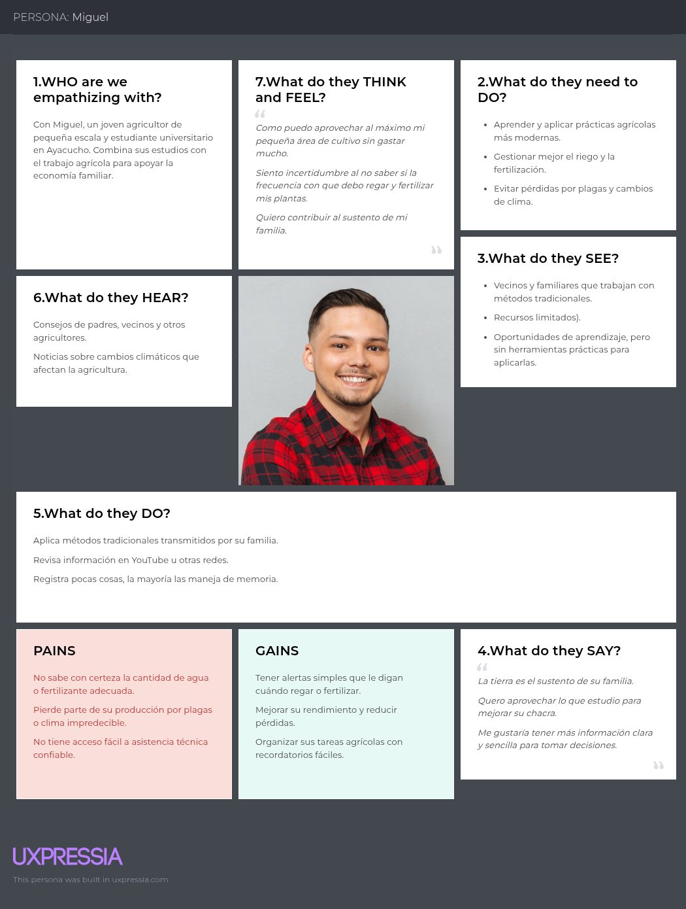
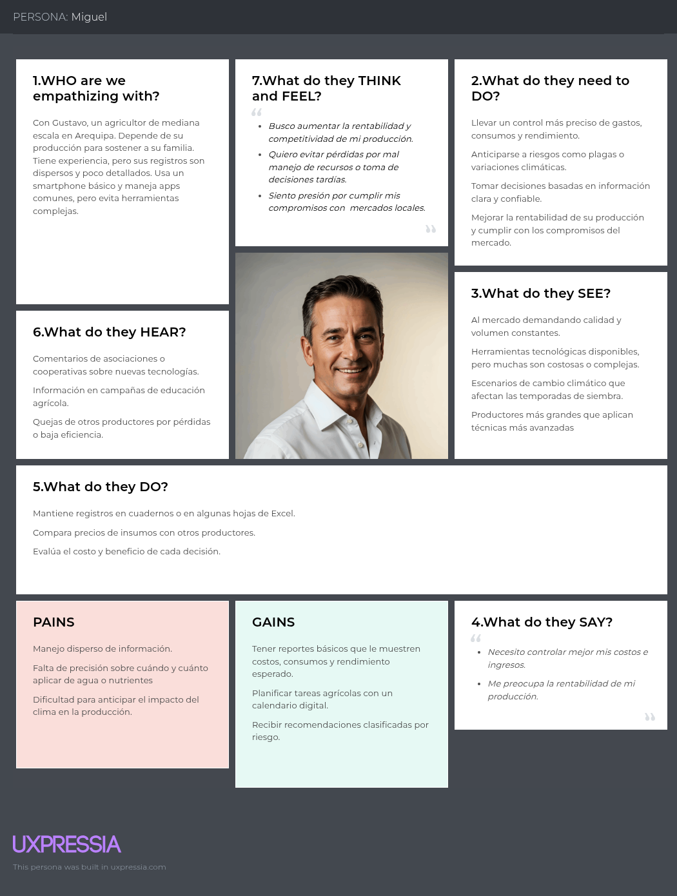
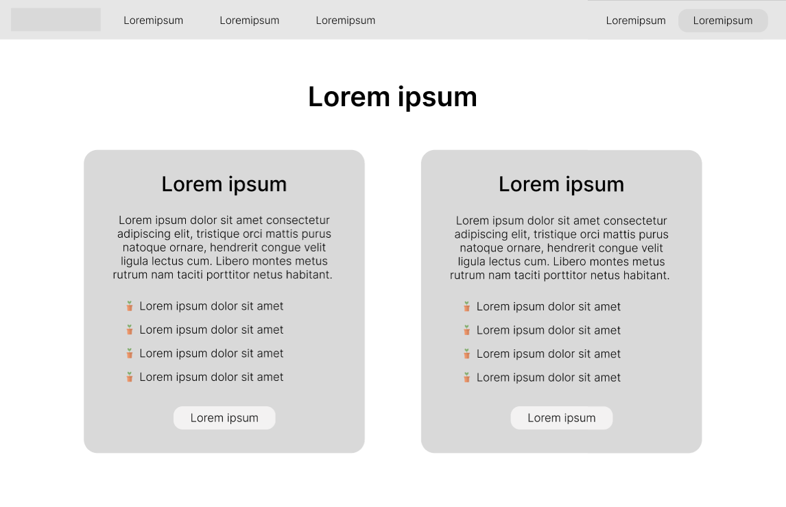
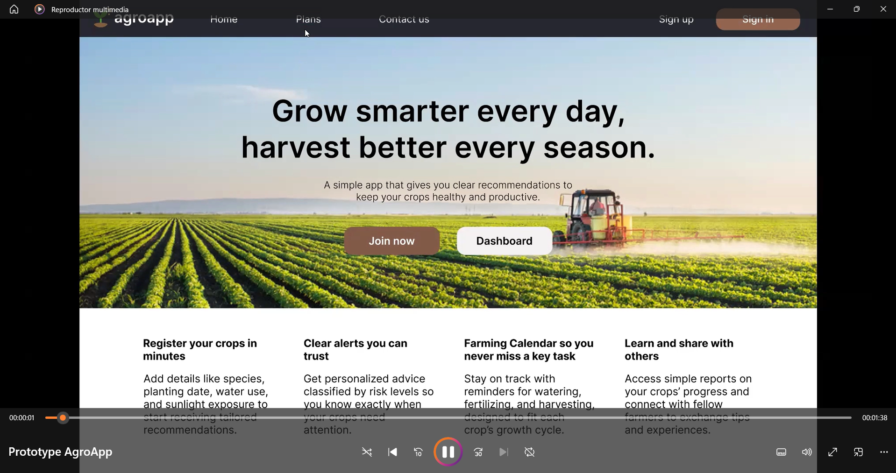
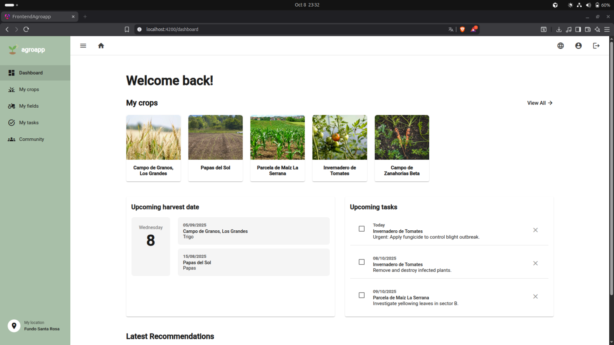
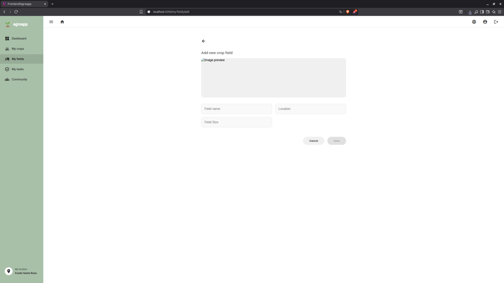

<div align="center">
   <div>

# <center>Informe del Trabajo Final</center>

   <br>
   <center></center>

   <br>
   <center>Universidad Peruana de Ciencias Aplicadas</center>

   <br>
   <center><b>Ingeniería de software</b></center>
   <br>

   <center><b>1ASI0729 Desarrollo de Aplicaciones Open Source</b></center>

   <br>
   <center><b>NRC:</b> 7351</center>
   <br>

   <center><b>Profesor:</b> Rafael Oswaldo Castro Veramendi </center>

   <br>
   <center><b>Nombre del StartUp:</b> AgroTech </center>
   <br>

   <center><b>Nombre del Producto:</b> AgroApp</center>

   </div>

   <br>

   <div align="center">

   <table style="margin-left: auto; margin-right: auto;">
   <tr>
   <th>Nombre</th>
   <th>Código</th>
   </tr>
   <tr>
   <td>Chirito Torres, Jose Raul</td>
   <td>U20201A293</td>
   </tr>
   <tr>
   <td>Ventosilla Trujillo, Anderson Ricardo</td>
   <td>U202319025</td>
   </tr>
   <tr>
   <td>Via Luna, Bruce </td>
   <td>U202313403</td>
   </tr>
   <tr>
   <td>Yalán Zhang, Angie Christina</td>
   <td>U202312504</td>
   </tr>

   </table>
   </div>

   <br>
   <center><b>Ciclo 2025-20</b></center>
   <br>

</div>

# Registro de Versiones del Informe

<div>

| Versión | Fecha      | Autores                            | Descripción de modificación                                                                           |
| ------- | ---------- | ---------------------------------- | ----------------------------------------------------------------------------------------------------- |
| 1.0     | 04/09/2025 | Angie, José, Sean, Anderson, Bruce | Creación del documento base en formato markdown                                                       |
| 1.1     | 07/09/2025 | Angie, Sean, Anderson, José, Bruce | Elaboración del Startup Profile y Antecedentes                                                        |
| 1.2     | 08/09/2025 | Angie, Sean, Anderson, José, Bruce | Desarrollo del Lean UX Process (Problem Statements, Assumptions, Hypothesis, Canvas)                  |
| 1.3     | 09/09/2025 | Angie, Sean, Anderson, José, Bruce | Diseño de entrevistas y registro de segmentos objetivo                                                |
| 1.4     | 11/09/2025 | Angie, Sean, Anderson, José, Bruce | Elaboración del Needfinding y primeras entrevistas                                                    |
| 1.5     | 14/09/2025 | Angie, Sean, Anderson, José, Bruce | Creación de diagramas de componentes y primeras correcciones                                          |
| 1.6     | 16/09/2025 | Angie, Sean, Anderson, José, Bruce | Desarrollo de Style Guidelines e Information Architecture (Labeling, SEO, Navigation, Searching)      |
| 1.7     | 17/09/2025 | Angie, Sean, Anderson, José, Bruce | Desarrollo de Landing Page (UI Design, Wireframes y Mock-ups)                                         |
| 1.8     | 18/09/2025 | Angie, Sean, Anderson, José, Bruce | Elaboración de Web Applications UX/UI Design y Wireframes                                             |
| 1.9     | 19/09/2025 | Angie, Sean, Anderson, José, Bruce | Desarrollo de Wireflow Diagrams, User Flow Diagrams y evidencia de Sprint 1                           |
| 2.01    | 20/09/2025 | Angie, Sean, Anderson, José, Bruce | Inclusión de conclusiones de Student Outcome, colaboración del equipo y despliegue de la Landing Page |
| 2.02    | 06/10/2025 | Angie, Anderson, José, Bruce | Implementación de Frontend - Sección Pets. Revisión de documentos.                         |
| 2.03    | 07/10/2025 | Angie, Anderson, José, Bruce | Agregar Sprint 2 |
| 2.04    | 08/10/2025 | Angie, Anderson, José, Bruce | Deploy de Frontend    |
| 3.01    | 09/11/2025 | Angie, Anderson, José, Bruce | Desarrollo del Backend    |
| 3.1    | 14/10/2025 | Angie, Anderson, José, Bruce | Deploy de Backend    |

</div>

# Project Report Collaboration Insights

URL del repositorio para el proyecto: https://github.com/AgroApp-UPC/Project-Report

**TB1**

Para el desarrollo del informe perteneciente a la entrega del TB1, se dividió la implementación de secciones de la siguiente forma para cada integrante del equipo:

| Integrantes         | Tareas Asignadas                                                                                                                                                                                                                |
| ------------------- |---------------------------------------------------------------------------------------------------------------------------------------------------------------------------------------------------------------------------------|
| José Chirito        | Competidores, tabla comparativa de análisis competitivo y estrategias y tácticas de la startup.                                                                                                                                 |
| Sean Palomares      | Entrevistas, Needfinding, Software configuration management, Sprint1                                                                                                                                                            |
| Anderson Ventosilla | Landing Page, deployment, entrevistas, sprint1                                                                                                                                                                                  |
| Bruce Via           | Domain Driven Design, diagrama de clases, diagrama de base de datos, event storming, users stories, impact mapping, product backlog                                                                                             |
| Angie Yalán         | Startup profile, solution profile, lean ux process, segmentos objetivos, diseño de entrevistas, style guidelines, information architecture, landing page UI design, web applications UX/UI Design, web applications prototyping |

**TP**

Para el desarrollo del informe perteneciente a la entrega del TB1, se dividió la implementación de secciones de la siguiente forma para cada integrante del equipo:

| Integrantes         | Tareas Asignadas                                                                                                                                                                                                                |
| ------------------- |---------------------------------------------------------------------------------------------------------------------------------------------------------------------------------------------------------------------------------|
| José Chirito        | Sección funcional del dashboard                                                                                                                                 |
| Anderson Ventosilla | Enrutamiento de secciones, diseño de pagina y deploy del Front-End                                                                                                                                                                                  |
| Bruce Via           | Sección "My Profile", "My Tasks", "Community", "My Fields", enrutamientos adicionales y sus funcionalidades                                                                                             |
| Angie Yalán         | Sección funcional "My Crops" |

**TB2**

Para el desarrollo del informe perteneciente a la entrega del TB1, se dividió la implementación de secciones de la siguiente forma para cada integrante del equipo:

| Integrantes         | Tareas Asignadas                                                                                                                                                                                                                |
| ------------------- |---------------------------------------------------------------------------------------------------------------------------------------------------------------------------------------------------------------------------------|
| José Chirito        | Bounded Context Profile y Communitty                                                                                                                             |
| Anderson Ventosilla |  Despliegue del Backend, base de datos, desarrollo del Bounded Contex CropFields, Task y Community                                                                                                                                                                                  |
| Bruce Via           | Bounded Context Profile                                                                                             |
| Angie Yalán         | Bounded Context Task y Field |

# Contenido

1. [Capítulo I: Introducción](#capítulo-i-introducción)<br>
   1.1. [Startup Profile](#11-startup-profile)<br>
   1.1.1. [Descripción de la Startup](#111-descripción-de-la-startup)<br>
   1.1.2. [Perfiles de integrantes del equipo](#112-perfiles-de-integrantes-del-equipo)<br>
   1.2. [Solution Profile](#12-solution-profile)<br>
   1.2.1 [Antecedentes y problemática](#121-antecedentes-y-problemática)<br>
   1.2.2 [Lean UX Process](#122-lean-ux-process)<br>
   1.2.2.1. [Lean UX Problem Statements](#1221-lean-ux-problem-statements)<br>
   1.2.2.2. [Lean UX Assumptions](#1222-lean-ux-assumptions)<br>
   1.2.2.3. [Lean UX Hypothesis Statements](#1223-lean-ux-hypothesis-statements)<br>
   1.2.2.4. [Lean UX Canvas](#1224-lean-ux-canvas)<br>
   1.3. [Segmentos objetivo](#13-segmentos-objetivo)<br>
2. [Capítulo II: Requirements Elicitation & Analysis](#capítulo-ii-requirements-elicitation--analysis)<br>
   2.1. [Competidores](#21-competidores)<br>
   2.1.1. [Análisis competitivo](#211-análisis-competitivo)<br>
   2.1.2. [Estrategias y tácticas frente a competidores](#212-estrategias-y-tácticas-frente-a-competidores)<br>
   2.2. [Entrevistas](#22-entrevistas)<br>
   2.2.1. [Diseño de entrevistas](#221-diseño-de-entrevistas)<br>
   2.2.2. [Registro de entrevistas](#222-registro-de-entrevistas)<br>
   2.2.3. [Análisis de entrevistas](#223-análisis-de-entrevistas)<br>
   2.3. [Needfinding](#23-needfinding)<br>
   2.3.1. [User Personas](#231-user-personas)<br>
   2.3.2. [User Task Matrix](#232-user-task-matrix)<br>
   2.3.3. [User Journey Mapping](#232-user-task-matrix)<br>
   2.3.4. [Empathy Mapping](#234-empathy-mapping)<br>
   2.3.5. [AS-IS Scenario Mapping](#235-as-is-scenario-mapping)<br>
   2.4. [Big Picture Event Storming](#24-big-picture-event-storming)<br>
   2.5. [Ubiquitous Language](#25-ubiquitous-language)<br>
3. [Capítulo III: Requirements Specification](#capítulo-iii-requirements-specification)<br>
   3.1. [TO-BE Scenario Mapping](#31-to-be-scenario-mapping)<br>
   3.2. [User Stories](#32-user-stories)<br>
   3.3. [Impact Mapping](#33-impact-mapping)<br>
   3.4. [Product Backlog](#34-product-backlog)<br>
4. [Capítulo IV: Product Design](#capítulo-iv-product-design)<br>
   4.1. [Style Guidelines](#41-style-guidelines)<br>
   4.1.1. [General Style Guidelines](#411-general-style-guidelines)<br>
   4.1.2. [Web Style Guidelines](#412-web-style-guidelines)<br>
   4.2. [Information Architecture](#42-information-architecture)<br>
   4.2.1. [Organization Systems](#421-organization-systems)<br>
   4.2.2. [Labeling Systems](#422-labeling-systems)<br>
   4.2.3. [SEO Tags and Meta Tags](#423-seo-tags-and-meta-tags)<br>
   4.2.4. [Searching Systems](#424-searching-systems)<br>
   4.2.5. [Navigation Systems](#425-navigation-systems)<br>
   4.3. [Landing Page UI Design](#43-landing-page-ui-design)<br>
   4.3.1. [Landing Page Wireframe](#431-landing-page-wireframe)<br>
   4.3.2. [Landing Page Mock-up](#432-landing-page-mock-up)<br>
   4.4. [Web Applications UX/UI Design](#44-web-applications-uxui-design)<br>
   4.4.1. [Web Applications Wireframes](#441-web-applications-wireframes)<br>
   4.4.2. [Web Applications Wireflow Diagrams](#442-web-applications-wireflow-diagrams)<br>
   4.4.2. [Web Applications Mock-ups](#442-web-applications-mock-ups)<br>
   4.4.3. [Web Applications User Flow Diagrams](#443-web-applications-user-flow-diagrams)<br>
   4.5. [Web Applications Prototyping](#45-web-applications-prototyping)<br>
   4.6. [Domain-Driven Software Architecture](#46-domain-driven-software-architecture)<br>
   4.6.1. [Design-Level Event Storming](#461-design-level-event-storming)<br>
   4.6.2. [Software Architecture Context Diagram](#462-software-architecture-context-diagram)<br>
   4.6.3. [Software Architecture Container Diagrams](#463-software-architecture-container-diagrams)<br>
   4.6.4. [Software Architecture Components Diagrams](#464-software-architecture-components-diagrams)<br>
   4.7. [Software Object-Oriented Design](#47-software-object-oriented-design)<br>
   4.7.1. [Class Diagrams](#471-class-diagrams)<br>
   4.8. [Database Design](#48-database-design)<br>
   4.8.1. [Database Diagram](#481-database-diagrams)<br>
5. [Capítulo V: Product Implementation, Validation & Deployment](#capítulo-v-product-implementation-validation--deployment)<br>
   5.1. [Software Configuration Management](#51-software-configuration-management)<br>
   5.1.1. [Software Development Environment Configuration](#511-software-development-environment-configuration)<br>
   5.1.2. [Source Code Management](#512-source-code-management)<br>
   5.1.3. [Source Code Style Guide & Conventions](#513-source-code-style-guide--conventions)<br>
   5.1.4. [Software Deployment Configuration](#514-software-deployment-configuration)<br>
   5.2. [Landing Page, Services & Applications Implementation](#52-landing-page-services--applications-implementation)<br>
   5.2.1. [Sprint 1](#521-sprint-1)<br>
   5.2.1.1. [Sprint Planning 1](#5211-sprint-planning-1)<br>
   5.2.1.2. [Aspect Leaders and Collaborators](#5212-aspect-leaders-and-collaborators)<br>
   5.2.1.3. [Sprint Backlog 1](#5213-sprint-backlog-1)<br>
   5.2.1.4. [Development Evidence for Sprint Review](#5214-development-evidence-for-sprint-review)<br>
   5.2.1.5. [Execution Evidence for Sprint Review](#5215-execution-evidence-for-sprint-review)<br>
   5.2.1.6. [Services Documentation Evidence for Sprint Review](#5216-services-documentation-evidence-for-sprint-review)<br>
   5.2.1.7. [Software Deployment Evidence for Sprint Review](#5217-software-deployment-evidence-for-sprint-review)<br>
   5.2.1.8. [Team Collaboration Insights during Sprint](#5218-team-collaboration-insights-during-sprint)<br>
   5.2.2. [Sprint 2](#522-sprint-2)<br>
   5.2.2.1. [Sprint Planning 2](#5221-sprint-planning-2)<br>
   5.2.2.2. [Aspect Leaders and Collaborators](#5222-aspect-leaders-and-collaborators)<br>
   5.2.2.3. [Sprint Backlog 2](#5223sprint-backlog-2)<br>
   5.2.2.4. [Development Evidence for Sprint Review](#5224development-evidence-for-sprint-review)<br>
   5.2.2.5. [Execution Evidence for Sprint Review](#5225execution-evidence-for-sprint-review)<br>
   5.2.2.6. [Services Documentation Evidence for Sprint Review](#5226services-documentation-evidence-for-sprint-review)<br>
   5.2.2.7. [Software Deployment Evidence for Sprint Review](#5227software-deployment-evidence-for-sprint-review)<br>
   5.2.2.8. [Team Collaboration Insights during Sprint](#5228team-collaboration-insights-during-sprint)<br>
   5.2.3. [Sprint 3](#523-sprint-3)<br>
   5.2.3.1. [Sprint Planning 3](#5231-sprint-planning)<br>
   5.2.3.2. [Aspect Leaders and Collaborators](#5232-aspect-leaders-and-collaborators)<br>
   5.2.3.3. [Sprint Backlog 3](#5223sprint-backlog-2)<br>
   5.2.3.4. [Development Evidence for Sprint Review](#5234-development-evidence-for-sprint-review)<br>
   5.2.3.5. [Execution Evidence for Sprint Review](#5235-execution-evidence-for-sprint-review)<br>
   5.2.3.6. [Services Documentation Evidence for Sprint Review](#5236-services-documentation-evidence-for-sprint-review)<br>
   5.2.3.7. [Software Deployment Evidence for Sprint Review](#5237-software-deployment-evidence-for-sprint-review)<br>
   5.2.3.8. [Team Collaboration Insights during Sprint](#5238-team-collaboration-insights-during--sprint)<br>
   5.3. [Validation Interviews](#53-validation-interviews)<br>
   5.3.1 [Diseño de Entrevistas](#531-diseño-de-entrevistas)<br>
   5.3.2 [Registro de Entrevistas](#532-registro-de-entrevistas)<br>
   5.3.3 [Evaluación según heurísticas](#533-evaluaciones-según-heurísticas)<br>
   5.4. [Video About-the-Product](#54-video-about-the-product)<br>
6. [Conclusiones](#conclusiones)<br>
   6.1 [Conclusiones y recomendaciones](#61-conclusiones-y-recomendaciones)<br>
   6.2. [Video About-the-Team](#62-video-about-the-team)<br>
7. [Bibliografía](#bibliografía)<br>
8. [Anexos](#anexos)<br>

# Student Outcome

| Criterio específico                                                   | Acciones realizadas                                                                                                                                                                                                                                                                                                                                                                                                                                                                                                                                                                                                                                                                                                                                                                                                                                                                                                                                                                                                                                                                                                                                                                                                                                                   | Conclusiones |
| --------------------------------------------------------------------- |-----------------------------------------------------------------------------------------------------------------------------------------------------------------------------------------------------------------------------------------------------------------------------------------------------------------------------------------------------------------------------------------------------------------------------------------------------------------------------------------------------------------------------------------------------------------------------------------------------------------------------------------------------------------------------------------------------------------------------------------------------------------------------------------------------------------------------------------------------------------------------------------------------------------------------------------------------------------------------------------------------------------------------------------------------------------------------------------------------------------------------------------------------------------------------------------------------------------------------------------------------------------------|--------------|
| Comunica oralmente con efectividad a diferentes rangos de audiencia   | **José Chirito** <br>TB1: De manera efectiva comuniqué los hallazgos del análisis competitivo de AgroApp frente a otros competidores, según la audiencia. <br>TP: Mis numerosos commits indican mi dedicación y enfoque intensivo en áreas clave como el dashboard. Esta inmersión me convierte en el experto del componente. Cuando hablo, puedo dar detalles precisos y exhaustivos sobre esa parte del sistema, lo cual es invaluable. Mi consistencia en el trabajo se traduce en una comunicación confiable; si yo digo que algo está cubierto, lo está.<br>TB2:José fue una pieza clave en la fundación técnica del backend. Como líder de la conexión a la base de datos, sus commits (JPA, auditing, refactors, e inicio del proyecto) demuestran un trabajo profundo en la arquitectura inicial. Completó con éxito su tarea de responsive design<br> <br>**Sean Palomares** <br>TB1: Realize entrevistas mediante las cuales pude comunicarme con nuestros segmentos objetivos para obtener información valiosa para el desarrollo del proyecto. <br><br> **Anderson Ventosilla** <br>TB1: Me encargué de implementar la Landing Page utilizando Astro, asegurando una estructura clara y adaptable. También configuré el repositorio en GitHub dentro de la organización y trabajé en una rama específica para mantener un flujo ordenado de cambios. Finalmente, realicé el despliegue en Vercel, explicando el proceso al equipo para garantizar la comprensión de los resultados.<br>TP: Al nombrar mis características correctamente, muestro que tengo una visión clara del alcance y la funcionalidad. Esta habilidad se traduce en una comunicación oral altamente estructurada y estratégica. Cuando hablo, no solo informo lo que estoy haciendo, sino que explico cómo mi pieza encaja en el rompecabezas general de la aplicación, lo cual es esencial para hablar con éxito con líderes de proyecto, compañeros y audiencias no técnicas. <br>TB2:Cumplió con éxito sus dos objetivos principales. Como líder en el desarrollo de endpoints, sus commits (Implement crop fields, Implement community posts) muestran su contribución directa a la creación de Bounded Contexts.<br><br> **Bruce Via** <br>TB1: Mediante las entrevistas presentadas logra comunicar correctamente la idea de nuestro produto a los segmentos objetivos <br> TP: Demuestra una alta capacidad de síntesis y enfoque, organice mis pensamientos de manera clara y metódica, habilidad clave para explicar conceptos complejos oralmente a cualquier audiencia. Su trabajo con merges indica que coordina múltiples hilos de desarrollo, lo que requiere comunicación oral efectiva para alinear equipos.<br> TB2: Bruce demostró una productividad y fiabilidad excepcionales. No solo actuó como organizador (Preparó el Sprint Planning), sino que completó el 100% de sus tareas asignadas<br><br> **Angie Yalán** <br>TB1: Fortalecí mi comunicación oral principalmente al realizar entrevistas a los segmentos objetivo. Adapté mi lenguaje para generar confianza con los agricultores y obtener información clara, lo que permitió validar necesidades reales y enriquecer el diseño de la solución. <br> TP: Mi foco está en la entrega y la acción. Aunque mi mensaje de commit es sencillo, refleja que mi prioridad es completar la tarea y ponerla a disposición. Oralmente, me gusta ser directo y centrado en la solución. Mi estilo de comunicación es ideal para discusiones rápidas donde la toma de decisiones y la eficiencia son lo más importante.<br>TB2: Fue responsable de entregar el CRUD de "Crops" (US-05, 06, 07), una funcionalidad central. Su historial de commits es el más activo, lo que sugiere que además de desarrollar sus propias tareas, asumió un rol clave en la integración, documentación y fusión de ramas ("Merge branch...", "docs: add bounded context..."), asegurando la cohesión del código. | **TB1:** Como equipo, fortalecimos nuestra comunicación oral adaptándola a distintos contextos y audiencias. Desde la presentación de análisis competitivos y la explicación técnica de procesos, hasta la realización de entrevistas con segmentos objetivos, logramos transmitir ideas con claridad y generar confianza. Esto nos permitió obtener información valiosa, validar la propuesta de AgroApp y asegurar que cada integrante aportara a la construcción de un mensaje efectivo y comprensible para públicos diversos.   <br><br> **TP:** Demostramos una habilidad clave para pensar de forma estructurada (evidente en cómo nombramos nuestros cambios), lo que nos permite explicar el 'por qué' del trabajo a cualquier audiencia, desde la gerencia hasta los miembros nuevos. Tenemos expertos que hablan con precisión sobre los detalles técnicos (el dashboard), y otros que se enfocan en la acción directa <br><br> **TB2:** El equipo demostró una productividad excepcional durante el Sprint 3, logrando el objetivo principal de implementar y desplegar la "real API". Hubo una especialización de roles muy efectiva: los miembros responsables de las funcionalidades centrales (CRUDs) completaron el 100% de sus tareas, mientras que otro miembro aseguró la entrega de la infraestructura crítica (despliegue de la base de datos). Un integrante también asumió un rol vital de integración y documentación, gestionando la cohesión del código. La ejecución fue casi perfecta, siendo el único bloque de trabajo incompleto el módulo de autenticación de usuarios, que queda como la principal deuda técnica para el siguiente sprint. |
| Comunica por escrito con efectividad a diferentes rangos de audiencia | **José Chirito** <br>TB1: Mediante escrito realicé de manera clara y estructurada el análisis competitivo a distinto público y audiencia. <br>TP: Me aseguro de que el historial de cambios refleje mi ritmo de trabajo constante y mi compromiso con la integración continua. Al hacer muchos commits pequeños (Update dashboard...), estoy comunicando que hago las cosas poco a poco y de forma incremental. Esto facilita enormemente la revisión del código y minimiza el riesgo de introducir errores grandes, demostrando una responsabilidad continua con la estabilidad del proyecto.<br>TB2:José fue una pieza clave en la fundación técnica del backend. Como líder de la conexión a la base de datos, sus commits (JPA, auditing, refactors, e inicio del proyecto) demuestran un trabajo profundo en la arquitectura inicial. Completó con éxito su tarea de responsive design<br> <br>**Sean Palomares** <br>TB1: Haciendo uso de la información recolectada por el equipo durante las entrevistas hice el needfinding para conocer mejor a nuestros segmentos objetivos. <br><br> **Anderson Ventosilla** <br>TB1: Implementé la documentación del proceso de despliegue en Vercel, detallando paso a paso las acciones realizadas y describiendo la configuración de la Landing Page. Me aseguré de que la información fuera clara, precisa y comprensible para todo el equipo. <br>TP: Mi comunicación escrita es mi mayor fortaleza: soy preciso, profesional y me adhiero a los estándares (feat(auth), feat(dashboard)). Esto me permite ser inmediatamente efectivo con mi audiencia técnica.<br>TB2:Cumplió con éxito sus dos objetivos principales. Como líder en el desarrollo de endpoints, sus commits (Implement crop fields, Implement community posts) muestran su contribución directa a la creación de Bounded Contexts.<br><br> **Bruce Via** <br>TB1: Gracias a la documentación y correcta demostración escrita, se muestra la efectividad de nuestra aplicación mediante actividades como historias de usuario o diagramas de clase<br>TP: Mis mensajes prueban mi disciplina y mi respeto por las buenas prácticas. Me aseguro de que mi audiencia técnica reciba información concisa y utilizable. Al usar prefijos y mensajes claros, estoy comunicando inmediatamente el qué y el por qué de mi trabajo, ahorrándole tiempo a cualquiera que revise el historial. Priorizo la claridad técnica en mi comunicación escrita.<br> TB2: Bruce demostró una productividad y fiabilidad excepcionales. No solo actuó como organizador (Preparó el Sprint Planning), sino que completó el 100% de sus tareas asignadas<br> <br>**Angie Yalán** <br>TB1: La elaboración de documentos como el Startup Profile y el Product Design me permitió comunicar por escrito de forma clara y estructurada. Usé un estilo técnico en los apartados académicos y uno más simple y persuasivo al destacar los beneficios de AgroApp para distintos públicos. <br> TP: Mi enfoque es simple: "El trabajo está hecho y disponible." Estoy comunicando mi compromiso con la finalización de mis tareas y garantizo que mi código está listo para el siguiente paso del proceso. Esto da confianza al equipo y a la gerencia de que el proyecto sigue avanzando sin retrasos.<br>TB2: Fue responsable de entregar el CRUD de "Crops" (US-05, 06, 07), una funcionalidad central. Su historial de commits es el más activo, lo que sugiere que además de desarrollar sus propias tareas, asumió un rol clave en la integración, documentación y fusión de ramas ("Merge branch...", "docs: add bounded context..."), asegurando la cohesión del código.                                                                         | **TB1:** Como grupo, demostramos efectividad en la comunicación escrita al producir documentos claros y estructurados que se adaptaron a distintos públicos. Desde análisis competitivos, needfinding y documentación técnica, hasta perfiles y diseños persuasivos, logramos transmitir tanto aspectos académicos como prácticos. Esto permitió al equipo organizar la información, dejar evidencia de los procesos y presentar AgroApp de manera comprensible y convincente para diversas audiencias.  <br><br> **TP:** Nuestro enfoque en los estándares profesionales asegura que nuestros mensajes son trazables y concisos. Comunicamos de manera efectiva no solo lo que hicimos, sino el valor funcional que agregamos (como implementar una UI completa). Lo más importante es que nuestra consistencia y transparencia en los registros de trabajo crean un historial fiable <br><br> **TB2:** El equipo demostró una productividad excepcional durante el Sprint 3, logrando el objetivo principal de implementar y desplegar la "real API". Hubo una especialización de roles muy efectiva: los miembros responsables de las funcionalidades centrales (CRUDs) completaron el 100% de sus tareas, mientras que otro miembro aseguró la entrega de la infraestructura crítica (despliegue de la base de datos). Un integrante también asumió un rol vital de integración y documentación, gestionando la cohesión del código. La ejecución fue casi perfecta, siendo el único bloque de trabajo incompleto el módulo de autenticación de usuarios, que queda como la principal deuda técnica para el siguiente sprint. |

# Capítulo I: Introducción

## 1.1. Startup Profile

### 1.1.1. Descripción de la Startup

AgroTech es una startup tecnológica orientada a la transformación digital del sector agrícola en el Perú. Nuestro principal producto, AgroApp, es una aplicación web responsive que busca empoderar a agricultores con poca o media experiencia, brindándoles recomendaciones inteligentes, soporte comunitario e integración con dispositivos IoT. Con agroApp, el agricultor podrá mejorar el rendimiento de sus cultivos gracias a un seguimiento personalizado y accesible desde cualquier dispositivo.

**Misión:**

Impulsar la transformación digital del sector agrícola brindando a los agricultores herramientas tecnológicas accesibles e inteligentes, que les permitan optimizar el rendimiento de sus cultivos mediante recomendaciones personalizadas, integración con IoT y un enfoque sostenible orientado a mejorar su calidad de vida.

**Visión:**

Ser la plataforma líder en soluciones digitales agrícolas en Latinoamérica, reconocida por democratizar el acceso a la tecnología en el campo y contribuir a la seguridad alimentaria a través de la innovación, la sostenibilidad y el fortalecimiento de los pequeños y medianos agricultores.

### 1.1.2. Perfiles de los integrantes del equipo

| Perfil                                                                                                                                                                                                                                                                                                                                                                                                                                                                  | Foto                                                                                     |
| ----------------------------------------------------------------------------------------------------------------------------------------------------------------------------------------------------------------------------------------------------------------------------------------------------------------------------------------------------------------------------------------------------------------------------------------------------------------------- | ---------------------------------------------------------------------------------------- |
| **Sean Palomares:**<br>Mi nombre es Sean Palomares, tengo 22 años y estudio la carrera de Ingeniería de Software. Tengo conocimiento en lenguajes como C#, C++, Python y bases de datos en MySQL. Me considero una persona positiva, tolerante y creativa, cualidades que me permiten adaptarme con facilidad a diferentes entornos de trabajo. Disfruto colaborar en equipo, compartir ideas y contribuir con una visión común para alcanzar los objetivos propuestos. |                  |
| **Jose Chirito:** <br> Mi nombre es Jose Chirito, tengo 23 años y estudio la carrera de Ingeniería de Software.También tengo conocimiento en varios lenguajes de programación. Y considero que aprendo rápido los temas y el trabajo grupal.                                                                                                                                                                                                                            |              |
| **Bruce Via:** <br> Mi nombre es Bruce Via, tengo 20 años y soy estudiante de la carrera de ingeniería de Software. Me considero uan persona que muestra un interés desmedido cuando lo que hago resulta agradable, dispuesto a aprender nuevos conocimientos incluso si no es necesario, ademas de siempre intentar mejorar en lo que hago demostrando iniciativo                                                                                                      |             |
| **Angie Yalán:**<br> Mi nombre es Angie Yalán. Soy estudiante de la carrera Ingeniería de Software y tengo 19 años. Me considero una persona proactiva que le gustan nuevas experiencias y aprender cosas diferentes. Sigo en el proceso de mejora en cuanto a la programación y cuento con toda la iniciativa para ser cada día mejor en ello.                                                                                                                         |             |
| **Anderson Ventosilla:**<br>Mi nombre es Anderson , tengo 21 años , soy estudiante de Ingeniería de Software, apasionado por la tecnología desde muy pequeño. Cuento con conocimientos en el desarrollo frontend y backend, lo que me permite desenvolverme en proyectos de manera integral. Mi interés está en seguir aprendiendo e ir mejorando mis habilidades dia a dia.                                                                                            |  |

## 1.2. Solution Profile

AgroApp es una aplicación web diseñada para apoyar a agricultores de pequeña y mediana escala en la gestión de sus cultivos, mediante un sistema de recomendaciones inteligentes basadas en datos ingresados por el usuario, y más adelante, e información recolectada a través de sensores IoT de humedad y luz solar. La plataforma permite registrar cultivos, monitorear variables clave como riego, nutrientes y exposición solar, y recibir alertas clasificadas por nivel de riesgo (bajo, medio, alto). De esta manera, AgroApp busca democratizar el acceso a la tecnología agrícola, optimizar el rendimiento de los cultivos y contribuir a la sostenibilidad del sector agropecuario en el Perú.

### 1.2.1 Antecedentes y problemática

Los agricultores de pequeña y mediana escala enfrentan barreras tecnológicas y de acceso a información que limitan el rendimiento de sus cultivos y su competitividad en el mercado. La falta de herramientas digitales simples y adaptadas a su realidad conlleva a decisiones empíricas, baja eficiencia en el uso de recursos y pérdidas económicas significativas. AgroApp surge como una solución tecnológica accesible, que integra datos ingresados por el usuario y sensores IoT, para generar recomendaciones claras y prácticas que fortalezcan la sostenibilidad del sector agrícola.
<br><br>
Según Lean Construction México, la técnica de las 5W's y 2H's facilita la creación y desarrollo de un plan de acción o estrategia detallada (Alvarez, 2020). A raíz de esto, resultará útil para nuestro contexto dado que nos permitirá entender y analizar a mayor profundidad las necesidades de los usuarios. Por ende, se recopiló información mediante esta técnica, la cual se presentará a continuación.

**What(Qué)**

##### ¿Cuál es el problema?

Los agricultores de pequeña y mediana escala carecen de herramientas digitales para monitorear y gestionar adecuadamente sus cultivos, lo que ocasiona baja productividad, uso ineficiente de recursos (agua, nutrientes, luz solar) y pérdidas económicas.

##### ¿Cuál es la relación con la persona en cuestión?

El agricultor es el usuario principal afectado, ya que depende de la productividad de sus cultivos para garantizar su sustento y competitividad en el mercado.

**Who (Quién)**

##### ¿Quiénes están involucrados?

Agricultores de pequeña y mediana escala, familiares de los agricultores que participan en la producción, y organizaciones vinculadas al sector agrícola (cooperativas, asociaciones).

##### ¿A quiénes le sucede el problema?

Principalmente a agricultores con poca o media experiencia técnica que no cuentan con sistemas de gestión agrícola digitalizados y que dependen de prácticas tradicionales o empíricas.

**Where (Dónde)**

##### ¿En dónde ocurre el problema?

En zonas rurales y periurbanas del Perú (sierra, selva y valles interandinos), donde se concentra la agricultura familiar y la producción de alimentos básicos para el mercado nacional.

**When (Cuándo)**

##### ¿Cuándo sucede el problema?

A lo largo de todo el ciclo del cultivo (siembra, crecimiento, maduración y cosecha), siendo más crítico en las etapas de riego, fertilización y control de plagas.

##### ¿Cuándo utiliza el cliente el producto?

El cliente usa agroApp desde el inicio del registro de sus cultivos y de manera recurrente durante el crecimiento para recibir alertas, registrar datos y consultar recomendaciones.

**Why (Por qué)**

##### ¿Cuál es la causa del problema?

La falta de acceso a información confiable, el uso empírico de prácticas agrícolas y la ausencia de herramientas tecnológicas adaptadas a la realidad de pequeños y medianos agricultores, que permitan optimizar el uso de recursos y aumentar la productividad.

**How (Cómo)**

##### ¿En qué condiciones los clientes usan nuestro producto?

En campo, utilizando dispositivos móviles con acceso a internet móvil (3G/4G) o en sus hogares cuando tienen acceso a conexión WiFi. Usan agroApp de forma sencilla e intuitiva, adaptada a sus conocimientos básicos de tecnología.

**How much (Cuánto)**

##### Estadísticas que sustentan la problemática.

- El 97 % de las unidades agropecuarias en el Perú son de agricultura familiar (Castillo, 2021).
- El sector es responsable de cerca del 70 % de los alimentos consumidos en el país (Castillo,2021).
- "Las mayores pérdidas ocurren en la fase de producción 28%, cosecha y almacenamiento 22%, distribución 17%, procesamiento 6%" (Gob, 2019).
- Según la INEI (2023), "En el año 2022, el 3,8% del total de los/las productores/as manifestaron haber recibido asistencia técnica.
  Sin embargo, en el año 2014, el valor fue de 9,2% lo que evidencia una disminución de productores/as
  asistidos/as en el periodo de análisis"


<div align=center>

  

</div>

### 1.2.2 Lean UX Process.

#### 1.2.2.1. Lean UX Problem Statements.

- **Domain (Dominio):**

  El sector agrícola en el Perú, enfocado en agricultores de pequeña y mediana escala que representan la mayoría de las unidades agropecuarias y son responsables de gran parte de la producción de alimentos.

* **Customer Segments (Segmentos de clientes):**
  - Agricultores de pequeña escala (subsistencia/autoconsumo).
  - Agricultores de mediana escala (producción comercial local/regional).

- **Pain Points (Puntos de dolor):**
  - Dificultad para tomar decisiones informadas sobre riego, nutrientes y cuidados del cultivo.
  - Pérdidas de rendimiento debido a prácticas empíricas o poco técnicas.
  - Falta de herramientas digitales simples, adaptadas a la realidad rural.
  - Baja adopción tecnológica por interfaces poco amigables o complejas.

* **Gap (Brecha):**

  Actualmente, no existen soluciones digitales ampliamente accesibles y adaptadas al contexto de pequeños y medianos agricultores peruanos que combinen registro de cultivos, recomendaciones personalizadas y alertas de riesgo en una sola plataforma.

- **Visión / Strategy (Visión / Estrategia):**

  Crear una aplicación web responsiva y accesible que brinde recomendaciones personalizadas y fáciles de entender, con base en datos ingresados por los agricultores, permitiendo mejorar la productividad de sus cultivos y optimizar el uso de recursos, contribuyendo así a la sostenibilidad del sector agrícola.

* **Initial Segment (Segmento inicial):**

  Agricultores de pequeña escala, y posteriormente, agricultores de mediana escala con mayores necesidades de gestión.

#### 1.2.2.2. Lean UX Assumptions.

##### 1.2.2.2.1. Features

- Registro de usuario con datos básicos (nombre, número celular, correo, contraseña).
- Registro de cultivos (especie, fecha de plantación, tipo de suelo, cantidad de agua, exposición solar).
- Recomendaciones personalizadas clasificadas por nivel de riesgo (bajo, medio, alto).
- Sistema de alertas y recordatorios automáticos (ejemplo: “riego insuficiente”, “suelo pobre en nutrientes”).
- Calendario de cultivo (recordatorios de riego, fertilización y fumigación).
- Comunidad interna con consejos y experiencias compartidas entre agricultores.
- Reportes básicos de rendimiento y uso de recursos (para agricultores medianos).
- Landing Page informativa y consistente con la Web Application.

##### 1.2.2.2.2. Business Outcomes

- Adopción inicial de la plataforma por agricultores pequeños, al ofrecer una app simple, visual y fácil de usar.
- Retención de usuarios gracias a las alertas y recordatorios que generan valor en la rutina agrícola.
- Escalabilidad del negocio con la incorporación de agricultores medianos interesados en funcionalidades avanzadas (reportes y gestión de datos).
- Generación de ingresos a futuro mediante planes premium para acceso a reportes detallados o funcionalidades adicionales.
- Posicionamiento de marca como una solución digital confiable y accesible para la agricultura familiar y comercial en el Perú.

##### 1.2.2.2.3. User Benefits

- Para agricultores de pequeña escala:
  - Recibir recomendaciones claras y fáciles de entender.
  - Anticiparse a problemas comunes (falta de agua, suelo pobre en nutrientes).
  - Tener un calendario sencillo que les recuerde las tareas agrícolas más importantes.
  - Mejorar el rendimiento de sus cultivos con prácticas simples y accesibles.

* Para agricultores de mediana escala:
  - Registrar y organizar datos de sus cultivos en un solo lugar.
  - Generar reportes básicos para tomar decisiones más informadas.
  - Optimizar el uso de recursos (agua, fertilizantes).
  - Reducir pérdidas y aumentar la rentabilidad de sus cosechas.

¿Quién es el usuario?

- Agricultores de pequeña escala (subsistencia/autoconsumo) que buscan recomendaciones simples y fáciles de aplicar.
- Agricultores de mediana escala (producción comercial/regional) que necesitan un mayor control de datos y reportes para optimizar la productividad de sus cultivos.

¿Dónde encaja nuestro producto en su trabajo o vida?

- En las tareas diarias de cultivo, como riego, fertilización y control básico de plagas.
- Como apoyo digital que complementa el conocimiento empírico, brindando alertas y recordatorios.
- En la planificación de cultivos, ya que permite organizar fechas de siembra, fertilización y cosecha.

¿Qué problemas tiene nuestro producto que resolver?

- La falta de información clara y personalizada sobre cómo cuidar cada cultivo.
- El manejo empírico y poco técnico que ocasiona pérdidas en la producción.
- La ausencia de herramientas accesibles para registrar y organizar información de forma digital.

¿Cuándo y cómo es nuestro producto usado?

- Cuándo: Durante todo el ciclo del cultivo, desde la siembra hasta la cosecha, especialmente en momentos críticos de riego y fertilización.

- Cómo:
  - Agricultores pequeños → ingresan datos básicos en la app y reciben recomendaciones simples y alertas visuales.
  - Agricultores medianos → registran datos con más detalle y consultan reportes para tomar decisiones productivas.

¿Qué características son importantes?

- Registro de cultivos y datos básicos (especie, suelo, agua, luz solar).
- Recomendaciones personalizadas clasificadas por nivel de riesgo.
- Alertas y recordatorios automáticos.
- Reportes básicos de rendimiento y recursos (para agricultores medianos).
- Interfaz sencilla, intuitiva y responsive para móvil y web.
- Comunidad de consejos y experiencias compartidas.

¿Cómo debe verse nuestro producto y comportarse?

- Diseño:
  - Minimalista, visual y fácil de usar.
  - Uso de colores asociados a estados de riesgo (verde, amarillo, rojo).
  - Adaptable a dispositivos móviles y de bajo costo.
- Comportamiento:
  - Rápido y fluido, con tiempos de carga mínimos.
  - Intuitivo: con pocos pasos para registrar un cultivo o ver recomendaciones.
  - Confiable: que no pierda datos aunque el acceso a internet sea intermitente.

#### 1.2.2.3. Lean UX Hypothesis Statements.

1. **Creemos que** proporcionar una aplicación simple y visual, con recomendaciones básicas y alertas claras clasificadas por nivel de riesgo (bajo, medio, alto), ayudará a los agricultores pequeños a cuidar mejor sus cultivos y evitar pérdidas por riego o nutrientes inadecuados.

   **Sabremos que** estamos bien cuando veamos que los agricultores ingresan sus datos al menos una vez por semana, reportan en encuestas que entienden fácilmente las alertas y / o se registra un aumento del 15% en la retención mensual de usuarios pequeños.

2. **Creemos que** ofrecer funciones de registro de datos y generación de reportes básicos permitirá a los agricultores medianos optimizar el uso de agua y nutrientes, mejorar el rendimiento de sus cultivos y aumentar su rentabilidad.

   **Sabremos que** estamos bien cuando veamos que los agricultores medianos generan al menos un reporte por mes, mencionan en encuestas que los reportes influyen en sus decisiones, y / o se registra un aumento del 20% en la productividad percibida en los primeros 6 meses de uso.

3. **Creemos que** una interfaz limpia, responsiva y optimizada para smartphones garantizará que tanto agricultores pequeños como medianos utilicen la aplicación de manera intuitiva durante sus actividades diarias en el campo.

   **Sabremos que** estamos bien cuando el feedback de usuarios describa la aplicación como “fácil de usar” o “rápida” en encuestas post-uso y / o la tasa de abandono sea menor al 10% y / o la calificación promedio supere 4.3 en las tiendas de apps.

4. **Creemos que** integrar un espacio comunitario donde agricultores compartan consejos y experiencias fomentará la confianza entre usuarios y aumentará la interacción dentro de la plataforma.

   **Sabremos que** estamos bien cuando veamos publicaciones de usuarios en la comunidad al menos una vez por semana y / o un 25% de los usuarios activos participen comentando o reaccionando en la comunidad y / o recibamos feedback positivo sobre el aprendizaje obtenido de otros agricultores.

#### 1.2.2.4. Lean UX Canvas.


## 1.3. Segmentos objetivo.

### Segmento objetivo #1: Agricultores de pequeña escala (subsistencia y autoconsumo)

Agricultores con terrenos menores a 5 hectáreas, generalmente familiares, que producen para autoconsumo y venta local en mercados.

#### Aspectos Demográficos:

- **Rango de edad:** 25 a 50 años
- **Sexo:** Hombres y mujeres (con ligera predominancia masculina en zonas rurales)
- **Nivel socioeconómico:** Bajo y medio-bajo

#### Aspectos Geográficos:

- **Nacionalidad:** Peruana
- **Zona geográfica de residencia:** Rural y periurbana
- **Departamento:** Principalmente en la Sierra (Ayacucho, Cusco, Cajamarca, Puno) y en zonas de la Selva (San Martín, Ucayali)

#### Aspectos Psicográficos

- Valoración de la tierra como principal fuente de sustento.
- Orientados al autoconsumo y a la venta en ferias o mercados locales.
- Limitada experiencia en el uso de aplicaciones digitales.
- Buscan soluciones prácticas, fáciles de entender y de bajo costo.
- Uso tecnológico: Acceso limitado a smartphones de gama media y conectividad 3G/4G.

### Segmento objetivo #2: Agricultores de mediana escala (producción comercial local y regional)

Agricultores con terrenos entre 5 y 20 hectáreas que producen cultivos para abastecer mercados regionales o cadenas de supermercados.

#### Aspectos Demográficos:

- **Rango de edad:** 30 a 55 años
- **Sexo:** Hombres y mujeres, con tendencia masculina en roles de decisión
- **Nivel socioeconómico:** Medio y medio-alto dentro del sector agrícola

#### Aspectos Geográficos:

- **Nacionalidad:** Peruana
- **Zona geográfica de residencia:** Zonas rurales y valles interandinos con acceso a mercados regionales
- **Departamento:** Principalmente en la Costa (La Libertad, Ica, Lambayeque, Piura) y valles de la Sierra (Arequipa, Junín)

#### Aspectos Psicográficos:

- Mayor orientación a la productividad y al mercado.
- Buscan optimizar el rendimiento de sus cultivos y reducir pérdidas.
- Tienen más apertura al uso de aplicaciones y tecnología digital.
- Interés en herramientas que les permitan organizar datos y tomar decisiones basadas en información.
- Uso tecnológico: Mayor acceso a dispositivos móviles modernos y disposición a usar apps para mejorar productividad.

# Capítulo II: Requirements Elicitation & Analysis

## 2.1. Competidores.

En el Perú existe distintos tipos de de startups y plataformas en desarrollo similares a Agroapp .
<br><br>
A continuacion se mostrará los competidores directos :

### 1. Sapce AG

Utiliza drones e intelingencia artificial para el desarrollo de sus cultivos e incluso los monitorea mediante imágenes satelitales.

### Segmento objetivo:

Agricultores de mediana y gran escala

### Aspectos Demograficos:

- **Rango de edad:** 35 a 60 años
- **Sexo:** Predomina las deciciones tomadas por sexo masculinon
- **Nivel socioeconómico:** Medio y medio-alto vinculados a agronegocios

#### Aspectos Geográficos:

- **Nacionalidad:** Peruana
- **Zona geográfica de residencia:** Zonas rurales , cerca de mercados de exportacion y agroindustrias
- **Departamento:** En la costa norte y sur (La Libertad, Ica, Lambayeque, Piura)

#### Aspectos Psicográficos:

- Mayor orientación eficiencia y rentabilidad
- Busca invertir tecnología avanzada para maximizar exportaciones
- Tienen presupuesto para pagar soluciones premium de alto valor agregado
- Apertura para nuevas innovaciones digitales
  <br><br>

### 2. Agros

Conecta a agricultores con financiamiento , proveedores e incluso insumos agricolas

### Segmento objetivo:

Agricultores de pequeña y mediana escala

### Aspectos Demograficos:

- **Rango de edad:** 25 a 50 años
- **Sexo:** Hombres y mujeres con más participacion femenina
- **Nivel socioeconómico:** Bajo, medio-bajo y medio

#### Aspectos Geográficos:

- **Nacionalidad:** Peruana
- **Zona geográfica de residencia:** Zonas rurales, conectados con cooperativas agrícolas
- **Departamento:** En la sierra y selva (Cusco, Ayacucho, San Martin , Aucayali)

#### Aspectos Psicográficos:

- Interés con ingresos de financiamiento y capacitacion
- Buscan soluciones para mejorar la seguridada económica
- Uso tecnológico: Acceso limitado para dispositivos moviles
  <br><br>

### 3. Ritec

Especializado en IoT para riego inteligente , con sistemas y sensores de humedad

### Segmento objetivo:

Agricultores de pequeña y mediana escala que buscan mejorar la eficiencia de riego y reducir costos

### Aspectos Demograficos:

- **Rango de edad:** 25 a 55 años
- **Sexo:** Hombres y mujeres
- **Nivel socioeconómico:** Medio-bajo y medio

#### Aspectos Geográficos:

- **Nacionalidad:** Peruana
- **Zona geográfica de residencia:** Zonas rurales con mayor actividad agricola
- **Departamento:** En la costa (Ica, Piura,Lambayeque, Arequipa )

#### Aspectos Psicográficos:

- Interésen tecnología que genere ahorro de agua y fertilizantes
- Buscan soluciones para mejorar la productividad y reducción de pérdidas
- Uso tecnológico: Mayor disposición de uso de sensores IoT conectados a aplicaciones webs de monitoreo

### 2.1.1. Análisis competitivo.

| Competitive Analysis Landscape |
| ------------------------------ |

| **¿Por qué llevar a cabo este análisis?** | Lograr identificar como se posiciona **AgroApp** frente a sus competidores en Perú, evaluadno el mercado objetivo y ventajas competitivas. |
| ----------------------------------------- | ------------------------------------------------------------------------------------------------------------------------------------------ |

| **Sección**                                | **AgroApp (Startup)**                                                                          | **Space AG**                                                   | **Agros**                                                                   | **Ritec**                                                                      |
| ------------------------------------------ | ---------------------------------------------------------------------------------------------- | -------------------------------------------------------------- | --------------------------------------------------------------------------- | ------------------------------------------------------------------------------ |
| **Perfil**                                 |                                                                                                |                                                                |                                                                             |                                                                                |
| **Overview**                               | App web con recomendaciones inteligentes y alertas de riesgo usando IoT básico (humedad, luz). | Monitoreo con drones, satélites e IA para agroexportación.     | Plataforma digital que conecta agricultores con crédito, seguros e insumos. | Startup peruana de IoT agrícola: sensores de clima y suelo, riego inteligente. |
| **Ventaja competitiva / Valor al cliente** | Simple, accesible y pensada para pequeños agricultores con baja experiencia digital.           | Tecnología avanzada y escalable para grandes agroexportadores. | Democratiza el acceso a financiamiento agrícola.                            | Ahorro de agua y fertilizantes con sensores y automatización de riego.         |
| **Perfil de Marketing**                    |                                                                                                |                                                                |                                                                             |                                                                                |
| **Mercado objetivo**                       | Agricultores pequeños y medianos (1–20 ha), Sierra y Selva.                                    | Grandes agroexportadores de la Costa.                          | Agricultores pequeños y medianos organizados en cooperativas.               | Agricultores medianos en zonas de riego intensivo (Costa y Sierra).            |
| **Estrategias de marketing**               | Alianzas con cooperativas, talleres rurales, educación digital.                                | Alianzas B2B con agroexportadoras y empresas grandes.          | Convenios con bancos, ONGs y asociaciones agrícolas.                        | Venta directa de hardware + acompañamiento técnico.                            |
| **Perfil de Producto**                     |                                                                                                |                                                                |                                                                             |                                                                                |
| **Productos & Servicios**                  | App web, alertas inteligentes, integración con IoT básico (humedad y luz).                     | Imágenes satelitales, drones e inteligencia artificial.        | Marketplace agrícola, créditos y seguros digitales.                         | Sensores de clima , de suelo , y sistemas de riego automatizado.               |
| **Precios & Costos**                       | Freemium + planes accesibles.                                                                  | Premium (alto costo).                                          | Suscripción + comisiones sobre transacciones.                               | Venta de hardware + servicio de mantenimiento.                                 |
| **Canales de distribución (Web/Móvil)**    | Web responsive y móvil.                                                                        | Web SaaS corporativo.                                          | Web y aplicación móvil.                                                     | Hardware IoT conectado a plataforma web.                                       |
| **Análisis SWOT**                          |                                                                                                |                                                                |                                                                             |                                                                                |
| **Fortalezas**                             | Fácil de usar, accesible, enfocado en pequeños agricultores.                                   | Alta tecnología y prestigio internacional.                     | Amplia red de aliados financieros.                                          | Tecnología propia peruana, impacto directo en ahorro de agua y fertilizantes.  |
| **Debilidades**                            | Requiere adopción digital en zonas rurales.                                                    | Costoso, inaccesible para pequeños agricultores.               | Poca innovación técnica en cultivos.                                        | Dependencia de hardware físico y costos iniciales altos.                       |
| **Oportunidades**                          | Expansión en Sierra y Selva; integración de más sensores IoT.                                  | Crecimiento sostenido de agroexportaciones.                    | Mayor demanda de servicios financieros agrícolas.                           | Escasez hídrica que impulsa soluciones de riego eficiente.                     |
| **Amenazas**                               | Competidores con más recursos tecnológicos.                                                    | Dependencia de grandes clientes corporativos.                  | Competencia de otras plataformas fintech agrícolas.                         | Competidores internacionales de IoT agrícola.                                  |

### 2.1.2. Estrategias y tácticas frente a competidores.

| Competidor   | Fortalezas                                                   | Estrategia de AgroApp                                                                            | Tácticas de AgroApp                                                                                                                                              |
| ------------ | ------------------------------------------------------------ | ------------------------------------------------------------------------------------------------ | ---------------------------------------------------------------------------------------------------------------------------------------------------------------- |
| **Space AG** | Imágenes satelitales y drones de alta precisión (costosas).  | Ofrecer una solución simple, accesible y de bajo costo para agricultores pequeños y medianos.    | - Modelo freemium o bajo costo.<br>- Tecnología para todos.<br>- Interfaz intuitiva sin conocimientos técnicos.                                                  |
| **Agros**    | Acceso a financiamiento, seguros e insumos agrícolas.        | Diferenciarse con un sistema de recomendaciones inteligentes e IoT para optimizar la producción. | - Alianzas con cooperativas.<br>- Posicionar AgroApp como herramienta que convierte créditos en resultados productivos.                                          |
| **Ritec**    | IoT avanzado en riego y monitoreo (sensores especializados). | Integrar IoT básicos y económicos con alertas automáticas y lenguaje sencillo.                   | -Marketing educativo : Talleres virtuales y prácticos.<br>- Alertas accionables para facilitar la toma de decisiones.<br>- Alianzas con ONG y gobiernos locales. |

## 2.2. Entrevistas.

### 2.2.1. Diseño de entrevistas.

**Segmento 1: Agricultores de pequeña escala (subsistencia/autoconsumo)**

Objetivo: Comprender cómo registran y cuidan sus cultivos actualmente, qué limitaciones tienen, y validar la utilidad de una app que les dé alertas simples y recomendaciones personalizadas.
<br><br>
Introducción: <br>
"Buenos días/tardes, gracias por aceptar esta entrevista. Somos de la startup AgroTech y estamos desarrollando una aplicación pensada especialmente para agricultores como usted, que buscan mejorar el cuidado de sus cultivos de manera práctica y sencilla. Queremos conocer más sobre cómo trabaja actualmente, cuáles son sus principales dificultades y qué tan útil sería una herramienta digital que le brinde recomendaciones y alertas para ayudarle a tomar mejores decisiones en el campo. Sus respuestas son muy valiosas y nos ayudarán a diseñar una aplicación que realmente se adapte a sus necesidades."
<br><br>
Preguntas:

- ¿Qué cultivos trabaja actualmente y en qué cantidad?
- ¿Cómo decide cuánta agua usar y cada cuánto regar?
- ¿Qué tipo de fertilizantes o nutrientes utiliza y cómo sabe cuándo aplicarlos?
- ¿Cuáles son las principales dificultades que enfrenta en el cuidado de sus cultivos?
- Si pudiera ingresar en una app datos como tipo de suelo, cantidad de agua o tiempo de luz solar, ¿le parecería útil recibir recomendaciones?
- ¿Qué tipo de alertas le resultarían más prácticas (ejemplo: “riego insuficiente”, “suelo poco nutritivo”)?
- ¿Le gustaría recibir recordatorios directamente en la aplicación?
- ¿Qué tan cómodo se siente usando aplicaciones en su celular?
- ¿Qué tanto tiempo estaría dispuesto a dedicar a registrar datos de sus cultivos?

**Segmento 2: Agricultores de mediana escala (producción comercial/local-regional)**

Objetivo: Identificar necesidades más avanzadas de gestión de cultivos, validar el valor de recomendaciones clasificadas por riesgo, y explorar interés en reportes de rendimiento básicos.
<br><br>
Introducción: <br>
"Buenos días/tardes, gracias por dedicar unos minutos a esta entrevista. Somos de la startup AgroTech y estamos diseñando una aplicación que busca ayudar a agricultores como usted a gestionar sus cultivos de forma más organizada y eficiente. Nos interesa conocer cómo maneja actualmente su producción, cuáles son sus principales retos y qué tipo de información o funcionalidades digitales podrían resultarle más útiles. Con su apoyo, podremos construir una herramienta que realmente aporte valor a su trabajo y mejore la productividad de sus cultivos."
<br><br>
Preguntas:

- ¿Qué cultivos maneja y en qué extensión de terreno?
- ¿Cómo controla actualmente el riego y los nutrientes en sus cultivos?
- ¿Qué métodos utiliza para registrar información sobre el estado de sus cultivos (ejemplo: cuadernos, hojas de cálculo, memoria)?
- ¿Cuáles son los mayores problemas que enfrenta en la gestión de sus cultivos?
- ¿Le sería útil recibir recomendaciones clasificadas por riesgo (bajo, medio, alto) según los datos que ingrese?
- ¿Qué tan valioso le resultaría poder generar reportes básicos con la información registrada (ejemplo: consumo de agua, rendimiento esperado)?
- ¿Con qué frecuencia estaría dispuesto a ingresar datos en la aplicación?
- ¿Qué tan importante considera contar con alertas preventivas para evitar pérdidas en sus cultivos?
- ¿Qué tanto valoraría que la aplicación ofrezca un calendario de tareas (riego, fertilización, fumigación)?
- ¿Estaría dispuesto a pagar una pequeña suscripción por acceder a reportes y recomendaciones más avanzadas?

### 2.2.2. Registro de entrevistas.

#### Segmento objetivo #1: Agricultores de pequeña escala (subsistencia y autoconsumo)

##### Datos del Entrevistado #1

- **Nombre completo:** Rosa Chavez
- **Segmento Objetivo:** Agricultores de pequeña escala
- **Edad:** 52
- **Distrito:** Ayacucho, Peru
- **Inicio de la entrevista:** 00:18
- **Duración:** 31:26
- **Screenshot del cuadro de video:** 
- **URL del video (Microsoft Stream):** _[Entrevista 01](https://upcedupe-my.sharepoint.com/:v:/g/personal/u202312504_upc_edu_pe/EeafUKILLfdHpZwk0nw2p34BgPkvxITk_-EUY3ugoWZoDA?nav=eyJyZWZlcnJhbEluZm8iOnsicmVmZXJyYWxBcHAiOiJPbmVEcml2ZUZvckJ1c2luZXNzIiwicmVmZXJyYWxBcHBQbGF0Zm9ybSI6IldlYiIsInJlZmVycmFsTW9kZSI6InZpZXciLCJyZWZlcnJhbFZpZXciOiJNeUZpbGVzTGlua0NvcHkifX0&e=BJ4UUe)_

**Resumen:**

Rosa Chavez, de 50 años, vive en Ayacucho y cultiva principalmente papa junto con verduras como brócoli, lechuga y cebolla en unas 3 hectáreas. Usa abono orgánico de ganado y restos vegetales, guiándose por la experiencia familiar para el riego y la fertilización. Sus mayores dificultades son el clima impredecible, el manejo adecuado del agua y las plagas que a veces no detecta a tiempo. Considera muy útil una aplicación que le brinde recomendaciones según los datos que ingrese, con alertas de riego, cuidados por etapa del cultivo y cambios de clima. Aunque solo usa WhatsApp y YouTube, estaría dispuesta a dedicar 20–30 minutos al día a registrar información siempre que la app sea sencilla.

##### Datos del Entrevistado #2

- **Nombre completo:** Miguel Rojas
- **Segmento Objetivo:** Agricultores de pequeña escala
- **Edad:** 24
- **Distrito:** Arequipa, Peru
- **Inicio de la entrevista:** 05:20
- **Duración:** 31:26
- **Screenshot del cuadro de video:** 
- **URL del video (Microsoft Stream):** _[Entrevista 02](https://upcedupe-my.sharepoint.com/:v:/g/personal/u202312504_upc_edu_pe/EeafUKILLfdHpZwk0nw2p34BgPkvxITk_-EUY3ugoWZoDA?nav=eyJyZWZlcnJhbEluZm8iOnsicmVmZXJyYWxBcHAiOiJPbmVEcml2ZUZvckJ1c2luZXNzIiwicmVmZXJyYWxBcHBQbGF0Zm9ybSI6IldlYiIsInJlZmVycmFsTW9kZSI6InZpZXciLCJyZWZlcnJhbFZpZXciOiJNeUZpbGVzTGlua0NvcHkifX0&e=BJ4UUe)_

**Resumen:**

Miguel Rojas, de 24 años, estudiante universitario en Arequipa, cultiva frijol, yuca y algo de papa en un terreno de 400 m², principalmente para consumo familiar y ventas ocasionales. Riega casi a diario con agua de acequia y emplea abono natural hecho en casa, evitando fertilizantes comerciales por su costo. Sus principales retos son la falta de tiempo, la prevención de plagas y la incertidumbre sobre el clima y la salud de las plantas. Valora una aplicación que ofrezca recomendaciones simples basadas en el tipo de suelo, cantidad de agua y luz solar, así como alertas de riego, abono y condiciones climáticas. Maneja aplicaciones con comodidad, pero prefiere un registro rápido de datos que le tome solo unos minutos.

##### Datos del Entrevistado #3

- **Nombre completo:** Carmen Díaz
- **Segmento Objetivo:** Agricultores de pequeña escala
- **Edad:** 28 años
- **Distrito:** Cercado de Lima, Perú
- **Inicio de la entrevista:** 08:49
- **Duración:** 31:26
- **Screenshot del cuadro de video:** 
- **URL del video (Microsoft Stream):** _[Entrevista 03](https://upcedupe-my.sharepoint.com/:v:/g/personal/u202312504_upc_edu_pe/EeafUKILLfdHpZwk0nw2p34BgPkvxITk_-EUY3ugoWZoDA?nav=eyJyZWZlcnJhbEluZm8iOnsicmVmZXJyYWxBcHAiOiJPbmVEcml2ZUZvckJ1c2luZXNzIiwicmVmZXJyYWxBcHBQbGF0Zm9ybSI6IldlYiIsInJlZmVycmFsTW9kZSI6InZpZXciLCJyZWZlcnJhbFZpZXciOiJNeUZpbGVzTGlua0NvcHkifX0&e=BJ4UUe)_

**Resumen:**

- Carmen Díaz, de 28 años, cuenta como quiere mejorar su salud incluyendo alimentos cultivados por ella misma a su dieta diaria. Mencionacomo mucha de la informacion que usa es de internet pero que no esta segura si se adapta al entorno de su ciudad. Nunca antes habia practicado la agricultura, pensando que solo era a gran escala en cultivos de hectarias de longitud, le interesa que la aplicacion le proporcione ayudas como fechas de regado o cambios de productos para un mejor cuidado y una cosecha mas productiva a futuro.

### Segmento objetivo #2: Agricultores de mediana escala (producción comercial local y regional)

##### Datos del Entrevistado #1

- **Nombre completo:** Walter Sanchez
- **Segmento Objetivo:** Agricultor de mediana escala
- **Edad:** 52 años
- **Distrito:** Caraz, Ancash, Perú
- **Inicio de la entrevista:** 13:09
- **Duración:** 31:26
- **Screenshot del cuadro de video:** 
- **URL del video (Microsoft Stream):** _[Entrevista 01](https://upcedupe-my.sharepoint.com/:v:/g/personal/u202312504_upc_edu_pe/EeafUKILLfdHpZwk0nw2p34BgPkvxITk_-EUY3ugoWZoDA?nav=eyJyZWZlcnJhbEluZm8iOnsicmVmZXJyYWxBcHAiOiJPbmVEcml2ZUZvckJ1c2luZXNzIiwicmVmZXJyYWxBcHBQbGF0Zm9ybSI6IldlYiIsInJlZmVycmFsTW9kZSI6InZpZXciLCJyZWZlcnJhbFZpZXciOiJNeUZpbGVzTGlua0NvcHkifX0&e=BJ4UUe)_

**Resumen:**

- Walter Sanchez, de 52 años, ingeniero agronomo al cuidado de diferentes cultivos de diferentes empresas, principalmente productoras de arandanos y sugar pees, menciona como su mayor problema es que mantener un registro de los diferentes cultivos en diferentes fechas resulta complicado debido a que no se suele manejar registros organizados, siendo muchas veces registros porco ortodoxos o informales lo cual desemboca en cosechas menos productivas. Sobre todo menciona como quisiera que esta posible aplicacion sea facil e intuitiva de usar para los agricultores, ya que un problema de trabajar en provincia, en sus palabras, es que la automatizacion resulta dificil debido a la falta de profesionales.

##### Datos del Entrevistado #2

- **Nombre completo:** Victor Otto Reinoso Díaz
- **Segmento Objetivo:** Agricultor de mediana escala
- **Edad:** 30
- **Distrito:** Lurigancho-Chosica
- **Inicio de la entrevista:** 19:44
- **Duración:** 31:26
- **Screenshot del cuadro de video:** 
- **URL del video (Microsoft Stream):** _[Entrevista 02](https://upcedupe-my.sharepoint.com/:v:/g/personal/u202312504_upc_edu_pe/EeafUKILLfdHpZwk0nw2p34BgPkvxITk_-EUY3ugoWZoDA?nav=eyJyZWZlcnJhbEluZm8iOnsicmVmZXJyYWxBcHAiOiJPbmVEcml2ZUZvckJ1c2luZXNzIiwicmVmZXJyYWxBcHBQbGF0Zm9ybSI6IldlYiIsInJlZmVycmFsTW9kZSI6InZpZXciLCJyZWZlcnJhbFZpZXciOiJNeUZpbGVzTGlua0NvcHkifX0&e=BJ4UUe)_

**Resumen:**
El entrevistado administra 14 hectáreas en total: 8 de palta, 4 de maíz y 2 de maracuyá, siendo la palta el cultivo más relevante por su alta demanda comercial en supermercados. Recibe apoyo ocasional de un ingeniero agrónomo para la gestión de los cultivos. Actualmente lleva el control mediante registros en Excel (gastos, inventario y seguimiento de cultivos). Su principal dificultad es la falta de información estructurada sobre el uso de recursos y estadísticas comparativas de otros periodos, lo que limita su capacidad de análisis y planificación. Considera muy valioso contar con recomendaciones automatizadas, notificaciones y un calendario agrícola que facilite la gestión y optimización de sus cultivos.

##### Datos del Entrevistado #3

- **Nombre completo:** Thiago Paucar
- **Segmento Objetivo:** Agricultor de mediana escala
- **Edad:** 24
- **Distrito:** San Juan de Lurigancho
- **Inicio de la entrevista:** 27:13
- **Duración:** 31:26
- **Screenshot del cuadro de video:** 
- **URL del video (Microsoft Stream):** _[Entrevista 03](https://upcedupe-my.sharepoint.com/:v:/g/personal/u202312504_upc_edu_pe/EeafUKILLfdHpZwk0nw2p34BgPkvxITk_-EUY3ugoWZoDA?nav=eyJyZWZlcnJhbEluZm8iOnsicmVmZXJyYWxBcHAiOiJPbmVEcml2ZUZvckJ1c2luZXNzIiwicmVmZXJyYWxBcHBQbGF0Zm9ybSI6IldlYiIsInJlZmVycmFsTW9kZSI6InZpZXciLCJyZWZlcnJhbFZpZXciOiJNeUZpbGVzTGlua0NvcHkifX0&e=BJ4UUe)_

**Resumen:**
El entrevistador maneja principalmente el cultivo de la papa, zanahoria y tomate en unas 13 hectáreas, controlando riego y nutrientes de forma manual y basándose en su experiencia, con registros mínimos en cuaderno. Sus mayores problemas son el uso excesivo de agua, plagas y enfermedades no detectadas a tiempo, y dificultades para asegurar la nutrición adecuada de sus cultivos. Considera muy útiles las recomendaciones clasificadas por riesgo, alertas preventivas, reportes de producción y un calendario de tareas, y estaría dispuesto a ingresar datos semanalmente y pagar una pequeña suscripción si estas herramientas le ayudan a mejorar la producción y reducir pérdidas.

### 2.2.3. Análisis de entrevistas.

Análisis del Segmento Agricultores de pequeña escala:

- Edad:

  - El 67% de los entrevistados son adultos jovenes.
  - El 33% de los entrevistados son adultos mayores de 40 años.

- Ubicación:

  - El 67% de los entrevistados viven en zonas andinas.
  - El 33% de los entrevistados viven en entorno urbano.

- Extensión de cultivo:

  - El 100% de los entrevistados trabajan en espacios menores a 5 hectareas.

- Uso de dispositivos electrónicos:

  - El 100% de los entrevistados tienen celular.

- Tipo de fertilización:

  - El 67% de los entrevistados utilizan abono orgánico.

- Disponibilidad de tiempo para registro de datos:

  - El 67% de los entrevistados dispuestos a dedicar menos de 30 minutos diarios.

Análisis del Segmento Agricultores de mediana escala:

- Edad:

  - El 67% de los entrevistados son adultos jovenes.
  - El 33% de los entrevistados son adultos mayores de 40 años.

- Ubicación:

  - El 33% de los entrevistados trabajan en zonas agrícolas de provincia.

- Extensión de cultivo:

  - El 67% de los entrevistados manejan extensiones de entre 13 y 14 hectáreas con cultivos comerciales.

- Uso de dispositivos electrónicos:

  - El 33% de los entrevistados utilizan registros digitales para el control de gastos y cultivos.

- Tipo de fertilización:

  - El 100% de los entrevistados emplean fertilización orientada a la producción a gran escala.

- Disponibilidad de tiempo para registro de datos:

  - El 33% de los entrevistados están dispuestos a ingresar datos periódicamente.

- El 33% de los entrevistados está dispuesto a pagar una suscripción si la aplicación ayuda a mejorar la producción y reducir pérdidas.

## 2.3. Needfinding.

Luego de realizar las entrevistas a ambos segmentos objetivos se obtuvo información relevante para poder identificar, comprender y priorizar las necesidades reales de los agricultores que usarán AgroApp. Las herramientas desarrolladas para el análisis del usuario: User Personas, User Task Matrix, User Journey Mapping y Empathy Mapping.

### 2.3.1. User Personas.

- User Persona del Segmento Objetivo 1:

<div align="center">

  

</div>

- User Persona del Segmento Objetivo 2:

<div align="center">

  

</div>

### 2.3.2. User Task Matrix.
#### Tabla de contendio de "Tasks" de los usuarios
<table>
  <thead>
    <tr>
      <th>Tarea</th>
      <th>Miguel - Frecuencia</th>
      <th>Miguel - Importacia</th>
      <th>Gustavo - Frecuencia</th>
      <th>Gustavo - Importancia</th>
    </tr>
  </thead>
  <tbody>
    <tr>
      <th>Registrar datos del terreno</th>
      <th>Muy Baja</th>
      <th>Baja</th>
      <th>Media</th>
      <th>Media</th>
    </tr>
    <tr>
      <th>Controlar gastos de insumos</th>
      <th>Media</th>
      <th>Alta</th>
      <th>Alta</th>
      <th>Muy Alta</th>
    </tr>
    <tr>
      <th>Siembra</th>
      <th>Baja</th>
      <th>Muy Alta</th>
      <th>Baja</th>
      <th>Muy Alta</th>
    </tr>
    <tr>
      <th>Regar cultivos</th>
      <th>Alta</th>
      <th>Muy Alta</th>
      <th>Alta</th>
      <th>Muy Alta</th>
    </tr>
    <tr>
      <th>Aplicar fertilizantes</th>
      <th>Media</th>
      <th>Alta</th>
      <th>Alta</th>
      <th>Muy Alta</th>
    </tr>
    <tr>
      <th>Controlar plagas</th>
      <th>Alta</th>
      <th>Alta</th>
      <th>Media</th>
      <th>Muy Alta</th>
    </tr>
    <tr>
      <th>Aprender nuevas técnicas agrícolas</th>
      <th>Alta</th>
      <th>Alta</th>
      <th>Media</th>
      <th>Media</th>
    </tr>
    <tr>
      <th>Planificar calendario de tareas</th>
      <th>Baja</th>
      <th>Media</th>
      <th>Baja</th>
      <th>Media</th>
    </tr>
    <tr>
      <th>Cosecha</th>
      <th>Baja</th>
      <th>Muy Alta</th>
      <th>Media</th>
      <th>Muy Alta</th>
    </tr>
  </tbody>
</table>

Conclusiones:

- Miguel tiene poca experiencia y trabaja a nivel de autoconsumo por lo que sus tareas son más manuales y frecuentes.
- Gustavo maneja una producción comercial local por lo que necesita mejores opciones de gestión de datos para poder tomar decisiones estratégicas que aumenten su rentabilidad.
- Para ambos la siembra y cosecha es de baja frecuencia pero de máxima importancia por lo que las funcionalidades que aseguren el cumplimiento oportuno de estas tareas tendrán mucha importancia.
- Ambas personas priorizan la siembra, riego de cultivos, el control de plagas y la cosecha. Lo que valida que las funcionalidades de la plataforma ligadas a estas necesidades serán fundamentales.

### 2.3.3. User Journey Mapping.

- User Journey: Miguel - Agricultores de pequeña escala.

<p align="center">


</p>

- User Journey: Gustavo - Agricultores de mediana escala.

<p align="center">


</p>


### 2.3.4. Empathy Mapping.

- Empathy Map: Miguel - Agricultores de pequeña escala.

<p align="center">



</p>

- Empathy Map: Gustavo - Agricultores de mediana escala.

<p align="center">



</p>


### 2.3.5. AS-IS Scenario Mapping.

**Segmento objetivo #1: Agricultores de pequeña escala**


**Segmento objetivo #2: Agricultores de mediana escala**


## 2.4. Big Picture Event Storming.

En esta sección, presentamos el ejercicio de Big Picture Event Storming realizado para nuestro proyecto AgroApp. Esta dinámica nos permitió explorar de manera colaborativa los procesos clave del dominio, identificar eventos relevantes y descubrir oportunidades de mejora. Gracias a este enfoque, logramos una visión compartida entre los distintos actores involucrados, lo que asegura que las necesidades del negocio y de los usuarios estén claramente representadas


## 2.5. Ubiquitous Language.
**Tabla del lenguaje Obicuo utilizado en nuestro proyecto**
<table>
  <thead>
    <tr>
      <th> Término (Ingles)</th>
      <th> Término (Español)</th>
      <th> Descripción (Español)</th>
    </tr>
  </thead>
  <tbody>
    <tr>
      <th> Farmers</th>
      <th> Agricultores </th>
      <th> Persona que se dedica o trabaja en el ambito de plantar, cuidar y cultivar alimentos </th>
    </tr>
    <tr>
      <th> Crop</th>
      <th> Cultivo </th>
      <th> Area de trabajo de los agricultores donde realizan su labor de plantar y cosechar sus alimentos </th>
    </tr>
    <tr>
      <th> Cultivation cycle</th>
      <th> Ciclo de Cultivo </th>
      <th> Eventos durante del proceso de un cultivo desde la siembra hasta la cosecha de este mismo </th>
    </tr>
    <tr>
      <th> Organizations</th>
      <th> Organizaciones </th>
      <th> Empresas interesadas en brindar sus servicios dentro de la aplicacion teniendo una paga de por medio. </th>
    </tr>
    <tr>
      <th> Harvest</th>
      <th> Cosecha </th>
      <th> Producto de extraccion de un cultivo en el momento indicado. </th>
    </tr>
    <tr>
      <th> Sustainability</th>
      <th> Sostenibilidad </th>
      <th> Capacidad de gastar menos recursos de los que se generan para el bien ambiental del cultivo. </th>
    </tr>
    <tr>
      <th> Cultivation history</th>
      <th> Historial de cultivo </th>
      <th> Registro actualizado que guarda la informacion de los estados y cuidados del cultivo. </th>
    </tr>
    <tr>
      <th> Novice farmer</th>
      <th> Agricultor novato </th>
      <th> Agrcultor aprendiendo sobre la agricultura sin mucha o nula experiencia previa. </th>
    </tr>
    <tr>
      <th> Payment gateway</th>
      <th> Pasarela de pago </th>
      <th> Proceso de verificacion que presta su servicio para transacciones dentro de la aplicacion. </th>
    </tr>
    <tr>
      <th> Platform</th>
      <th> Plataforma </th>
      <th> Sistema digital donde los agricultores y asesores interactúan y  comparten información. </th>
    </tr>
    <tr>
      <th> Alert system</th>
      <th> Sistema de alertas </th>
      <th> Mecanismo digital de notificaciones que recuerdan el estado y necesidades del cultivo. </th>
    </tr>
    <tr>
      <th> Cultivation status</th>
      <th> Estado de cultivo </th>
      <th> Mecanismo digital de notificaciones que recuerdan el estado y necesidades del cultivo. </th>
    </tr>
    <tr>
      <th> Resources</th>
      <th> Recursos </th>
      <th> Medios fisicos que sirven para el mantenimiento correcto de un cultivo. </th>
    </tr>
    <tr>
      <th> Field Data</th>
      <th> Datos de Campo </th>
      <th> Campo en el que se ingresaran los datos de un cultivo, estos ingresandose por separado. </th>
    </tr>
    <tr>
      <th> Irrigation schedule</th>
      <th> Calendario de riego </th>
      <th> Recordatorio apropiado de la cantidad de dias que faltan para que un cultivo sea regado. </th>
    </tr>
    <tr>
      <th> Cultivation area </th>
      <th> Area de cultivo </th>
      <th> Limites medidos del cultivo para su evaluacion y delimitacion.</th>
    </tr>
    <tr>
      <th> Performance reports</th>
      <th> Reportes de rendimiento</th>
      <th> Analisis documentados de todo la cosecha del cultivo y como puede mejorar. </th>
    </tr>
    <tr>
      <th> Digital Profile</th>
      <th> Perfil digital</th>
      <th> Perfil publico en la aplicacion con la informacion del agricultor, caracteristicas, fotos, cultivos registrados visibles para los usuarios. </th>
    </tr>
  </tbody>
</table>

# Capítulo III: Requirements Specification

## 3.1. TO-BE Scenario Mapping.

**Segmento objetivo #1: Agricultores de pequeña escala** 


**Segmento objetivo #2: Agricultores de mediana escala** 


## 3.2. User Stories

**Epicas para AgroApp**

<table>
  <thead>
    <tr>
      <th> EPIC (ID)</th>
      <th> Titulo</th>
      <th> Descripción</th>
    </tr>
  </thead>
  <tbody>
    <tr>
      <th> 01</th>
      <th> Gestion de usuarios </th>
      <th> Como usuario de AgroApp, quiero crear un perfil, modificarlo, abrir y cerrar sension en cualquier dispositivo y recuperar la contraseña de mi cuenta para crear mi identidad dentro de la aplicacion y acceder a sus funcionalidades. </th>
    </tr>
    <tr>
      <th> 02</th>
      <th> Publicacion de Cultivos </th>
      <th> Como usuario de AgroApp, quier crear, eliminar y editar cultivos para tener un control de ellos en tiempo real y actualizado usando las funcionalidades de AgroApp.  </th>
    </tr>
    <tr>
      <th> 03</th>
      <th> Publicacion de Campo de Cultivo </th>
      <th> Como usuario a AgroApp, registrar campos donde ingresaran mis cultivos para editarlos independiente si ocurre algo. </th>
    </tr>
    <tr>
      <th> 04</th>
      <th> Mantenimiento de cultivos </th>
      <th> Como usuario de AgroApp, quiero señalar y recibir señales de datos que necesiten mantenimiento en mi cultivo para asi enfocarme en mejorar y revisar evitando perdidas. </th>
    </tr>
    <tr>
      <th> 05</th>
      <th> Notificaciones de estado del cultivo</th>
      <th> Como usuario de AgroApp, quiero recibir notificaciones personalizadas y adaptadas a mis cultivos para no olvidar los cuidados o si muchos de sus datos estan desactualizados antes de perdir una evaluacion. </th>
    </tr>
    <tr>
      <th> 06</th>
      <th> Seguridad de informacion </th>
      <th> Como administrador de AgroApp, quiero gestionar y cuidar el perfil de mis usuario, para asegurar su estadia dentro de la aplicacion y no sientan un riesgo de ssu datos al navegar dentro de ella. </th>
    </tr>
    <tr>
      <th> 07</th>
      <th> Historial de cultivo </th>
      <th> Como usuario de AgroApp, quiero tener un historial actualizado de los cambios y modificaciones que pueda hacerle a mi cultivo, para saber en que paso pudo cambiar el rendimiento de mi cultivo. </th>
    </tr>
    <tr>
      <th> 08</th>
      <th> Verificacion de identidad </th>
      <th> Como administrador de AgroApp, quiero un sistema de verificacion de identidades de mis usuarios, para asegurarme de que no existan cuentas duplicadas o falsificadores de identidad. </th>
    </tr>
    <tr>
      <th> 09</th>
      <th> Accesibilidad  </th>
      <th> Como usuario de AgroApp, quiero funcionalidades que ayuden a que la aplicacion sea mas accesible en aspectos como color, configuracion y optimizacion para no tener problemas durante su uso. </th>
    </tr>
    <tr>
      <th> 10</th>
      <th> User Experience en la Landing Page </th>
      <th> Como usuario de AgroApp, quiero navegar por una Landing Page con una experiencia de usuario fluida y agil, para verificar y experimentar sus funcionalidades y el acceso a la informacion util del producto. </th>
    </tr>
  </tbody>
</table>

**Historias de Usuario para AgroApp**

<table>
  <thead>
    <tr>
      <th> Storie ID</th>
      <th> Titulo</th>
      <th> Descripción</th>
      <th> Acceptance Criteria</th> 
      <th> Epic ID</th>
    </tr>
  </thead>
  <tbody>
    <tr>
      <th> 01</th>
      <th> Registro de cuenta </th>
      <th> Como usuario, quiero registrarme en la aplicacion, para acceder a sus funciones</th>
      <th> Scenario 1: Registro correcto <br>
      Given el usuario ha ingresado los datos <br>
      When el usuario presiona el boton "Create Account" <br>
      Then la cuenta es creada exitosamente y se accede a la aplicacion <br>
      <br>
      Scenario 2: Registro incorrecto<br>
      Given el usuario no ha ingresado ningun dato <br>
      When el usuario presiona el boton "Create Account" <br>
      Then el sistema muestra un mensaje de campos incompletos <br> 
      </th>
      <th>01</th>
    </tr>
    <tr>
      <th> 02</th>
      <th> Inicio de Sesión </th>
      <th> Como usuario, quiero iniciar sesion, para acceder a mi cuenta</th>
      <th> Scenario 1: Login Exitoso <br>
      Given el usuario ingrese sus datos de cuenta correctamente<br>
      When el usuario presione el boton "Iniciar Sesión" <br>
      Then el sistema abrira la sesion del usuario con sus datos <br>
      <br>
      Scenario 2: Login Fallido <br>
      Given el usuario ingrese datos incorrectos <br>
      When el usuario presione el boton "Inciar Sesion"<br>
      Then el sistema negara el acceso e indicara un mensaje de datos erroneos<br><br>
      Scenario 3: Cerrar sesion<br>
      Given el usuario ingrese a su perfil<br>
      When el usuario presione el boton "Cerrar Sesion"<br>
      Then el sistema cerrar la sesion del usuario
      <th>01</th>
      </th>
    </tr>
    <tr>
      <th> 03</th>
      <th> Recuperar Contraseña </th>
      <th> Como usuario, quiero recuperar la contraseña de mi cuenta, para recuperar el acceso a ella en caso se me olvide </th>
      <th>Scenario 1: Pedir contraseña <br>
      Given el usuario no recuerde la contraseña de su cuenta<br>
      When el usuario presione el boton de "Recuperar contraseña"<br>
      Then el sustema iniciaria el proceso para recuperar o reemplazar su anterior contraseña<br>
      </th>
      <th>01</th>
    </tr>
    <tr>
      <th> 04</th>
      <th> Editar perfil </th>
      <th> Como usuario, quiero modificar mi perfil, para mantenerlo actualizado todo el tiempo </th>
      <th>Scenario 1: Acceso a la ediion<br>
      Given el usuario esta en al seccion "Mi Perfil"<br>
      When el usuario presione el boton "Editar Perfil"<br>
      Then el sistema iniciara el formulario de datos editables del perfil de usuario<br><br>
      Scenario 2: Edicion de Perfil<br>
      Given el usuario esta en el formulario de editar perfil<br>
      When el usuario modifique los datos que desee<br>
      Then el sistema lo actualizara y su perfil mostrara los nuevos datos<br>
      </th>
      <th>01</th>
    </tr>
    <tr>
      <th> 05</th>
      <th> Registrar cultivos</th>
      <th> Como agricultor, quiero registrar diferentes cultivos, para mantener un registro a mi alcance </th>
      <th>Scenario 1: Registrar cultivo<br>
      Given el agricultor quiere registrar un ultivo en la aplicacion <br>
      When el agricultor seleccione el boton "Agregar Cultivo"<br>
      Then el sistema abrira un formulario para llenar con los datos de su cultivo<br>
      </th>
      <th>02</th>
    </tr>
    <tr>
      <th> 06</th>
      <th> Eliminar cultivos</th>
      <th> Como agricultor, quiero eliminar los cultivos que desee, para mantener un registro actualizado </th>
      <th>Scenario 1: Eliminar cultivo<br>
      Given el agricultor desee eliminar un ultivo previamente registrado <br>
      When el agricultor este en el cultivo que desee eliminar<br>
      When el agricultor presione el boton "Elimar Cultivo"<br>
      Then el sistema eliminara el registro del cultivo con toda su informacion<br>
      </th>
      <th>02</th>
    <tr>
      <th> 07</th>
      <th> Editar cultivos</th>
      <th> Como agricultor, quiero editar los cultivos que tenga registrados, para asegurarme que siempre esten actualizados </th>
      <th>Scenario 1: Formulario de edicion<br>
      Given el agricultor se encuentre en el registro del cultivo deseado <br>
      When el agricultor presione el boton "Editar Cultivo"<br>
      Then el sistema abrira un registro para editar datos del cultivo<br>
      <br>
      Scenario 2: Edicion de cultivo
      Given el agricultor se encuentre en el formulario de edicion <br>
      When el agricultor cambie los datos que desee<br>
      When el agricultor presione el boton "Actualizar Cultivo"
      Then el sistema actualizara los datos<br>
      </th>
      <th>02</th>
    </tr>
    <tr>
      <th> 08</th>
      <th> Registro de campo </th>
      <th> Como agricultor, quiero agregar un campo de cultivo, para registrar y actualizar los datos de mis cultivos sin confusion </th>
      <th>Scenario 1: Registro de campo<br>
      Given el agricultor este en la seccion "Mis Campos"<br>
      When el agricultor presione el boton "Añadir campo"<br>
      Then el sistema iniciara una proceso de creacion de campo de cultivo
      </th>
      <th>03</th>
    <tr>
      <th> 09</th>
      <th> Publicar Campo </th>
      <th> Como agricultor, quiero publicar mis campos de cultivo, para vincularlos facilmente a los cultivos</th>
      <th>Scenario 1: Publicacion de campo<br>
      Given el usuario lleno en formulario para crear un campo<br>
      When el usuario presione el boton de "Guardar"<br>
      Then el sistema creara un campo para su uso <br>
      </th>
      <th>03</th>
    </tr>
    <tr>
      <th> 10</th>
      <th> Vincular con cultivos </th>
      <th> Como usuario, quiero vincular mis cultivos con los campos, para organizarlos y mantener un registro ordenado </th>
      <th>Scenario 1: Vinculacion<br>
      Given el usuario lleno los datos del cultivo <br>
      When el usuario presione el campo al que va a pertenecer<br>
      Then el sistema vinculara los datos para su que se muestre completamente<br>
      </th>
      <th>03</th>
    </tr>
    <tr>
      <th> 11</th>
      <th> Señalaciones </th>
      <th> Como agricultor, quiero ver la señalaciones en mis cultivos, para saber si algo puede estar mal</th>
      <th>Scenario 1: Visualizacion de señales<br>
      Given el usuario ya recibio una evaluacion de su cultivo<br>
      When el usuario acceda a su cultivo<br>
      Then el sistema mostrara señalaciones en partes de su registro que puedan necesitar cambios
      </th>
      <th>04</th>
    </tr>
    <tr>
      <th> 12</th>
      <th> Datos adicionales </th>
      <th> Como agricultor, quiero señalar si mi cultivo tiene caracteristias adicionales, para recibir mejor informacion </th>
      <th>Scenario 1: Señalar datos <br>
      Given el agricultor esta registrando su cultivo<br>
      When el agriculto presione el boton "Cuidados Adicionales"<br>
      Then el sistema abrira una formulario que permita señalar nuevos datos<br>
      <br>
      Scenario 2: Eleccion de datos<br>
      Given el agriculto señalo la opcion "Cuidados adicionales"<br>
      When el sistema muestre formularios adiionales<br>
      Then el agriultor podra señalar que cuidados necesitara<br>
      </th>
      <th>04</th>
    </tr>
    <tr>
      <th> 13</th>
      <th> Notificacion de riego </th>
      <th> Como agricultor, quiero recibir recordatorios en forma de mensajes, para saber cuando regar mis cultivos </th>
      <th>Scenario 1: Activar recordatorios<br>
      Given el agricultor registro en los datos los dias de cultivo<br>
      When el sistema detecte el dia de riego<br>
      Then el sistema mandara recordatorios mediante señalando el dia de riego<br>
      <br>
      Scenario 2: Desactivar recordatorios<br>
      Given el agricultor registro en los datos los dias de cultivo<br>
      When el usuario no quiera recibir recordatorios<br>
      And el usuario marque la opcion "No recibir recordatorio"<br>
      Then el sistema no enviara recordatorios<br>
      </th>
      <th>05</th>
    </tr>
    <tr>
      <th> 14</th>
      <th> Recordatorio de datos del cultivo</th>
      <th> Como agricultor, quiero recibir recordatorios de los datos de mi cultivo, en caso necesite actualizarlos </th>
      <th>Scenario 1: Recordatorio de datos<br>
      Given el usuario ya registro su cultivo<br>
      When el sistema detecte que ha pasado demasiado tiempo<br>
      Then el sistema enviara un recordatorio sobre los datos del cultivo en caso necesiten un cambio<br>
      </th>
      <th>05</th>
    </tr>
    <tr>
      <th> 15</th>
      <th> Gestionar usuarios </th>
      <th> Como administrador, quiero verifiar y gestionar a los usuarios registrados, para una correcta administracion de la aplicacion </th>
      <th>Scenario 1: Acceso a gestion<br>
      Given el adminitrador ingrese al sistema <br>
      And el administrador inicie la sesion<br>
      When el administrador entre al modulo de gestion de usuarios<br>
      Then el sistema mostrara una lista de todos los usuarios registrados<br>
      </th>
      <th>06</th>
    </tr>
    <tr>
      <th> 16</th>
      <th> Bloqueo de cuenta </th>
      <th> Como administrador, quiero asegurar el acceso al perfil de los usuarios, para mantener su informacion segura </th>
      <th>Scenario 1: Acceso bloqueado<br>
      Given el sistema detecta un ingreso fallido a una cuenta<br>
      When el sistema detecte mas de 10 intentos fallidos de aeder a una cuenta<br>
      Then el sistema bloqueara el acceso a la cuenta por un tiempo definido<br>
      </th>
      <th>06</th>
    </tr>
    <tr>
      <th> 17</th>
      <th> Creacion de historial </th>
      <th> Como agricultor, quiero acceder a un historial de los cambios del cultivo para mantener un registro detallado </th>
      <th>Scenario 1: Historial creado<br>
      Given el agricultor realizo una edicion de su cultivo en la aplicacion<br>
      When el agricultor este por guardar el cambio <br>
      Then el sistema creara un historial y lo enviara al agricultor
      </th>
      <th>07</th>
    </tr>
    <tr>
      <th> 18</th>
      <th> Atajos sencillos </th>
      <th> Como usuario, quiero tener acceso a atajos de organización para
      una mejor navegación dentro de la aplicacion </th>
      <th>Scenario 1: Regreso al inicio<br>
      Given el usuario quiere regresar a la sección de “Inicio”<br>
      When el usuario presione el logo del producto<br>
      Then se regresará a la sección de “Inicio” nuevamente cargada<br>
      </th>
      <th>09</th>
    </tr>
    <tr>
      <th> 19</th>
      <th> Disponibilidad de sistema </th>
      <th> Como usuario, quiero un sistema que esté disponible en cualquier
      hora para acceder cuando quiero sin problema de disponibilidad o
      mantenimiento</th>
      <th>Scenario 1: Uso del sistema<br>
      Given el usuario necesite usar el sistema<br>
      When el usuario ingrese a la página del producto<br>
      Then entrara con normalidad sin problemas de coneccion o
      soporte<br>
      </th>
      <th>09</th>
    </tr>
    <tr>
      <th> 20</th>
      <th> Visualizar página de inicio </th>
      <th> Como usuario, quiero visualizar una página de inicio clara para
      comprender rápidamente de qué trata AgroApp. </th>
      <th>Scenario 1: Acceso a la página principal<br>
      Given  el usuario accede al landing page de AgroApp<br>
      When el sistema cargue la página <br>
      Then el sistema mostrara el nombre del producto, una descripción
      breve y una pagina correctamente diseñada.<br>
      </th>
      <th>10</th>
    </tr>
    <tr>
      <th> 21</th>
      <th> Navegación desde el footer </th>
      <th> Como usuario, quiero acceder a enlaces de navegación en el footer
      para moverme entre secciones fácilmente </th>
      <th>Scenario 1: Acceso a secciones desde el footer<br>
      Given el usuario está visualizando el footer<br>
      When haga clic en un enlace de sección (Inicio, Características, etc)<br>
      Then será desplazado automáticamente a la sección correspondiente del landing.
      </th>
      <th>10</th>
    </tr>
  </tbody>
</table>

## 3.3. Impact Mapping.

**Mapa de Impacto en nuestros usuarios en un tiempo promedio de año y medio**


## 3.4. Product Backlog.

<table>
  <thead>
    <tr>
      <th> #Orden</th>
      <th> User Story ID</th>
      <th> Título</th>
      <th> Descripción</th>
      <th> Story Points (1/2/3/5/8)</th>
      <th> Epic ID</th>
    </tr>
  </thead>
  <tbody>
    <tr>
      <th> EP01</th>
      <th> Gestion de usuarios </th>
      <th></th>
      <th>Como usuario de AgroApp, quiero crear un perfil, modificarlo, abrir y cerrar sension en cualquier dispositivo y recuperar la contraseña de mi cuenta para crear mi identidad dentro de la aplicacion y acceder a sus funcionalidades.</th>
      <th></th>
      <th>01</th>
    </tr>
    <tr>
      <th> 1</th>
      <th> US01 </th>
      <th>Registro de cuenta</th>
      <th>Como usuario, quiero registrarme en la aplicacion, para acceder a sus funciones</th>
      <th>2</th>
      <th>01</th>
    </tr>
    <tr>
      <th> 2</th>
      <th> US02 </th>
      <th>Inicio de Sesión</th>
      <th>Como usuario, quiero iniciar sesion, para acceder a mi cuenta</th>
      <th>1</th>
      <th>01</th>
    </tr>
    <tr>
      <th> 3</th>
      <th> US03 </th>
      <th>Recuperar Contraseña</th>
      <th>Como usuario, quiero recuperar la contraseña de mi cuenta, para recuperar el acceso a ella en caso se me olvide</th>
      <th>3</th>
      <th>01</th>
    </tr>
    <tr>
      <th> 4</th>
      <th> US04 </th>
      <th>Editar perfil</th>
      <th>Como usuario, quiero modificar mi perfil, para mantenerlo actualizado todo el tiempo</th>
      <th>1</th>
      <th>01</th>
    </tr>
    <tr>
      <th> EP02</th>
      <th> Publicacion de Cultivos </th>
      <th></th>
      <th> Como usuario de AgroApp, quier crear, eliminar y editar cultivos para tener un control de ellos en tiempo real y actualizado usando las funcionalidades de AgroApp.  </th>
      <th></th>
      <th>02</th>
    </tr>
    <tr>
      <th> 5</th>
      <th> US05 </th>
      <th>Registrar cultivos</th>
      <th>Como agricultor, quiero registrar diferentes cultivos, para mantener un registro a mi alcance</th>
      <th>3</th>
      <th>02</th>
    </tr>
    <tr>
      <th> 6</th>
      <th> US06 </th>
      <th>Eliminar cultivos</th>
      <th>Como agricultor, quiero eliminar los cultivos que desee, para mantener un registro actualizado</th>
      <th>2</th>
      <th>02</th>
    </tr>
    <tr>
      <th> 7</th>
      <th> US07 </th>
      <th>Editar cultivos</th>
      <th>Como agricultor, quiero editar los cultivos que tenga registrados, para asegurarme que siempre esten actualizados</th>
      <th>1</th>
      <th>02</th>
    </tr>
    <tr>
      <th> EP03</th>
      <th> Publicacion de Campo de Cultivo </th>
      <th></th>
      <th> Como usuario a AgroApp, registrar campos donde ingresaran mis cultivos para editarlos independiente si ocurre algo. </th>
      <th></th>
      <th>03</th>
    </tr>
    <tr>
      <th> 8</th>
      <th> US08 </th>
      <th>Registro de campo</th>
      <th>Como agricultor, quiero agregar un campo de cultivo, para registrar y actualizar los datos de mis cultivos sin confusion</th>
      <th>3</th>
      <th>03</th>
    </tr>
    <tr>
      <th> 9</th>
      <th> US09 </th>
      <th>Publicar Campo</th>
      <th>Como agricultor, quiero publicar mis campos de cultivo, para vincularlos fácilmente a los cultivos</th>
      <th>5</th>
      <th>03</th>
    </tr>
    <tr>
      <th> 10</th>
      <th> US10 </th>
      <th>Vincular con cultivos</th>
      <th>Como usuario, quiero vincular mis cultivos con los campos, para organizarlos y mantener un registro ordenado</th>
      <th>5</th>
      <th>03</th>
    </tr>
    <tr>
      <th> EP04</th>
      <th> Mantenimiento de cultivos </th>
      <th></th>
      <th> Como usuario de AgroApp, quiero señalar y recibir señales de datos que necesiten mantenimiento en mi cultivo para asi enfocarme en mejorar y revisar evitando perdidas. </th>
      <th></th>
      <th>04</th>
    </tr>
    <tr>
      <th> 11</th>
      <th> US11 </th>
      <th>Señalaciones</th>
      <th>Como agricultor, quiero ver la señalaciones en mis cultivos, para saber si algo puede estar mal</th>
      <th>2</th>
      <th>04</th>
    </tr>
      <th> 12</th>
      <th> US12 </th>
      <th>Datos adicionales</th>
      <th>Como agricultor, quiero señalar si mi cultivo tiene características adicionales, para recibir mejor informacion</th>
      <th>2</th>
      <th>04</th>
    </tr>
    <tr>
      <th> EP05</th>
      <th> Notificaciones de estado del cultivo</th>
      <th></th>
      <th> Como usuario de AgroApp, quiero recibir notificaciones personalizadas y adaptadas a mis cultivos para no olvidar los cuidados o si muchos de sus datos estan desactualizados antes de perdir una evaluacion. </th>
      <th></th>
      <th>05</th>
    </tr>
    </tr>
      <th> 13</th>
      <th> US13 </th>
      <th>Notificacion de riego</th>
      <th>Como agriultor, quiero reibir recordatorios en forma de mensajes, para saber cuando regar mis cultivos</th>
      <th>1</th>
      <th>05</th>
    </tr>
    </tr>
      <th> 14</th>
      <th> US14 </th>
      <th>Recordatorio de datos del cultivo</th>
      <th>Como agricultor, quiero recibir recordatios de los datos de mi cultivo, en caso necesite actualizarlos</th>
      <th>2</th>
      <th>05</th>
    </tr>
    <tr>
      <th> EP06</th>
      <th> Seguridad de informacion </th>
      <th></th>
      <th> Como administrador de AgroApp, quiero gestionar y cuidar el perfil de mis usuario, para asegurar su estadia dentro de la aplicacion y no sientan un riesgo de ssu datos al navegar dentro de ella. </th>
      <th></th>
      <th>06</th>
    </tr>
    </tr>
      <th> 15</th>
      <th> US15 </th>
      <th>Gestionar usuarios</th>
      <th>Como administrador, quiero verificar y gestionar a los usuarios registrados, para una correcta administracion de la aplicacion</th>
      <th>5</th>
      <th>06</th>
    </tr>
    </tr>
      <th> 16</th>
      <th> US16 </th>
      <th>Bloqueo de cuenta</th>
      <th>Como administrador, quiero asegurar el acceso al perfil de los usuarios, para mantener su informacion segura</th>
      <th>3</th>
      <th>06</th>
    </tr>
    <tr>
      <th> EP07</th>
      <th> Historial de cultivo </th>
      <th></th>
      <th> Como usuario de AgroApp, quiero tener un historial actualizado de los cambios y modificaciones que pueda hacerle a mi cultivo, para saber en que paso pudo cambiar el rendimiento de mi cultivo. </th>
      <th></th>
      <th>07</th>
    </tr>
    </tr>
      <th> 17</th>
      <th> US17 </th>
      <th>Creacion de historial</th>
      <th>Como agricultor, quiero acceder a un historial de los cambios del cultivo para mantener un registro detallado</th>
      <th>3</th>
      <th>07</th>
    </tr>
    <tr>
      <th> EP09</th>
      <th> Accesibilidad  </th>
      <th></th>
      <th> Como usuario de AgroApp, quiero funcionalidades que ayuden a que la aplicacion sea mas accesible en aspectos como color, configuracion y optimizacion para no tener problemas durante su uso. </th>
      <th></th>
      <th>09</th>
    </tr>
    </tr>
      <th> 18</th>
      <th> US18 </th>
      <th>Atajos sencillos</th>
      <th>Como usuario, quiero tener acceso a atajos de organización para
      una mejor navegación dentro de la aplicacion</th>
      <th>2</th>
      <th>09</th>
    </tr>
    </tr>
      <th> 19</th>
      <th> US19 </th>
      <th>Disponibilidad de sistema</th>
      <th>Como usuario, quiero un sistema que esté disponible en cualquier
      hora para acceder cuando quiero sin problema de disponibilidad o
      mantenimiento</th>
      <th>1</th>
      <th>09</th>
    </tr>
    <tr>
      <th> EP10</th>
      <th> User Experience en la Landing Page </th>
      <th></th>
      <th> Como usuario de AgroApp, quiero navegar por una Landing Page con una experiencia de usuario fluida y agil, para verificar y experimentar sus funcionalidades y el acceso a la informacion util del producto. </th>
      <th></th>
      <th>10</th>
    </tr>
    </tr>
      <th> 20</th>
      <th> US20 </th>
      <th>Visualizar página de inicio</th>
      <th>Como usuario, quiero visualizar una página de inicio clara para
      comprender rápidamente de qué trata AgroApp</th>
      <th>3</th>
      <th>10</th>
    </tr>
    </tr>
      <th> 21</th>
      <th> US21 </th>
      <th>Navegación desde el footer</th>
      <th>Como usuario, quiero acceder a enlaces de navegación en el footer
      para moverme entre secciones fácilmente</th>
      <th>2</th>
      <th>10</th>
    </tr>
  </tbody>
</table>

# Capítulo IV: Product Design

## 4.1. Style Guidelines.

### 4.1.1. General Style Guidelines.

La identidad visual de AgroApp se fundamenta en transmitir confianza, simplicidad y cercanía hacia agricultores de pequeña y mediana escala. Se optó por un estilo sereno pero entusiasta, con un tono de comunicación formal-casual: respetuoso en el lenguaje pero accesible, claro y amigable.
<br><br>
El sistema visual se inspira en Design Systems modernos, pero adaptado a la realidad agrícola, priorizando la legibilidad, el contraste y la claridad de los elementos.

#### 4.1.1.1. Tipografía

##### 4.1.1.1.1. Tipografía del logo

<div align="center">

  

</div>
El logotipo utiliza la fuente Inter en estilo SemiBold, en minúsculas. Esta decisión transmite modernidad, cercanía y simplicidad, evitando un aspecto corporativo rígido. La elección en minúsculas aporta accesibilidad, mientras que el grosor SemiBold garantiza buena presencia visual en pantallas grandes y pequeñas.

##### 4.1.1.1.2. Tipografía del texto regular

<div align="center">


</div>

Para todo el contenido textual se utiliza también la familia tipográfica Inter, que ofrece una amplia gama de grosores desde ExtraLight hasta Bold. Esto asegura consistencia en el sistema y flexibilidad para jerarquizar títulos, subtítulos y párrafos.

- Títulos principales: Inter Bold, tamaño 24–32px en web.
- Subtítulos y secciones: Inter Medium, tamaño 18–20px.
- Texto regular y descripciones: Inter Regular, tamaño 14–16px.
- Notas o textos secundarios: Inter Light, tamaño 12px.

La tipografía Inter fue elegida por su legibilidad en dispositivos móviles y su neutralidad estética, lo que permite destacar el contenido agrícola por encima del diseño.

#### 4.1.1.2. Colores

<div align="center"> 

  

</div>

La paleta de colores se compone de tonos inspirados en la naturaleza agrícola del Perú:

**Paleta principal:**

- Verde claro (#A5BDA6) → representa crecimiento y frescura.
- Verde medio (#577C61) → transmite confianza, estabilidad y conexión con el campo.
- Negro (#000000) → usado para contraste y textos principales.

**Paleta secundaria:**

- Arena claro (#E3D3C3) → aporta calidez y neutralidad.
- Blanco (#FFFFFF) → usado para fondos limpios y legibles.
- Verde pálido (#C2D6B9) → soporte para resaltar recomendaciones o alertas suaves.
- Marrón tierra (#826450) → conecta con el suelo, las raíces y la agricultura tradicional.

La combinación de verdes y marrones evoca naturaleza, confianza y sustentabilidad, mientras que los neutros (blanco y arena) aseguran una interfaz limpia y ligera.

#### 4.1.1.3. Iconografía

<div align="center">


</div>

Los íconos siguen un estilo lineal, minimalista y de trazo uniforme, basados en un grid de 24px y con grosor de 2px–4px según el tamaño. Se emplean íconos de uso universal (hogar, usuario, añadir, editar, eliminar) para garantizar intuitividad y consistencia.

- El ícono de inicio (home) es la referencia central, diseñado en distintos tamaños (30–90px) manteniendo proporción y grosor.
- Íconos adicionales (agregar, usuario, tareas, comunidad) se alinean con el estilo lineal, asegurando coherencia visual.
- La paleta de iconografía se mantiene en tonos oscuros (negro/gris) para máxima legibilidad sobre fondos claros, aunque puede incorporar acentos de verde en casos de estados activos.

#### 4.1.1.4. Tono de comunicación y lenguaje aplicado

El tono de comunicación de AgroApp busca ser cercano, claro y motivador, evitando tecnicismos innecesarios que puedan generar confusión en agricultores con poca o media experiencia. Se definió como un estilo formal-casual:

- Formal en el respeto, claridad y precisión de la información técnica (ej. recomendaciones de riego, fertilización o riesgos).
- Casual en la forma de dirigirse al usuario, utilizando mensajes breves, fáciles de entender y amigables.

### 4.1.2. Web Style Guidelines.

La experiencia web de AgroApp ha sido diseñada con un enfoque centrado en la funcionalidad, simplicidad y accesibilidad para agricultores de pequeña y mediana escala. La interfaz prioriza la claridad visual mediante una estructura jerarquizada, con menús laterales intuitivos, navegación fluida y componentes fáciles de identificar. Se emplean botones destacados, íconos representativos y etiquetas claras que facilitan la interacción, incluso para usuarios con poca experiencia en tecnología. Cada sección del sistema —desde el panel de campos hasta la comunidad— mantiene coherencia gráfica, asegurando una experiencia sin fricciones. Además, el diseño es completamente responsive, adaptándose automáticamente a distintos tamaños de pantalla, garantizando una experiencia óptima tanto en desktop como en dispositivos móviles de uso cotidiano. En conjunto, las Web Style Guidelines de AgroApp buscan crear una plataforma visual consistente, confiable y centrada en el usuario, optimizada para el entorno digital agrícola.
<br><br>
**Estructura de navegación**

La estructura de navegación en AgroApp está pensada para ofrecer acceso rápido y organizado a las funcionalidades principales de la plataforma. El menú lateral fijo permite desplazarse entre secciones sin perder el contexto, con el soporte de íconos claros y etiquetas breves para reforzar la comprensión. En pantallas reducidas, este menú se transforma en un menú desplegable tipo hamburguesa, manteniendo todas las funciones accesibles. Se integran breadcrumbs (rutas de navegación) y botones de retroceso en secciones más profundas, asegurando que el usuario siempre tenga presente dónde se encuentra dentro del sistema.

**Jerarquía visual**

AgroApp establece una jerarquía visual clara que permite a los agricultores identificar con rapidez las áreas más relevantes. Los títulos de sección se diferencian con mayor tamaño y peso tipográfico, mientras que las acciones principales se destacan mediante botones con colores contrastantes. El uso del color cumple también una función informativa: verde para estados saludables, amarillo para riesgo medio y rojo para riesgo alto. Esta jerarquía visual favorece tanto a usuarios experimentados como a quienes utilizan la plataforma por primera vez, reduciendo la curva de aprendizaje.

**Componentes de interfaz**

La plataforma hace uso de componentes reutilizables y consistentes como tarjetas (cards), formularios, botones, tablas y modales, diseñados con un estilo minimalista y funcional. Los botones cuentan con distintos estilos según su propósito (primarios para acciones principales, secundarios para soporte, de alerta para situaciones críticas). Las tablas presentan espaciado suficiente para mejorar la legibilidad, y los formularios están acompañados de etiquetas claras y estados visuales para cada interacción (activo, hover, error, éxito). Estos componentes se adaptan a diferentes escenarios agrícolas y aseguran una interacción intuitiva en todo momento.

**Responsive design**

El diseño de AgroApp se adapta de forma fluida a cualquier dispositivo. Se implementan grids flexibles que reorganizan los elementos de acuerdo al ancho de pantalla, manteniendo la claridad y accesibilidad en todo momento. En versiones móviles, el menú lateral se convierte en menú desplegable, y los componentes como tarjetas o tablas se presentan en formato apilado para favorecer la legibilidad. Esta adaptabilidad es clave para agricultores que acceden desde teléfonos inteligentes en zonas rurales, donde la pantalla suele ser el dispositivo principal de interacción.

**Accesibilidad y claridad**

AgroApp se ha diseñado bajo principios de inclusión y accesibilidad. El contraste entre textos y fondos sigue estándares mínimos de accesibilidad (WCAG AA), asegurando una lectura cómoda incluso en condiciones de baja iluminación. Los íconos cuentan con etiquetas o tooltips que refuerzan su significado, y los formularios incluyen mensajes breves y legibles para guiar al usuario. El lenguaje empleado es claro, directo y respetuoso, evitando tecnicismos innecesarios. De esta forma, AgroApp minimiza la curva de aprendizaje y maximiza la eficiencia de cada acción realizada por el agricultor.

## 4.2. Information Architecture.

### 4.2.1. Organization Systems.

- **Landing page Diagram:**
<div align="center">


</div>

- **Homepage Diagram:**
<div align="center">


</div>

- **Dashboard Diagram:**
<div align="center">


</div>


### 4.2.2. Labeling Systems.

El sistema de etiquetado de AgroApp se basa en principios de claridad, brevedad y consistencia, asegurando que los agricultores puedan interpretar la información sin ambigüedades. Cada etiqueta está diseñada con un mínimo número de palabras y se utiliza de manera uniforme en toda la plataforma para evitar duplicidades o confusión.

**Principios generales**

- **Lenguaje claro y directo:** etiquetas fáciles de comprender, sin tecnicismos innecesarios.
- **Consistencia:** las mismas palabras se usan en todos los módulos (ej. “My Fields” nunca cambia a “Crop Areas”).
- **Brevity first:** máximo 1–2 palabras por etiqueta siempre que sea posible.
- **Asociación intuitiva:** cada etiqueta se vincula directamente con la acción o dato representado.

**Etiquetas principales (Navegación Global)**

- Dashboard → Vista general de recomendaciones, tareas y estado de los cultivos.
- My Crops → Lista y gestión de cultivos registrados.
- My Fields → Información y detalles de los campos agrícolas.
- My Tasks → Registro de tareas pendientes, en curso o completadas.
- Community → Sección de intercambio de consejos y experiencias con otros agricultores.
- Profile → Configuración de cuenta e información personal.

**Etiquetas secundarias (Dentro de cada sección)**

- Field Name → Nombre del campo.
- Location → Ubicación (distrito, provincia, región).
- Size → Tamaño del campo (ha o categorías: pequeño, mediano, grande).
- Crop → Tipo de cultivo.
- Variety → Variedad del cultivo.
- Planting Date → Fecha de siembra.
- Harvest Date → Fecha estimada de cosecha.
- Soil Type → Tipo de suelo.
- Watering → Registro de riego.
- Sunlight → Horas de sol.
- Status → Estado actual (Healthy, Medium Risk, High Risk).
- Recommendation → Sugerencia generada por el sistema.
- History → Registro de actividades realizadas.

**Etiquetas para estados y acciones**

- Add Field → Registrar nuevo campo.
- Add Crop → Agregar cultivo a un campo.
- Healthy → Estado óptimo del cultivo.
- Attention → Requiere atención moderada.
- Critical → Requiere atención urgente.
- Save → Confirmar y guardar cambios.
- Edit → Modificar.
- Delete → Eliminar.

**Asociaciones entre etiquetas**

- Fields ↔ Crops: cada campo puede tener múltiples cultivos.
- Crops ↔ Tasks: cada cultivo se vincula con tareas específicas (riego, fertilización, cosecha).
- Crops ↔ Status/Recommendations: cada cultivo tiene un estado y recomendaciones asociadas.
- Community ↔ Tips: los usuarios publican consejos asociados a cultivos o tareas.

### 4.2.3. SEO Tags and Meta Tags

La estrategia de SEO y metaetiquetado de AgroApp busca optimizar la visibilidad del sitio en buscadores y mejorar la experiencia de descubrimiento tanto de la Landing Page (atracción y captación de usuarios) como de la Web Application (uso recurrente y valor agregado).

Se definen las siguientes etiquetas base:

- **Title:** breve, descriptivo y único por página.
- **Meta Description:** entre 140–160 caracteres, explicando el propósito de la página.
- **Meta Keywords:** términos clave relacionados con agricultura, cultivos y tecnología.
- **Meta Author:** autoría del proyecto.

#### 4.2.3.1. Landing Page (Sitio estático)

- Title:

        <title>AgroApp | Smart Farming for Small and Medium-Scale Farmers</title>

- Meta Description:

        <meta name="description" content="AgroApp is the digital companion for small and medium-scale farmers. Register your crops, track soil and water, and receive simple, personalized recommendations to grow smarter and harvest better.">

- Meta Keywords:

        <meta name="keywords" content="AgroApp, smart farming, agriculture Peru, crop management, sustainable farming, farm technology, farmers app, digital agriculture">

- Meta Author:

        <meta name="author" content="AgroTech Startup Team">

#### 4.2.3.2. Web Application (Plataforma)

**Dashboard**

- Title:

        <title>AgroApp Dashboard | Your Crops at a Glance</title>

- Meta Description:

        <meta name="description" content="View your fields, tasks, and crop recommendations in one simple dashboard. Stay on top of your farming with AgroApp.">

- Meta Keywords:

      <meta name="keywords" content="AgroApp dashboard, crop monitoring, farmer assistant, field management">

- Meta Author:
  <meta name="author" content="AgroTech Startup Team">

**My Fields**

- Title:

      <title>AgroApp | My Fields</title>

- Meta Description:

        <meta name="description" content="Register and manage your agricultural fields. Add crops, track soil, water, and sunlight data easily with AgroApp.">

- Meta Keywords:

        <meta name="keywords" content="AgroApp fields, register crops, farm fields management, soil tracking">

- Meta Author:

        <meta name="author" content="AgroTech Startup Team">

**My Crops**

- Title:

        <title>AgroApp | My Crops</title>

- Meta Description:

        <meta name="description" content="Organize and monitor your crops by species, planting date, and current status. AgroApp helps you optimize every harvest.">

- Meta Keywords:

        <meta name="keywords" content="AgroApp crops, crop monitoring, harvest planning, agricultural app">

- Meta Author:

        <meta name="author" content="AgroTech Startup Team">

**Community**

- Title:

        <title>AgroApp | Community</title>

- Meta Description:

        <meta name="description" content="Connect with other farmers, share experiences, and learn tips to improve your farming practices with AgroApp community.">

- Meta Keywords:

        <meta name="keywords" content="AgroApp community, farmer tips, agriculture forum, farming collaboration">

- Meta Author:

        <meta name="author" content="AgroTech Startup Team">

### 4.2.4. Searching Systems.

El sistema de búsqueda en AgroApp tiene como objetivo facilitar el acceso rápido a la información dentro de la plataforma, evitando que los agricultores se sientan abrumados por el volumen de datos registrados (campos, cultivos, tareas y publicaciones de la comunidad).

**Filtros**

- Campos: tamaño (pequeño, mediano, grande), región.
- Cultivos: estado (Healthy, Medium Risk, High Risk), fecha de siembra.
- Tareas: urgencia (Hoy, Esta semana, Próximas), estado (pendiente, completada).

### 4.2.5. Navigation Systems.

El sistema de navegación de AgroApp está diseñado para guiar a los usuarios de forma simple, predecible y eficiente, asegurando que puedan cumplir sus metas con el menor número de pasos posibles.

**Landing Page:**

- La navegación se estructura en un menú superior fijo con accesos directos a: Home, Plans, Contact Us, Sign up y Sign in.
- Los call-to-action (CTA) en botones destacados redirigen a la vista correspondiente en la Web Application (ej. “Dashboard” → Login).
- El contenido se presenta en scroll vertical progresivo, con secciones claras.

**Web Application:**

- La aplicación cuenta con un menú lateral persistente que incluye las secciones clave: Dashboard, My Fields, My Crops, My Tasks, Community y Profile.
- En dispositivos móviles, este menú se repliega en un menú hamburguesa para mantener la funcionalidad sin sacrificar espacio.
- Se integran breadcrumbs (rutas de navegación) en vistas más profundas, como el detalle de un campo o cultivo, para que el usuario nunca pierda el contexto.
- Botones de retroceso y accesos rápidos en el encabezado facilitan regresar a la vista anterior.

En conjunto, estas decisiones permiten que el usuario recorra la experiencia desde la Landing Page hasta la Web Application con continuidad visual y lógica, asegurando una interacción fluida.

## 4.3. Landing Page UI Design.

La propuesta de UI del Landing Page de AgroApp traduce las decisiones de diseño del Design System en una interfaz clara, moderna y alineada con la identidad visual del producto.

La arquitectura de información se organiza en bloques:

1. Hero section con slogan central y botones de acción (Join now / Dashboard), destacando la propuesta de valor.
2. Features section, que explica de manera resumida los beneficios principales (registro de cultivos, alertas claras, calendario agrícola, comunidad).
3. Audience section, segmentando a los usuarios (pequeños agricultores y agricultores medianos) con tarjetas diferenciadas, cada una con features adaptados.
4. Contact section, que integra íconos de redes sociales, información de soporte/ventas y un formulario de contacto.
5. Authentication pages (Sign in / Sign up), con diseño minimalista y visual agrícola para generar confianza.

El diseño prioriza la claridad visual, con tipografía limpia (Inter), botones de contraste alto y uso consistente de la paleta verde–tierra. Además, se aplica un lenguaje visual accesible, con iconografía representativa y espacios amplios que facilitan la lectura.

### 4.3.1. Landing Page Wireframe.

<div align="center"> 

  

  

  

  

  
</div>

Los wireframes establecen la estructura inicial de la experiencia:

**Desktop Web Browser:**

- Barra superior fija con navegación clara (Home, Plans, Contact us, Sign up/Sign in).
- Hero section al centro con un mensaje fuerte y CTA.
- Secciones en cards (features, audiencias) que permiten escaneo rápido.
- Footer con links secundarios y redes sociales.

**Mobile Web Browser:**

- Menú simplificado en formato hamburguesa para optimizar el espacio.
- Hero section con slogan centrado y un botón CTA principal.
- Features y audiencias en scroll vertical, manteniendo jerarquía de títulos e iconografía para no perder claridad.
- Contacto con formulario compacto y acceso directo a redes sociales.

En ambos casos, se aplican principios de diseño inclusivo:

- Contraste suficiente en tipografía y botones.
- Espaciado amplio para legibilidad.
- Formularios con etiquetas claras y accesibles.
- Arquitectura de información que evita sobrecarga cognitiva.

### 4.3.2. Landing Page Mock-up.

<div align="center">

  
  
  
  
  
</div>

Los mockups transforman los wireframes en propuestas visuales finales:

- **Desktop version:** Se emplea fotografía de campo agrícola como fondo de la hero section, reforzando el contexto de AgroApp. Los botones principales combinan verde (asociado a naturaleza y confianza) con marrón (tierra, estabilidad).
- **Features:** Cada beneficio aparece con iconos simples y texto breve, evitando ambigüedad.
- **Audience cards:** Diferenciadas con títulos en negrita y bullets con emojis (plant pot 🌱) que transmiten calidez y accesibilidad.
- **Contact section:** Fondo limpio, íconos de redes en verde y formulario sencillo, alineado al tono formal pero cercano.
- **Mobile version:** Ajusta la disposición de columnas a bloques verticales, manteniendo coherencia en color, tipografía e iconos, optimizados para pantallas pequeñas.

En todo momento, los mockups aplican el Design System definido:

- **Colores** (paleta verde, marrón, negro y tonos claros de apoyo).
- **Tipografía** (Inter, en jerarquías claras: títulos bold, párrafos regular).
- **Iconografía** (líneas simples, consistentes, asociadas a agricultura).
- **Lenguaje visual:** Formal, respetuoso, claro y con un tono entusiasta que motiva al agricultor a usar la app.

## 4.4. Web Applications UX/UI Design.

La experiencia de usuario en las aplicaciones web de AgroApp ha sido diseñada bajo principios de simplicidad, claridad y funcionalidad. El sistema ofrece a los agricultores una interfaz visual coherente con la identidad de marca, priorizando la navegación intuitiva, el acceso rápido a la información y la consistencia gráfica en todas las pantallas.
<br><br>
Cada módulo —Dashboard, My Crops, My Fields, My Tasks, Community y Profile— está concebido con layouts claros y jerarquía visual que permite a los usuarios identificar de inmediato sus cultivos, tareas pendientes y estado de los campos. El lenguaje visual se apoya en tipografías legibles, colores con función semántica (verde = healthy, naranja = atención, rojo = crítico) y componentes reutilizables como tarjetas, tablas, botones y formularios.
<br><br>
Además, se incorporan principios de diseño inclusivo: alto contraste en elementos clave, etiquetas claras en los formularios, tooltips explicativos y estados de interacción (hover, active, completed). Esto asegura que usuarios con diferentes niveles de alfabetización digital puedan desenvolverse sin fricción en la plataforma.

### 4.4.1. Web Applications Wireframes.

<div align="center">

>


</div>

Los wireframes constituyen la base estructural de la experiencia digital de AgroApp, definiendo la arquitectura de información y la interacción antes de avanzar al diseño final.

- **Dashboard:** muestra los cultivos activos, próximas fechas de cosecha, tareas por realizar y recomendaciones automatizadas. Se aplican principios de jerarquía al destacar lo inmediato (fecha, tareas de hoy) en la parte superior.
- **My Crops & My Fields:** utilizan tablas y cards para organizar la información, lo que facilita la comparación rápida entre cultivos y campos.
- **Forms de registro (Add new crop / Add new field):** priorizan simplicidad en el llenado, con inputs claros y secciones bien delimitadas.
- **Community:** fomenta la interacción social mostrando contribuciones de otros usuarios en un listado lineal, optimizado para lectura rápida.
- **My Profile:** mantiene consistencia de diseño con formularios editables y toggles simples para configuraciones.

La representación en baja fidelidad evidencia cómo la aplicación organiza la información sin distracciones, aplicando principios de claridad, consistencia y usabilidad.

### 4.4.2. Web Applications Wireflow Diagrams.

#### Segmento objetivo #1: Agricultores de pequeña escala

**User Goal:** Añadir un cultivo nuevo a uno de sus campos para empezar a recibir recomendaciones personalizadas.

- **Task Flow:**

<p align="center">


</p>

- **Wireflow:**
<p align="center">


</p>

**User Goal:** Visualizar un tip o consejo en la sección de Community.

- **Task Flow:**
<p align="center">


</p>

- **Wireflow:**
<p align="center">


</p>

#### Segmento objetivo #2: Agricultores de mediana escala

**User Goal:** Revisar información detallada sobre un campo específico y sus cultivos asociados.

- **Task Flow:**
<p align="center">


</p>

- **Wireflow:**
<p align="center">


</p>

**User Goal:** Marcar como realizada una tarea pendiente en su campo de maíz.

- **Task Flow:**
<p align="center">


</p>

- **Wireflow:**
<p align="center">


</p>


### 4.4.2. Web Applications Mock-ups.

<div align="center">


</div>

Los mock-ups de AgroApp representan la transición de la estructura al diseño final, aplicando el Design System previamente establecido.

- **Dashboard:** usa tarjetas con imágenes de cultivos y colores semánticos para reflejar el estado de cada campo. La tipografía en negrita resalta las fechas y tareas inmediatas, mientras que los bloques de recomendaciones se diferencian mediante bullets simples.
- **My Crops & My Fields:** presentan tablas con líneas divisorias claras, botones de acción (editar, eliminar) y tarjetas con fotografías que humanizan y contextualizan la información agrícola.
- **Community:** el feed se mantiene minimalista para dar protagonismo al contenido generado por los usuarios, reforzando la identidad colaborativa de AgroApp.
- **My Profile:** combina formularios editables con switches de activación, transmitiendo simplicidad en la gestión de datos personales y configuraciones.

El uso de imágenes de campos agrícolas en los mock-ups refuerza la conexión con el entorno real de los usuarios, mientras que la coherencia visual entre pantallas garantiza una experiencia profesional, confiable y alineada con las necesidades del sector agrícola.

### 4.4.3. Web Applications User Flow Diagrams.

#### Segmento objetivo #1: Agricultores de pequeña escala

**User Goal:** Añadir un cultivo nuevo a uno de sus campos para empezar a recibir recomendaciones personalizadas.

<p align="center">


</p>

**User Goal:** Visualizar un tip o consejo en la sección de Community.


<p align="center">


</p>

#### Segmento objetivo #2: Agricultores de mediana escala

**User Goal:** Revisar información detallada sobre un campo específico y sus cultivos asociados.

<p align="center">


</p>

**User Goal:** Marcar como realizada una tarea pendiente en su campo de maíz.

<p align="center">


</p>

## 4.5. Web Applications Prototyping.

<p align="center">



</p>


Video: _[Video](https://upcedupe-my.sharepoint.com/:v:/g/personal/u202312504_upc_edu_pe/Eblgu9ZKBBdFuFEVEuDIlpsBbKIO-H_TpjLgVCCi2fptjQ?nav=eyJyZWZlcnJhbEluZm8iOnsicmVmZXJyYWxBcHAiOiJPbmVEcml2ZUZvckJ1c2luZXNzIiwicmVmZXJyYWxBcHBQbGF0Zm9ybSI6IldlYiIsInJlZmVycmFsTW9kZSI6InZpZXciLCJyZWZlcnJhbFZpZXciOiJNeUZpbGVzTGlua0NvcHkifX0&e=1ZYHp6)_

Web Applications Prototyping web view: _[Web Applications Prototyping](https://www.figma.com/proto/ZBulGqbgy8UqeVVcz7505E/AgroApp?node-id=107-687&p=f&t=zTIr6yNub1GBQw11-1&scaling=contain&content-scaling=fixed&page-id=107%3A658&starting-point-node-id=107%3A687&show-proto-sidebar=1)_

## 4.6. Domain-Driven Software Architecture.

En esta parte se expone la arquitectura de software del proyecto AgroApp. La propuesta fue elaborada con un enfoque orientado al dominio, de manera que los elementos más relevantes de la plataforma estén correctamente representados y respondan a los requerimientos de los usuarios. Seguidamente, se incluyen diagramas esenciales que ilustran la interacción entre los distintos componentes del sistema y los actores externos.

### 4.6.1. Design-Level Event Storming.

En esta sección, presentamos el Design Level Event Storming desarrollado para nuestro proyecto AgroApp. Esta actividad nos permitió profundizar en los detalles del dominio, definiendo de manera clara los eventos, comandos, agregados y políticas que guían el comportamiento del sistema. El objetivo fue transformar la visión general en un diseño más estructurado, asegurando que los límites contextuales y las interacciones entre componentes quedaran bien definidos


### 4.6.2. Software Architecture Context Diagram.

El diagrama de contexto de AgroApp ofrece una visión global de las interacciones principales entre el sistema central y los actores externos que lo rodean. La plataforma está orientada a simplificar la gestión y supervisión de cultivos por parte de los usuarios. En este nivel, se identifican actores clave como el Agricultor, encargado de registrar y administrar sus cultivos, y la Asociación, que envía las evaluaciones correspondientes. Asimismo, se muestran las integraciones externas más relevantes: la Pasarela de Pago para procesar transacciones con las asociaciones, el Servicio de Mapas para visualizar la ubicación de los cultivos y las Redes Sociales para compartir información de manera pública. Esta representación de alto nivel permite entender de manera clara cómo AgroApp se relaciona y coopera con su ecosistema digital y humano.


### 4.6.3. Software Architecture Container Diagrams.

El diagrama de contenedores detalla la organización interna de AgroApp, mostrando cómo los diferentes componentes de software trabajan en conjunto para brindar la funcionalidad de la plataforma. La Aplicación Web, implementada en React, sirve como punto de interacción donde los usuarios pueden registrar y gestionar sus cultivos. Esta interfaz se conecta con una API en Node.js, que cumple el rol de enlace entre la capa de presentación y los servicios del backend. La información esencial de usuarios, cultivos, registros, evaluaciones y pagos se almacena en una Base de Datos PostgreSQL. Asimismo, se integran contenedores adicionales como el Servicio de Mapas (basado en Google Maps API) para la visualización de ubicaciones y la Pasarela de Pago (Stripe), destinada a la gestión de transacciones. En conjunto, este nivel del modelo permite comprender cómo se estructuran y comunican las partes técnicas del sistema.


### 4.6.4. Software Architecture Components Diagrams.

El diagrama de componentes pone el foco en la arquitectura interna de la API de AgroApp, encargada de coordinar la lógica de negocio central de la plataforma. Esta API, desarrollada en Spring boot (Java), se organiza en distintos componentes especializados, cada uno orientado a un dominio concreto. El Componente de Gestión de Usuarios administra la autenticación y los perfiles; Gestión de Cultivos permite realizar operaciones sobre los cultivos registrados; Control de Cultivos abarca el ciclo completo de cuidado de cada cultivo; Ubicaciones y Terrenos gestiona la localización de los cultivos registrados; y Reporte de Evaluaciones procesa tanto los informes como los pagos asociados a dichas evaluaciones. La interacción entre estos módulos sigue un flujo funcional definido: los agricultores administran cultivos, estos se asocian a cuentas y pueden ser evaluados. Esta separación de responsabilidades refleja un diseño guiado por el dominio, donde cada componente encapsula una función específica y colabora con los demás para dar soporte integral a la plataforma junto a los Bounded Countext desarrollados que explicacion de forma aun mas detallada la funcionalidad de cada componente existente de la plataforma AgroApp.


<div align=center>


</div>

## 4.7. Software Object-Oriented Design.

### 4.7.1. Class Diagrams.

- Diagrama de clases del proyecto AgroApp
 

## 4.8. Database Design.

### 4.8.1. Database Diagrams.

- Diagrama de la base de datos del proyecto AgroApp

 

# Capítulo V: Product Implementation, Validation & Deployment

## 5.1. Software Configuration Management.

### 5.1.1. Software Development Environment Configuration.

- Project Management

  - Google Meet: https://meet.google.com

    Plataforma de videoconferencias usada para reuniones en las que se coordina el avance del trabajo grupal.

  - WhatsApp: https://www.whatsapp.com

    Aplicación de mensajería intstantánea usada para la comunicación del grupo de trabajo.

  - Trello: https://trello.com

    Plataforma para la organización de tareas en equipo mediante tarjetas.

- Requirements Management

  - Structurizr: https://structurizr.com

    Plataforma en linea que facilita la creación de modelos C4.

  <!--TODO: Vertabelo o alternativa-->

- Product UX/UI Design

  - Figma: https://www.figma.com

    Plataforma colaborativa para el diseño de productos y prototipos interactivos.

- Software Development

  - HTML5

    Lenguaje de marcado de hipertexto que su usa para elaborar la estructura de los contenidos de una página web.

  - CSS

    Lenguaje de diseño que permite estilizar los documentos HTML.

  - JavaScript

    Lenguaje de programación utilizado para la creación de funciones interactivas en páginas web.

- Software Deployment

  - Vercel: https://vercel.com/

    Plataforma que permite el despliegue de un sitio web.

- Software Documentation

  - Git: https://git-scm.com/

    Sistema de codigo abierto que permite controlar diferentes versiones de un mismo proyecto.

  - GitHub: https://github.com/

    Plataforma que permite alojar repositorios y sus múltiples versiones.

### 5.1.2. Source Code Management.

Para el alojamiento y seguimiento de modificaciones del código se utiliza la herramienta Git en conjunto con la plataforma GitHub. Tambien se utiliza el flujo de trabajo con Gitflow para la gestión de ramas.

Las releases del proyecto se gestionarán siguiendo el esquema de Semantic Versioning 2.0.0 para mantener un versionado claro y coherente

Ramas usadas:

<table>
  <thead>
    <tr>
      <th>Rama</th>
      <th>Descripción</th>
    </tr>
  </thead>
  <tbody>
    <tr>
      <th>main</th>
      <th>Rama principal y estable del proyecto.</th>
    </tr>
    <tr>
      <th>develop</th>
      <th>Rama principal de desarrollo donde se integran nuevas funcionalidades estables.</th>
    </tr>
    <tr>
      <th>feature</th>
      <th>Ramas temporales creadas a partir de develop para trabajar en nuevas funcionalidades.</th>
    </tr>
    <tr>
      <th>hotfix</th>
      <th>Ramas creadas a partir de master para corregir errores críticos en producción de forma inmediata. Se fusiona con las ramas main y develop.</th>
    </tr>
    <tr>
      <th>release</th>
      <th>Ramas usadas para preparar una nueva versión estable, se crea desde develop para hacer pruebas finales y correcciones antes de fusionarse en main.</th>
    </tr>
  </tbody>
</table>

Conventional Commits

```
chore: indica tareas rutinarias de mantenimiento o configuración que no afectan directamente el código de la aplicación.
docs: cambios en la documentación.
feat: incorpora una nueva funcionalidad o característica para el proyecto.
fix: corrección de errores.
perf: mejoras de rendimiento.
refactor: reestructuración del código para hacerlo más comprensible.
revert: deshacer un cambio previo en el código.
style: ajustes que afectan solo la apariencia o formato del código.
```

Evidencia de trabajo con Conventional Commits y Gitflow:

<p align="center">


</p>

Organización de AgroApp: https://github.com/AgroApp-UPC

Repositorio en GitHub del informe: https://github.com/AgroApp-UPC/Project-Report

Repositorio en GitHub de la Landing Page: https://github.com/AgroApp-UPC/landing-page

### 5.1.3. Source Code Style Guide & Conventions.

Con el fin de mantener el código claro, legible y consistente en todo el proyecto se adoptarán convenciones de nomenclatura además de estándares que garanticen coherencia y faciliten la colaboración en el equipo.

- HTML

  - Uso de minúsculas para nombres de atributos.
  - Cerrar todos los elementos HTML
  - Siempre poner el nombre de los atributos entre comillas dobles.
  - Especificar ancho, altura y alt para las imágenes.
  - Nombres de clase en kebab-case.

- CSS

  - Usar nombres con significado que reflejen el propósito del elemento.
  - Clases en kebab-case
  - Evitar nombres excesivamente largos
  - Preferir selectores de clase antes que selectores de ID.

- JavaScript
  - Uso de camelCase para variables y funciones.
  - Uso de PascalCase para clases y componentes.
  - Uso de UPPER_SNAKE_CASE para constantes.
  - Comentar funciones y clases.
  - Uso de const y let en lugar de var.

### 5.1.4. Software Deployment Configuration.

En esta sección se explica el proceso de despliegue de la Landing Page utilizando el servicio **Vercel**, una plataforma que facilita la implementación continua de aplicaciones web con integración directa a GitHub.

**Pasos realizados:**

1. **Conexión con el repositorio:**  
   Se enlazó el repositorio de la organización en GitHub con la cuenta de Vercel, lo que permitió habilitar el despliegue automático.

   

2. **Selección del proyecto:**  
   Se seleccionó el repositorio correspondiente a la Landing Page y se configuró como un nuevo proyecto dentro de Vercel.

   

3. **Configuración del framework:**  
   Durante el setup, Vercel detectó el framework **Astro** empleado en el desarrollo. No fue necesario realizar configuraciones adicionales, ya que Vercel cuenta con soporte nativo.

   

4. **Deploy automático:**  
   Con cada cambio realizado en la rama principal del repositorio, Vercel ejecuta automáticamente un nuevo build y despliega la versión actualizada de la Landing Page.

   

**Resultado:**  
La Landing Page quedó publicada en un dominio proporcionado por Vercel, garantizando disponibilidad inmediata y actualizaciones automáticas con cada commit al repositorio y disponible en el siguiente enlace:  
👉 [https://landing-page-j8amn4de5-and12326s-projects.vercel.app/](https://landing-page-j8amn4de5-and12326s-projects.vercel.app/)


## 5.2. Landing Page, Services & Applications Implementation.

### 5.2.1. Sprint 1

#### 5.2.1.1. Sprint Planning 1.

En esta sección se detalla la reunion de planificación para iniciar con el desarrollo de la Landing Page de AgroApp.

<table border="1">
  <tr>
    <th>Sprint #</th>
    <th>Sprint 1</th>
  </tr>
  <tr>
    <td>Date</td>
    <td>2025-09-13</td>
  </tr>
  <tr>
    <td>Time</td>
    <td>11:00 AM</td>
  </tr>
  <tr>
    <td>Location</td>
    <td>Virtual (Google Meet)</td>
  </tr>
  <tr>
    <td>Prepared By</td>
    <td>Ventosilla Trujillo, Anderson Ricardo</td>
  </tr>
  <tr>
    <td>Attendees (to planning meeting)</td>
    <td>Chirito Torres, Jose Raul<br>Palomares Andrade, Sean Farith<br>Ventosilla Trujillo, Anderson Ricardo<br>Via Luna, Bruce<br>Yalán Zhang, Angie Christina</td>
  </tr>
  <tr>
    <td>Sprint n – 1 Review Summary</td>
    <td>No aplica por ser primer Sprint</td>
  </tr>
  <tr>
    <td>Sprint n – 1 Retrospective Summary</td>
    <td>No aplica por ser primer Sprint</td>
  </tr>
  <tr>
    <td colspan="2">Sprint Goal & User Stories</td>
  </tr>
  <tr>
    <td>Sprint n Goal </td>
    <td>Nuestro enfoque es desarrollar el Landing Page de AgroApp. Creemos que dará confianza a los usuarios de ambos segmentos objetivos. Esto será confirmado cuando los usuarios tengan conocimiento de todas las funciones y beneficios que tiene la plataforma con solo mirar nuestro Landing Page.</td>
  </tr>
  <tr>
    <td>Sprint n Velocity</td>
    <td>2 Story Points</td>
  </tr>
  <tr>
    <td>Sum of Story Points</td>
    <td>2</td>
  </tr>
</table>

#### 5.2.1.2. Aspect Leaders and Collaborators.

<table border="1">
  <tr>
    <th>Team Member (Last Name, First Name)</th>
    <th>GitHub Username</th>
    <th>Visualizar página de inicio (L) / Collaborator (C)</th>
    <th>Navegación desde el footer Leader (L) / Collaborator (C)</th>
  </tr>
  <tr>
    <td>Chirito Torres, Jose Raul</td>
    <td>JoseR044</td>
    <td>C</td>
    <td>C</td>
  </tr>
  <tr>
    <td>Palomares Andrade, Sean Farith</td>
    <td>Sean6513201</td>
    <td>C</td>
    <td>C</td>

  </tr>
  <tr>
    <td>Ventosilla Trujillo, Anderson Ricardo</td>
    <td>aNd12326</td>
    <td>L</td>
    <td>L</td>

  </tr>
  <tr>
    <td>Via Luna, Bruce</td>
    <td>Shukaritas</td>
    <td>C</td>
    <td>C</td>
  </tr>
  <tr>
    <td>Yalán Zhang, Angie Christina</td>
    <td>aaaaangie</td>
    <td>C</td>
    <td>C</td>
  </tr>
</table>

#### 5.2.1.3. Sprint Backlog 1.

<table border="1">
  <tr>
    <th colspan="8">Sprint # Sprint 1</th>
  </tr>
  <tr>
    <th colspan="2">User Story</th>
    <th colspan="6">Work-Item/Task</th>
  </tr>
  <tr>
    <th>Id</th>
    <th>Title</th>
    <th>Id</th>
    <th>Title</th>
    <th>Description</th>
    <th>Estimation (Hours)</th>
    <th>Assigned To</th>
    <th>Status (To-do/In-Process/To-Review/Done)</th>
  </tr>
  <tr>
    <td>US-20</td>
    <td>Visualizar página de inicio	</td>
    <td>01</td>
    <td>Crear Landing Page</td>
    <td>Proporcionar una visión clara los servicios y beneficios que ofrece AgroApp</td>
    <td>1</td>
    <td>Anderson</td>
    <td>Done</td>
  </tr>
  <tr>
    <td>US-21</td>
    <td>Navegación desde el footer	</td>
    <td>02</td>
    <td>Crear footer</td>
    <td>Permitir a los usuarios conocer la información de contacto y volver al inicio del Landing Page</td>
    <td>1</td>
    <td>Anderson</td>
    <td>Done</td>
  </tr>
</table>

Sprint Backlog en Trello: https://trello.com/invite/b/68c704486754278db2e2e5f2/ATTIaed303ed0acbdc274fd831ff943e93dbFEAEEDF8/agroapp

#### 5.2.1.4. Development Evidence for Sprint Review.

<table>
  <tr>
    <th>Repository</th>
    <th>Branch</th>
    <th>Commit Id</th>
    <th>Commit</th>
    <th>Date</th>
 
  </tr>
  <tr>
    <td>AgroApp-UPC/Project-Report</td>
    <td>main</td>
    <td>59fb115</td>
    <td>initial commit</td>
    <td>2025-09-17</td>
  </tr>
  <tr>
    <td>AgroApp-UPC/Project-Report</td>
    <td>main</td>
    <td>df5cd27</td>
    <td>feat:landing page</td>
    <td>2025-09-18</td>
  </tr>
</table>

#### 5.2.1.5. Execution Evidence for Sprint Review.

Para este primer sprint se implemento el Landing Page de AgroApp tiendo como objetivo lograr una experiencia de navegación intuitiva y un facil entiendimiento de información.

- Vista inicial del Landing Page:

<p align="center">


</p>

- Información sobre los Planes:

<p align="center">


</p>

- Sección de Contacto:

<p align="center">


</p>


**Video sobre landing page:** https://youtu.be/7E-qTN7gIjI

#### 5.2.1.6. Services Documentation Evidence for Sprint Review.

Este primer Sprint está enfocado al desarrollo y despliegue de nuestro Landing Page. Por ello no se incluye la relación de Endpoints documentados con OpenAPI.

#### 5.2.1.7. Software Deployment Evidence for Sprint Review.

Durante este primer Sprint los procesos de deployment realizados fueron exclusivamente para el Landing Page mediante Vercel.

Para empezar se accedió al apartado Pages de la configuración del repositorio.

<div align="center">


</div>

Se seleccionó la rama main para el despliegue.

<div align="center">


</div>

Muestra de la organizacion, donde se encuentra el repositorio de la landing page.

<div align="center">


</div>

#### 5.2.1.8. Team Collaboration Insights during Sprint.

En este sprint las teareas de desarrollo y despliegue del Landing Page fueron llevadas a cabo por Anderson Ventosilla.

Analíticos de colaboración y commits en GitHub.

<p align="center">


</p>

## 5.2.2. Sprint 2

### 5.2.2.1. Sprint Planning 2
<table class="sprint-table">
  <tr>
    <th>Sprint #</th>
    <th>Sprint 2</th>
  </tr>
  <tr>
    <td>Date</td>
    <td>2025-10-09</td>
  </tr>
  <tr>
    <td>Time</td>
    <td>10:30 AM</td>
  </tr>
  <tr>
    <td>Location</td>
    <td>Virtual (Google Meet)</td>
  </tr>
  <tr>
    <td>Prepared By</td>
    <td>Via Luna, Bruce</td>
  </tr>
  <tr>
    <td>Attendees (to planning meeting)</td>
    <td>
      Chirito Torres, Jose Raul<br>
      Palomares Andrade, Sean Farith<br>
      Ventosilla Trujillo, Anderson Ricardo<br>
      Via Luna, Bruce<br>
      Yalán Zhang, Angie Christina
    </td>
  </tr>
  <tr>
    <td>Sprint n – 2 Review Summary</td>
    <td>
      Se completó el <b>frontend en Angular</b> (Dashboard, My Crops, My Fields, My Tasks y Community),
      routing, componentes standalone, Angular Material e integración con <i>fake API</i> (JSON-Server).
    </td>
  </tr>
  <tr>
    <td>Sprint n – 2 Retrospective Summary</td>
    <td>
      <b>Positivo:</b> buena coordinación y código modular.<br>
      <b>A mejorar:</b> estandarizar commits y nombres de ramas.<br>
      <b>Acción:</b> aplicar Git Flow y guía de estilos.
    </td>
  </tr>
  <tr>
    <td colspan="2" class="section">Sprint Goal &amp; User Stories</td>
  </tr>
  <tr>
    <td>Sprint n Goal</td>
    <td>
      Consolidar la app integrando completamente el CRUD con <i>fake API</i>, mejorar la usabilidad
      y responsividad, e iniciar la sección <b>Community</b>. El éxito se validará mostrando datos
      persistidos y navegación fluida en escritorio y móvil.
    </td>
  </tr>
  <tr>
    <td>Sprint n Velocity</td>
    <td>5 Story Points</td>
  </tr>
  <tr>
    <td>Sum of Story Points</td>
    <td>5</td>
  </tr>
</table>

### 5.2.2.2. Aspect Leaders and Collaborators

<table border="1">
  <tr>
    <th>Team Member (Last Name, First Name)</th>
    <th>GitHub Username</th>
    <th>Visualizar página de inicio (L) / Collaborator (C)</th>
    <th>Navegación desde el footer Leader (L) / Collaborator (C)</th>
  </tr>
  <tr>
    <td>Chirito Torres, Jose Raul</td>
    <td>JoseR044</td>
    <td>C</td>
    <td>C</td>
  </tr>
  <tr>
    <td>Palomares Andrade, Sean Farith</td>
    <td>Sean6513201</td>
    <td>C</td>
    <td>C</td>

  </tr>
  <tr>
    <td>Ventosilla Trujillo, Anderson Ricardo</td>
    <td>aNd12326</td>
    <td>C</td>
    <td>C</td>

  </tr>
  <tr>
    <td>Via Luna, Bruce</td>
    <td>Shukaritas</td>
    <td>L</td>
    <td>L</td>
  </tr>
  <tr>
    <td>Yalán Zhang, Angie Christina</td>
    <td>aaaaangie</td>
    <td>C</td>
    <td>C</td>
  </tr>
</table>

### 5.2.2.3. Sprint Backlog 2
<table class="sprint-table">
  <tr>
    <th colspan="8">Sprint # Sprint 2</th>
  </tr>
  <tr>
    <th colspan="2">User Story</th>
    <th colspan="6">Work-Item/Task</th>
  </tr>
  <tr>
    <th>Id</th>
    <th>Title</th>
    <th>Id</th>
    <th>Title</th>
    <th>Description</th>
    <th>Estimation (Hours)</th>
    <th>Assigned To</th>
    <th>Status (To-do/In-Process/To-Review/Done)</th>
  </tr>

  <!-- AUTH -->
  <tr>
    <td>US-01</td>
    <td>Registro de cuenta</td>
    <td>01</td>
    <td>Wire API de registro</td>
    <td>Conectar formulario Angular al endpoint /auth/signup, validaciones y toast de éxito/error</td>
    <td>4</td>
    <td>José</td>
    <td>To-Do</td>
  </tr>
  <tr>
    <td>US-02</td>
    <td>Inicio de sesión</td>
    <td>02</td>
    <td>Login + Guard + Logout</td>
    <td>Integrar /auth/login, guardar token, AuthGuard, botón de cerrar sesión</td>
    <td>5</td>
    <td>José</td>
    <td>In-Process</td>
  </tr>
  <tr>
    <td>US-03</td>
    <td>Recuperar contraseña</td>
    <td>03</td>
    <td>Flujo “Forgot Password”</td>
    <td>Pantalla de email, mock de envío y confirmación (stub con fake API)</td>
    <td>4</td>
    <td>José</td>
    <td>To-do</td>
  </tr>
  <tr>
    <td>US-04</td>
    <td>Editar perfil</td>
    <td>04</td>
    <td>Form perfil + PATCH</td>
    <td>Formulario editable y actualización en /users/:id (validaciones básicas)</td>
    <td>4</td>
    <td>Bruce</td>
    <td>Done</td>
  </tr>

  <!-- CROPS CRUD -->
  <tr>
    <td>US-05</td>
    <td>Registrar cultivos</td>
    <td>05</td>
    <td>Create Crop</td>
    <td>Conectar “Add New Crop” al POST /crops, refrescar lista y navegación</td>
    <td>6</td>
    <td>Angie</td>
    <td>Done</td>
  </tr>
  <tr>
    <td>US-07</td>
    <td>Editar cultivos</td>
    <td>06</td>
    <td>Edit Crop</td>
    <td>Formulario de edición (modal/ruta), PUT /crops/:id, manejo de estados</td>
    <td>5</td>
    <td>Angie</td>
    <td>Done</td>
  </tr>
  <tr>
    <td>US-06</td>
    <td>Eliminar cultivos</td>
    <td>07</td>
    <td>Delete Crop</td>
    <td>Acción con confirmación, DELETE /crops/:id y actualización reactiva</td>
    <td>3</td>
    <td>Angie</td>
    <td>Done</td>
  </tr>

  <!-- FIELDS & LINKING -->
  <tr>
    <td>US-08/09</td>
    <td>Registro/Publicación de campo</td>
    <td>08</td>
    <td>CRUD Fields</td>
    <td>Crear formulario de campo, listar, POST/PUT/DELETE en /fields</td>
    <td>6</td>
    <td>Bruce</td>
    <td>Done</td>
  </tr>
  <tr>
    <td>US-10</td>
    <td>Vincular con cultivos</td>
    <td>09</td>
    <td>Field ↔ Crop Linking</td>
    <td>Agregar select de Field en Crop (guardar fieldId), join en la tabla</td>
    <td>4</td>
    <td>Bruce</td>
    <td>Done</td>
  </tr>

  <!-- STATUS & UX -->
  <tr>
    <td>US-11</td>
    <td>Señalaciones</td>
    <td>10</td>
    <td>Badges de estado</td>
    <td>Render de chips (Healthy/Attention/Critical) y reglas visuales en la lista de cultivos</td>
    <td>3</td>
    <td>Angie</td>
    <td>Done</td>
  </tr>

  <!-- RESPONSIVE & COMMUNITY (alcance Sprint 2) -->
  <tr>
    <td>US-20</td>
    <td>Visualizar página de inicio</td>
    <td>12</td>
    <td>Responsive pass</td>
    <td>Ajustes responsive (mobile/tablet) en módulos principales (Crops/Fields/Dashboard)</td>
    <td>5</td>
    <td>José y Anderson</td>
    <td>Done</td>
  </tr>
  <tr>
    <td>US-04/21</td>
    <td>Perfil / Footer nav</td>
    <td>13</td>
    <td>Mejoras de navegación</td>
    <td>Links del footer a secciones, acceso rápido a Perfil y Home</td>
    <td>2</td>
    <td>Bruce</td>
    <td>Done</td>
  </tr>
</table>

Sprint Backlog en Trello: https://trello.com/invite/b/68e736ec94c7471af5c50f17/ATTIea8f2ebe3ab851d08fa13af5d68231060E69E5EB/agroapp-sprint2

### 5.2.2.4. Development Evidence for Sprint Review
| Repository | Commit Id     | Commit Message | Commited on (Date) |
|-------------|---------------|----------------|--------------------|
| f1341bd | Shukaritas    | feature: trabajo_parcial | 2025-10-08 |
| 228165c | Shukaritas    | Merge remote-tracking branch 'origin/feature/my-crops' into develop | 2025-10-08 |
| 479d3c1 | Shukaritas    | Merge branch 'feature/task-community' into develop | 2025-10-08 |
| 04a8cde | Shukaritas    | Merge remote-tracking branch 'origin/feature/dashboard-view' into develop | 2025-10-08 |
| 648c679 | aaaaangie     | docs: add my crop fields | 2025-10-08 |
| 9671056 | Jose04        | Update dashboard.component.html | 2025-10-07 |
| ad7fdde | Jose04        | Update dashboard.component.ts | 2025-10-07 |
| 0bc7416 | Jose04        | Update dashboard.component.html | 2025-10-07 |
| 7efd83d | Jose04        | Update dashboard.component.html | 2025-10-07 |
| f71a9cf | Jose04        | Update dashboard.component.ts | 2025-10-07 |
| 6ea8e53 | Jose04        | Update dashboard.component.ts | 2025-10-07 |
| 6142f7e | Jose04        | Update dashboard.component.ts | 2025-10-07 |
| 1780508 | Jose04        | Update dashboard.component.ts | 2025-10-07 |
| 8e4f4fe | Jose04        | Update dashboard.component.ts | 2025-10-07 |
| ec04520 | Jose04        | Update dashboard.component.ts | 2025-10-07 |
| 9c4a17e | Jose04        | Update dashboard.component.ts | 2025-10-07 |
| d54b974 | Jose04        | Update start.sh | 2025-10-07 |
| 8539354 | Jose04        | Update start.sh | 2025-10-07 |
| 62bba95 | Jose04        | Update dashboard.component.ts | 2025-10-07 |
| 822a95f | Jose04        | Update dashboard.component.ts | 2025-10-07 |
| 798e090 | Jose04        | Update dashboard.component.ts | 2025-10-07 |
| 5cb0ff7 | Jose04        | Update dashboard.component.ts | 2025-10-07 |
| 1100a6b | Jose04        | Update dashboard.component.ts | 2025-10-07 |
| 1450161 | Jose04        | Update dashboard.component.ts | 2025-10-07 |
| e4cb3ab | JoseR044      | feat: integrate server mock from feature/server | 2025-10-07 |
| f626823 | Shukaritas    | feature/modified task and community | 2025-10-07 |
| 8ca432c | Shukaritas    | featured: db.json and tasks | 2025-10-06 |
| b5de0f7 | Jose04        | Update dashboard.component.ts | 2025-10-06 |
| 496dbbc | Jose04        | Update dashboard.component.ts | 2025-10-06 |
| 0d103d9 | Anderson      | Merge pull request #2 from AgroApp-UPC/feature/login-view | 2025-10-04 |
| b71cbd5 | Anderson R VT | feat(auth): implement login view with localStorage authentication | 2025-10-04 |
| 277ffc6 | Anderson      | Merge pull request #1 from AgroApp-UPC/feature/dashboard-view | 2025-10-04 |
| a1ed793 | Anderson R VT | feat(dashboard): implement dashboard view with crops, harvest dates, tasks and recommendations | 2025-10-04 |
| 4a35ea2 | Anderson R VT | Add complete UI implementation with sidebar, navbar, and i18n support | 2025-10-04 |
| 79581b0 | Anderson R VT | initial commit | 2025-10-03 |
### 5.2.2.5. Execution Evidence for Sprint Review

Durante este Sprint trabajamos el desarrollo del frontend del sistema web **AgroApp”** utilizando el entorno de desarrollo **WebStorm**, siguiendo los principios de **Domain-Driven Design (DDD)** para organizar la estructura y responsabilidades del sistema.  

Se lograron implementar de forma funcional las vistas principales, orientadas a brindar una **experiencia inicial clara y amigable** para los usuarios adoptantes.

- **Inicio de sesión**: Se implementó la vista de inicio de sesión para que los usuarios puedan autenticarse en la plataforma.  
  

- **Pagina de Dashboard**: Se implementó la pantalla principal mostrando información dinámica y accesos a todas las funcionalidades.  
  

- **Pagina de My crops**: Esta sección permite a los usuarios ver un listado de sus cultivos activos, con detalles como tipo de cultivo, estado de crecimiento y fecha estimada de cosecha. Facilita el seguimiento y gestión de cada cultivo de manera visual y organizada.  
  

- **Boton de añadir crops**: Este botón permite a los usuarios registrar nuevos cultivos en su cuenta. Al hacer clic, se despliega un formulario donde pueden ingresar información como tipo de cultivo, cantidad de plantas, ubicación y fecha estimada de cosecha. Facilita la actualización y gestión de los cultivos de manera rápida y sencilla. 
  

- **Pagina de My Fields**: Aquí los usuarios pueden consultar información sobre sus parcelas o campos asignados, incluyendo ubicación, tamaño y estado general. Esta vista ayuda a tener un control geográfico y físico de la producción.  
  

- **Pagina para añadir nuevo nuevo campo de cultivo**: Esta página permite a los usuarios crear un nuevo campo o parcela para sus cultivos. Incluye un formulario donde se puede ingresar información como nombre del campo, ubicación, tamaño y tipo de suelo. Facilita la organización de los cultivos y la planificación de las tareas agrícolas de manera ordenada.  
  

- **Detalle de Fields**: Esta página permite a los usuarios ver información detallada de cada campo o parcela registrada. Se muestra la ubicación, tamaño, tipo de suelo, cultivos activos y estado general del campo. Facilita el seguimiento preciso y la gestión de cada parcela de manera clara y organizada.  
  

- **Pagina de My Tasks**: En esta sección se muestran las tareas pendientes relacionadas con el manejo de cultivos y campos, como riegos, fertilización o cosechas. Los usuarios pueden marcar tareas como completadas y priorizar acciones importantes.  
  

- **Botón “Add task”**: Este botón permite al usuario registrar nuevas tareas relacionadas con el mantenimiento o supervisión de sus cultivos. Al hacer clic, se despliega un formulario donde se pueden ingresar detalles como el nombre de la tarea, fecha, responsable y prioridad. Facilita la organización del trabajo diario dentro del sistema.  
  


- **Pagina de Community**: Esta sección ofrece un espacio para que los usuarios interactúen con otros miembros de la plataforma, compartan experiencias, consejos o novedades sobre sus cultivos y técnicas agrícolas. Fomenta la colaboración y el aprendizaje entre usuarios.  
  

### 5.2.2.6. Services Documentation Evidence for Sprint Review

AgroApp utiliza un servicio de datos simulado mediante JSON Server, que provee endpoints REST para manejar la información agrícola de los usuarios, cultivos, campos y tareas.
Estos servicios permiten al frontend consumir datos en formato JSON, realizar operaciones CRUD y mantener sincronía con la interfaz de usuario. <br>

**GitHub - Proyecto Web Services (planeado para Sprint 3)**
> URL estimada del repositorio de backend: <br>
> https://github.com/AgroApp-UPC/Back-end

**Resumen de Acciones del Equipo**
<table>
  <tr>
    <th>Integrante</th>
    <th>Acciones Realizadas</th>
 
  </tr>
  <tr>
    <td>Bruce Via</td>
    <td>Desarrollo pracial de Front-End, sección campos, perfil, tareas y comunidad junto a unir todos los commits</td>
  </tr>
  <tr>
    <td>Anderson Ventosillo</td>
    <td>Desarrollo inicial y asignación de rutas, deployment final</td>
  </tr>
    <td>Angie Yalan</td>
    <td>Funcionamiento de cultivos</td>
  </tr>
    <tr>
    <td>Jose Chirito</td>
    <td>Seccion incial de dashboard</td>
  </tr>
</table>

### 5.2.2.7. Software Deployment Evidence for Sprint Review

Durante el Sprint 2, el equipo realizó el despliegue exitoso del **frontend del sistema AgroApp** en la plataforma **Vercel**, permitiendo el acceso público a la aplicación y la validación de las funcionalidades implementadas durante el sprint.

El entorno desplegado corresponde a la rama `main`, en la cual se integraron los componentes principales, vistas y consumo del servidor JSON local para la simulación de datos.

---

**Proceso de Deployment realizado**

- Se creó un repositorio GitHub para el proyecto: https://github.com/AgroApp-UPC/Front-end


**URL despliegue**

> https://front-end-eta-bice.vercel.app/

**Responsable**

- **Anderson Ventosilla**: configuración del repositorio, estructura del proyecto.

### 5.2.2.8. Team Collaboration Insights during Sprint

Durante el Sprint 2, la totalidad del trabajo de implementación fue realizada por todo el equipo, quienes asumimos todas
las funciones de diseño, codificación, validación y despliegue de la solución.

| Integrante | Acciones realizadas durante el Sprint 1 |
|------------|----------------------------------------|
| Todo el equipo | - Desarrollo de toda la interfaz con Angular y angular Material<br>- Estructura de carpetas y componentes<br>- Subida al repositorio y despliegue |

**Evidencia de colaboración en GitHub (Sprint 2)**


## 5.2.3. Sprint 3

### 5.2.3.1. Sprint Planning 3
<table class="sprint-table">
  <tr>
    <th>Sprint #</th>
    <th>Sprint 3</th>
  </tr>
  <tr>
    <td>Date</td>
    <td>2025-11-14</td>
  </tr>
  <tr>
    <td>Time</td>
    <td>15:40 PM</td>
  </tr>
  <tr>
    <td>Location</td>
    <td>Virtual (Google Meet)</td>
  </tr>
  <tr>
    <td>Prepared By</td>
    <td>Via Luna, Bruce</td>
  </tr>
  <tr>
    <td>Attendees (to planning meeting)</td>
    <td>
      Chirito Torres, Jose Raul<br>
      Ventosilla Trujillo, Anderson Ricardo<br>
      Via Luna, Bruce<br>
      Yalán Zhang, Angie Christina
    </td>
  </tr>
  <tr>
    <td>Sprint n – 3 Review Summary</td>
    <td>
      Se completó el <b>backend en Intelli</b> (Get, Post, Push, Update),
      conexion a una base de datos MySQL en una <i>real API</i>
    </td>
  </tr>
  <tr>
    <td>Sprint n – 3 Retrospective Summary</td>
    <td>
      <b>Positivo:</b> Mejor coordinacion y tiempos de desarrollo.<br>
      <b>A mejorar:</b> Declaracion de Commits y metodos shared<br>
      <b>Acción:</b> Aplicar desarrollo backend y guia de endpoints
    </td>
  </tr>
  <tr>
    <td colspan="2" class="section">Sprint Goal &amp; User Stories</td>
  </tr>
  <tr>
    <td>Sprint n Goal</td>
    <td>
      Consolidar la app integrando completamente el CRUD con la <i>real API</i>, creando esta misma y desplegandola para tener un funcionamiento a una api subida en la nube y proxima conexion con el Front-end
    </td>
  </tr>
  <tr>
    <td>Sprint n Velocity</td>
    <td>5 Story Points</td>
  </tr>
  <tr>
    <td>Sum of Story Points</td>
    <td>5</td>
  </tr>
</table>

### 5.2.3.2. Aspect Leaders and Collaborators

<table border="1">
  <tr>
    <th>Team Member (Last Name, First Name)</th>
    <th>GitHub Username</th>
    <th>Desarrollar el backend basado en enpoints (L) / Collaborator (C)</th>
    <th>Conetarlo con la base de datos (L) / Collaborator (C)</th>
  </tr>
  <tr>
    <td>Chirito Torres, Jose Raul</td>
    <td>JoseR044</td>
    <td>C</td>
    <td>L</td>
  </tr>
  <tr>
    <td>Ventosilla Trujillo, Anderson Ricardo</td>
    <td>aNd12326</td>
    <td>L</td>
    <td>C</td>

  </tr>
  <tr>
    <td>Via Luna, Bruce</td>
    <td>Shukaritas</td>
    <td>C</td>
    <td>C</td>
  </tr>
  <tr>
    <td>Yalán Zhang, Angie Christina</td>
    <td>aaaaangie</td>
    <td>L</td>
    <td>C</td>
  </tr>
</table>


### 5.2.3.3. Sprint Backlog 3
<table class="sprint-table">
  <tr>
    <th colspan="8">Sprint # Sprint 3</th>
  </tr>
  <tr>
    <th colspan="2">User Story</th>
    <th colspan="6">Work-Item/Task</th>
  </tr>
  <tr>
    <th>Id</th>
    <th>Title</th>
    <th>Id</th>
    <th>Title</th>
    <th>Description</th>
    <th>Estimation (Hours)</th>
    <th>Assigned To</th>
    <th>Status (To-do/In-Process/To-Review/Done)</th>
  </tr>

  <!-- AUTH -->
  <tr>
    <td>US-01</td>
    <td>Registro de cuenta</td>
    <td>01</td>
    <td>Wire API de registro</td>
    <td>Conectar formulario Angular al endpoint /auth/signup, validaciones y toast de éxito/error</td>
    <td>4</td>
    <td>José</td>
    <td>To-Do</td>
  </tr>
  <tr>
    <td>US-02</td>
    <td>Inicio de sesión</td>
    <td>02</td>
    <td>Login + Guard + Logout</td>
    <td>Integrar /auth/login, guardar token, AuthGuard, botón de cerrar sesión</td>
    <td>5</td>
    <td>José</td>
    <td>In-Process</td>
  </tr>
  <tr>
    <td>US-03</td>
    <td>Recuperar contraseña</td>
    <td>03</td>
    <td>Flujo “Forgot Password”</td>
    <td>Pantalla de email, mock de envío y confirmación (stub con fake API)</td>
    <td>4</td>
    <td>José</td>
    <td>To-do</td>
  </tr>
  <tr>
    <td>US-04</td>
    <td>Editar perfil</td>
    <td>04</td>
    <td>Form perfil + PATCH</td>
    <td>Formulario editable y actualización en /users/:id (validaciones básicas)</td>
    <td>4</td>
    <td>Bruce</td>
    <td>Done</td>
  </tr>

  <!-- CROPS CRUD -->
  <tr>
    <td>US-05</td>
    <td>Registrar cultivos</td>
    <td>05</td>
    <td>Create Crop</td>
    <td>Conectar “Add New Crop” al POST /crops, refrescar lista y navegación</td>
    <td>6</td>
    <td>Angie</td>
    <td>Done</td>
  </tr>
  <tr>
    <td>US-07</td>
    <td>Editar cultivos</td>
    <td>06</td>
    <td>Edit Crop</td>
    <td>Formulario de edición (modal/ruta), PUT /crops/:id, manejo de estados</td>
    <td>5</td>
    <td>Angie</td>
    <td>Done</td>
  </tr>
  <tr>
    <td>US-06</td>
    <td>Eliminar cultivos</td>
    <td>07</td>
    <td>Delete Crop</td>
    <td>Acción con confirmación, DELETE /crops/:id y actualización reactiva</td>
    <td>3</td>
    <td>Angie</td>
    <td>Done</td>
  </tr>

  <!-- FIELDS & LINKING -->
  <tr>
    <td>US-08/09</td>
    <td>Registro/Publicación de campo</td>
    <td>08</td>
    <td>CRUD Fields</td>
    <td>Crear formulario de campo, listar, POST/PUT/DELETE en /fields</td>
    <td>6</td>
    <td>Bruce</td>
    <td>Done</td>
  </tr>
  <tr>
    <td>US-10</td>
    <td>Vincular con cultivos</td>
    <td>09</td>
    <td>Field ↔ Crop Linking</td>
    <td>Agregar select de Field en Crop (guardar fieldId), join en la tabla</td>
    <td>4</td>
    <td>Bruce</td>
    <td>Done</td>
  </tr>

  <!-- STATUS & UX -->
  <tr>
    <td>US-11</td>
    <td>Señalaciones</td>
    <td>10</td>
    <td>Badges de estado</td>
    <td>Render de chips (Healthy/Attention/Critical) y reglas visuales en la lista de cultivos</td>
    <td>3</td>
    <td>Angie</td>
    <td>Done</td>
  </tr>

  <!-- RESPONSIVE & COMMUNITY (alcance Sprint 2) -->
  <tr>
    <td>US-20</td>
    <td>Visualizar página de inicio</td>
    <td>12</td>
    <td>Responsive pass</td>
    <td>Ajustes responsive (mobile/tablet) en módulos principales (Crops/Fields/Dashboard)</td>
    <td>5</td>
    <td>José y Anderson</td>
    <td>Done</td>
  </tr>
  <tr>
    <td>US-04/21</td>
    <td>Perfil / Footer nav</td>
    <td>13</td>
    <td>Mejoras de navegación</td>
    <td>Links del footer a secciones, acceso rápido a Perfil y Home</td>
    <td>2</td>
    <td>Bruce</td>
    <td>Done</td>
  </tr>
  <tr>
    <td>US-15</td>
    <td>Gestionar usuarios</td>
    <td>14</td>
    <td>Mejoras de distribucion de datos</td>
    <td>Manejar los datos desde el backend para los usuarios</td>
    <td>2</td>
    <td>Angie</td>
    <td>Done</td>
  </tr>
    <tr>
    <td>US-19</td>
    <td>Disponibilidad de sistema</td>
    <td>15</td>
    <td>Desplegar la base de datos para ser accesible</td>
    <td>Permtir que las paginas siempre carguen el contindo al instante</td>
    <td>3</td>
    <td>Anderson</td>
    <td>Done</td>
  </tr>
</table>

Sprint Backlog en Trello: https://trello.com/invite/b/6918100ab0d9b15b39ac44bd/ATTI43f49a63dc6f5f670728cf8780108b0cCFFA6907/sprint-backlog-3


### 5.2.3.4. Development Evidence for Sprint Review

| Repository | Commit Id     | Commit Message | Commited on (Date) |
|-------------|---------------|----------------|--------------------|
Commit Id: b4aa346 | Author: aaaaangie | Commit Message: Merge branch 'feature/fields' into develop | Commited on (Date): 2025-11-14
Commit Id: 415c207 | Author: aaaaangie | Commit Message: Merge branch 'feature/fields' of ... into feature/fields | Commited on (Date): 2025-11-14
Commit Id: e5d4e26 | Author: aaaaangie | Commit Message: docs: add bounded context Field | Commited on (Date): 2025-11-14
Commit Id: 4af8c91 | Author: aaaaangie | Commit Message: Merge branch 'feature/tasks' into develop | Commited on (Date): 2025-11-14
Commit Id: 1e953e5 | Author: aaaaangie | Commit Message: Merge branch 'feature/tasks' of ... into feature/tasks | Commited on (Date): 2025-11-14
Commit Id: 2b14a16 | Author: aaaaangie | Commit Message: docs: add bounded context task | Commited on (Date): 2025-11-14
Commit Id: 9a318bd | Author: JoseR044 | Commit Message: Merge pull request #1 from AgroApp-UPC/feature/profile | Commited on (Date): 2025-11-14
Commit Id: e12f58d | Author: aaaaangie | Commit Message: docs: add bounded context task | Commited on (Date): 2025-11-14
Commit Id: 3f8fc4d | Author: JoseR044 | Commit Message: fix: remove JWT dependencies from feature/profile | Commited on (Date): 2025-11-14
Commit Id: 00f687b | Author: aaaaangie | Commit Message: docs: add bounded context Field | Commited on (Date): 2025-11-14
Commit Id: 1fafc91 | Author: aaaaangie | Commit Message: Merge branch 'develop' into feature/profile | Commited on (Date): 2025-11-14
Commit Id: 6e5551e | Author: aaaaangie | Commit Message: Merge branch 'feature/crop-fields' into develop | Commited on (Date): 2025-11-14
Commit Id: 4d13b56 | Author: aaaaangie | Commit Message: Merge branch 'feature/crop-fields' of ... into feature/crop-fields | Commited on (Date): 2025-11-14
Commit Id: 82d05cb | Author: Shukaritas / aaaaangie | Commit Message: feat: updated CropFields | Commited on (Date): 2025-11-14
Commit Id: 1f1400b | Author: ahd12326 / aaaaangie | Commit Message: Implement crop fields bounded context | Commited on (Date): 2025-11-14
Commit Id: 1fe6a73 | Author: Shukaritas | Commit Message: feat: updated CropFields | Commited on (Date): 2025-11-14
Commit Id: e92dc00 | Author: JoseR044 | Commit Message: feat: add profile bounded context and configuration | Commited on (Date): 2025-11-14
Commit Id: 3a6727a | Author: ahd12326 | Commit Message: Implement crop fields bounded context | Commited on (Date): 2025-11-12
Commit Id: 61fd57e | Author: ahd12326 | Commit Message: Implement community posts bounded context | Commited on (Date): 2025-11-12
Commit Id: 0f9d07b | Author: JoseR044 | Commit Message: Implement PhysicalNamingStrategy for JPA | Commited on (Date): 2025-11-10
Commit Id: 097e2d0 | Author: JoseR044 | Commit Message: Update OpenApiConfiguration.java | Commited on (Date): 2025-11-10
Commit Id: 726eba3 | Author: JoseR044 | Commit Message: Add auditing fields to AuditableModel class | Commited on (Date): 2025-11-10
Commit Id: f826790 | Author: JoseR044 | Commit Message: Refactor AuditableAbstractAggregateRoot class | Commited on (Date): 2025-11-10
Commit Id: 721dced | Author: JoseR044 | Commit Message: Merge branch 'main' of https://github.com/AgroApp-UPC/Back-end | Commited on (Date): 2025-11-09
Commit Id: 706b90f | Author: JoseR044 | Commit Message: Initial commit: AgroApp backend | Commited on (Date): 2025-11-09
Commit Id: 26749cb | Author: Shukaritas | Commit Message: Add files via upload | Commited on (Date): 2025-10-09

### 5.2.3.5. Execution Evidence for Sprint Review

Durante el Sprint 3, se logró un progreso significativo en la implementación del backend del sistema. Nos enfocamos en la
creación de múltiples endpoints RESTful que permiten la gestión de entidades clave como campos, cultivos y tareas.
Todo el código fue desarrollado siguiendo principios de arquitectura limpia, con especial énfasis en la separación de capas y
la persistencia adecuada de datos.


- Bounded Context registrados en la base de datos


- Bounded Context Community en la base de datos


- Capturas del Backend desplegado y ejecutandose


### 5.2.3.6. Services Documentation Evidence for Sprint Review

En esta sección se incluye la relación de endpoints documentados con OpenAPI, desarrollados como parte del alcance del
Sprint 3. Se resumen los logros alcanzados en relación con la implementación y documentación de los servicios REST del
Backend.

**Backend en IntelliJ IDEA**


Este backend está desarrollado siguiendo el patrón Domain-Driven Design (DDD), estructurando la lógica en Bounded
Contexts claramente definidos y separados. Cada contexto encapsula su propio modelo de dominio, comportamientos y
reglas de negocio, lo que permite una arquitectura modular, mantenible y alineada con el negocio.


**Bounded Contexts usados:**

**- Community:** Encargado de reservar las opiniones de la comunidad

**- CropField:** Poseedor de los cultivos sin un campo especificado

**- Field:** Campos o espacios donde ingresaran los cultivos

**- Profile:** Perfil con los datos del usuario

**- Task:** Tareas que el usuario puede marcar, eliminar y crear dependiendo de su cultivo

### 5.2.3.7. Software Deployment Evidence for Sprint Review

Durante el Sprint 3, se logró desplegar exitosamente la API del backend del proyecto AgroTech  utilizando la plataforma Docker, permitiendo el acceso público a los endpoints implementados y documentados. 

Esta acción asegura
que las funcionalidades desarrolladas estén accesibles para pruebas externas y validación del producto en un entorno de
staging.


El despliegue incluye una instancia de servidor corriendo la aplicación Spring Boot y una base de datos MySQL
conectada de manera remota. Para la gestión de la base de datos, se utilizó Railway, lo cual permitió visualizar y verificar
en tiempo real la persistencia de los datos ingresados mediante los endpoints REST.


**URL:** https://back-end-production-c7a6.up.railway.app

### 5.2.3.8. Team Collaboration Insights during Sprint
Durante el Sprint 3, la totalidad del trabajo de implementación fue realizada por todo el equipo, quienes asumimos todas
las decisiones de funcionalidad del Backend, union y despliegue.

| Integrante | Acciones realizadas durante el Sprint 1 |
|------------|----------------------------------------|
| Todo el equipo | - Desarrollo de diferentes Bounded Contexts<br>- Estructura de carpetas y componentes<br>- Subida al repositorio y despliegue |

**Evidencia de colaboración en GitHub (Sprint 3)**


# 5.3. Validation Interviews.

## 5.3.1. Diseño de Entrevistas.

**Preguntas para el Segmento #1: Agricultores de Pequeña Escala**

Estas preguntas se centran en la facilidad de uso, el valor inmediato y la barrera tecnológica, asumiendo que el usuario tiene acceso limitado a la tecnología y un enfoque en la producción familiar.

**Módulo: Primeras Impresiones y Panel de Control (Dashboard)**

- Al ver esta pantalla principal, ¿qué es lo más importante para usted? ¿Ver sus campos, sus tareas o las recomendaciones?

- ¿Le parece útil que la aplicación le muestre "Traeas proximas" o "Ultimas recomendaciones"? ¿Cómo manejaria este contenido?

- ¿Le parece fácil de entender esta pantalla, o ve demasiada información?

- ¿Qué tan importante es para usted poder cambiar el idioma de la aplicación entre inglés y español?

**Módulo: "Mis Campos" y "Gestionar Cultivos"**

- ¿Usted suele organizar su chacra por "campos" o la ve como una sola unidad?

- Al registrar un nuevo campo, ¿le parece útil añadir una foto, nombre y ubicación? ¿Sabe usted el tamaño exacto de su terreno (en hectáreas o m²)?

- Al ver los detalles de su campo, ¿qué datos le interesan más? ¿El "Tipo de Suelo", la "Luz solar" o la "Frecuencia de riego"? ¿Son datos que usted ya conoce?

- ¿Le ayudaría tener un registro de sus cultivos con sus fechas de siembra y cosecha? ¿Suele anotar esta información en algún lugar?

- La aplicación clasifica sus cultivos como "Saludable", "Atención" o "Crítico". ¿Le parece útil esta clasificación? ¿Qué haría usted si viera un cultivo en estado "Crítico"?

**Módulo: "Mis Tareas"**

- ¿Le gustaría recibir recordatorios en su celular para tareas como regar, fertilizar o revisar sus cultivos?

- ¿Le parece sencillo entrar aquí y marcar una tarea como "completada"?

- ¿Qué tipo de tareas le gustaría que la aplicación le recuerde?

**Módulo: "Comunidad"**

- ¿Usted suele pedir consejos a otros agricultores, vecinos o a un agrónomo?

- En esta sección, otros expertos (como "Científicos de Suelo" o "Especialistas en Riego") dan consejos. ¿Confiaría en estos consejos para aplicarlos en su chacra?

- ¿Le gustaría poder hacer preguntas y que otros agricultores o expertos le respondan?

**Módulo: "Perfil" y Configuración**

- Al crear su perfil, ¿le parece bien ingresar su nombre y número de celular? ¿Se sentiría cómodo ingresando su número de DNI?

**Preguntas para el Segmento #2: Agricultores de Mediana Escala (Comercial)**

Estas preguntas se centran en la eficiencia, la gestión de múltiples parcelas, la organización del trabajo y el valor comercial, asumiendo que el usuario maneja una operación más grande y tecnificada.

**Módulo: Primeras Impresiones y Panel de Control (Dashboard)**

- Al ver el "Panel de Control", ¿la información que se muestra (campos, tareas, recomendaciones) es suficiente para que usted planifique su día de trabajo?

- ¿Qué métrica o dato clave le gustaría ver en este panel que no está presente? (Ej. ¿Precios de mercado, resumen de costos, clima?)

- Vemos que el panel muestra "Tareas Próximas". ¿Esto es más valioso para usted o para sus trabajadores?

**Módulo: "Mis Campos" y "Gestionar Cultivos"**

- ¿Qué tan valioso es para usted poder ver todos sus campos en un mapa o lista, cada uno con su estado de salud (Saludable, Atención, Crítico)?

- Al registrar un nuevo campo, ¿qué tan importante es diferenciar "Ubicación" y "Tamaño del campo" para su gestión?

- En la página de "Detalle del Campo", ¿usa usted datos como "Tipo de Suelo", "frecuencia de riego (en litros)" y "horas de luz solar" para tomar decisiones?

- ¿Le gustaría poder añadir un historial de "Progreso" (riego, fertilización, pestes) más detallado? ¿Quizás con costos asociados?

- Al "Gestionar Cultivos", ¿la vista de tabla es la mejor forma de ver sus cultivos, o preferiría un calendario?

- ¿La información que se pide al registrar un nuevo cultivo (nombre, fechas, campo, estado) es suficiente para su control comercial? ¿Le faltaría registrar "Variedad", "Rendimiento esperado" o "Costo de siembra"?

**Módulo: "Mis Tareas"** 

- ¿Cómo gestiona actualmente las tareas de sus trabajadores? ¿Usa cuadernos, WhatsApp, o algún otro método?

- ¿Usaría esta sección de "Mis Tareas" para organizar el trabajo de su equipo?

- ¿Qué le faltaría a esta sección para serle realmente útil? (Ej. ¿Poder asignar una tarea a un trabajador específico? ¿Marcar una tarea como "Urgente"?)

**Módulo: "Comunidad"**

- ¿De dónde obtiene sus recomendaciones técnicas actualmente (proveedores de insumos, agrónomo privado, juntas de regantes)?

- Esta sección de "Comunidad" ofrece consejos de expertos. ¿Le parecen consejos generales o información técnica valiosa que podría aplicar para mejorar su rentabilidad?

- ¿Preferiría un foro público o un servicio de chat directo para consultar a un "Especialista en Riego" o un "Consultor de Plagas"?

**Módulo: "Perfil" y Configuración**

- En la sección "Perfil", ¿qué tan importante es para usted poder cambiar su contraseña y ver su información personal?

## 5.3.2. Registro de Entrevistas.

**User Persona del segmento objetivo #1: Agricultores de pequeña escala**


**Entrevistado(a):** Carmen Diaz

**Genero:** Femenino

**Edad:** 28 años

**Enlace de la entrevista (Drive):** [Enlace Entrevista 1](https://drive.google.com/file/d/16a5DEo8rsQiFq_b5dB4SaLW-56eSEDVu/view?usp=sharing)

**Resumen:** Carmen Diaz es una agriculta de nivel intermedio que simbra mayormente en su casa, fue entrevistada previamente para pensar en la idea de una startup como la que se le presentara a continuacion. Se destaco siemopre por intentar ver por el bienestar de sus cultivos en una zona como la ciudad y señalo como gracias a nustra aplicacion esto sera mucho mas facil y sobre todo tranquilo gracias a las funcionalidades que esta tiene.

**User Persona del Segmento objetivo #2: Agricultores de mediana escala**


**Entrevistado(a):** Walter Sanchez

**Genero:** Masculino

**Edad:** 52 años

**Enlace de la entrevista (Drive):** [Enlace Entrevista 1](https://drive.google.com/file/d/1xcO7OeAifOQHp4JiuoMy9zwnR-uc_szB/view?usp=sharing)

**Resumen:** Walter Sanchez es ya un agricultor titulado y trabajador desde mas de 20 años, entrevistado previamente para presentarle la idea, hoy la prueba mediante nuestra aplicacion, permitiendole registrar cultivos y campos de cultivo para su trabajo. Se destaca en ser un referente en su area y como el trabajar en esto, pese a ser algo que le gusta tambien resulta ser dificil debido a que muchos procesos son obsoletos, lentos o simplemente tedioso luego de repetirse y señala como con la aplicacion al menos traera la digitalizacion de procesos y el como muchos trabjos que le costaban tiempo y esfuerzo seran mas faciles con nuestro producto.


**Entrevistado(a):** Victor Reinoso

**Genero:** Masculino

**Edad:** 25 años

**Enlace de la entrevista (Drive):** [Enlace Entrevista 2](https://youtu.be/vTMKWR7H6ls)

**Resumen:** Victor Reinoso es un agricultor de mediana escala. Comenta que la aplicación fue de su gusto, y que le parecía muy intuitivo. Las secciones de cultivos y tareas fueron las de mayor agrado, ya que optimiza mucho su flujo de trabajo. Comenta que normalmente el seguimiento de esas actividades se realizaban mediante métodos tradicionales como cuadernos, pero ahora con AgroApp podrá digitalizar todos esos procesos.


## 5.3.2. Evaluaciones según heurísticas.

<span style="font-size: 2em; font-weight: normal;">Site o App a evaluar</span>

**Nombre:** AgroApp

**Objetivo:**  Identificar problemas de usabilidad en el sistema web de control de campos y cultivos usando la Lista Heurística de
Nielsen.

<span style="font-size: 2em; font-weight: normal;">Tareas a evaluar</span>

1. Visualización y navegación en la página principal
2. Visualización del campo de Cultivo (galería, fichas, presentación de información)
3. Navegación por la sección de Cultivos (flujo, claridad de información, pasos a seguir)
4. Accesibilidad y claridad del menú lateral (ubicación, iconos, estructura)
5. Visualizacion de los atributos de los campos y cultivos (nombre, dimensiones, producto, estado, etc)
6. Diferenciación entre las secciones “Cultivos” y “Campos”
7. Visualización de detalles del campo (tareas, estado, producto)
8. Gestión de cultivos y sus campos (tareas, recordatorios)
9. Claridad de iconografía y etiquetas
10. Navegación lateral y localización de sección activa
11. Estructura y claridad del formulario de registros
12. Proceso de cambio de idioma
13. Personalización y curva de aprendizaje

<span style="font-size: 2em; font-weight: normal;">Problema Detectado</span>

| # | Problema Detectado | Heuristica violada | Severidad |
|---|--------------------|--------------------|-----------|
|1|Falta de complementos visuales|Visibilidad del estado del sistema|1|
|2|Confusión entre Campos y Cultivos|Coincidencia entre el sistema y el mundo real|3|
|3|Falta de tutoriales o guía para nuevos usuarios |Ayuda y documentación|2|
|4|Inconsistencia de los estados de los campos|Visibilidad del estado del sistema|3

<span style="font-size: 2em; font-weight: normal;">Escala de severidad</span>

|Nivel |Severidad|
|------|---------|
|1|Problema superficial: fácilmente superado por el usuario o muy poco frecuente. No es prioritario.|
|2|Problema menor: algo más frecuente o confuso; se debe resolver en una próxima versión.|
|3|Problema mayor: ocurre frecuentemente y afecta el uso normal. Prioridad alta.|
|4|Problema muy grave: impide el uso del sistema. Debe corregirse antes del lanzamiento.|

<span style="font-size: 2em; font-weight: normal;">Análisis heuristico detallado</span>

<span style="font-size: 19px; font-weight: normal;">Problema #01: Falta de complementos visuales</span>

**Severidad:** 1

**Heuristica violada:** Visibilidad del estado del sistema

**Descripción:**

Las secciones como cultivos o tareas no se ven atractivas visualmente para los usuarios, o segun ellos le falta algun atratactivo visual

**Recomendación:**

Incluir divisores visuales, algunos colores a los botones y una mejor presentacion de modo que se vuelve atractivo para mas usuarios y deja de parecer una lista impresa

<span style="font-size: 19px; font-weight: normal;">Problema #02: Confusión entre Campos y Cultivos</span>

**Severidad:** 3

**Heuristica violada:** Coincidencia entre el sistema y el mundo real

**Descripción:**

Los usuarios no difrencian muy bien entre las dos secciones, confundiendolas constantement al momento de referirse a estas

**Recomendación:**

Renombrar o cambiar la forma de etiquetar cada una de esas por ejemplos ("Cultivos pertenecientes a un campo" o "Campos de Cultivo")

<span style="font-size: 19px; font-weight: normal;">Problema #03: Falta de tutoriales o guía para nuevos usuarios</span>

**Severidad:** 2

**Heuristica violada:** Ayuda y documentación

**Descripción:**

No hay tutorial, guía ni sección de ayuda visible. Esto afecta la curva de aprendizaje, especialmente en usuarios no expertos

**Recomendación:**

Incluir un recorrido inicial con explicaciones breves, un botón de ayuda permanente o una sección de preguntas frecuentes

<span style="font-size: 19px; font-weight: normal;">Problema #04: Inconsistencia de los estados de los campos</span>

**Severidad:** 3

**Heuristica violada:** Visibilidad del estado del sistema

**Descripción:**

Los usuarios remarcan como lo estados de los campos pese a seguir una guia con los colores, algunos estan en ingles y otros en español, si bien son acorde a lo que se muestra, genera confusion 

**Recomendación:**

Estandarizar todos los estados a un lenguaje u otro, ademas de usar tambien las mismas palabras para que siempre muestren la que quiere representar

## 5.4. Video About-the-Product.

En esta sección, el equipo presenta un resumen de los aspectos más relevantes del video "About The Product –AgroApp". El video muestra en detalle las características principales de la aplicación, enfocándose en cómo cada funcionalidad ha sido diseñada para responder a las necesidades reales de los usuarios interesados en el cuidado de sus cultivos a mayor o menor escala.


A lo largo del video, se presentan demostraciones visuales de la aplicación en funcionamiento, incluyendo flujos clave como la creracion de los campos, la creacion de los cultivos, la vinculacion de estos y la creacion de tareas.

La narración guía al espectador a través de la experiencia del usuario, mientras que testimonios reales aportan valor, reflejando el impacto positivo que AgroApp ha tenido tanto en agricultores pequeños como en agricultores a mayor escala. Estos relatos destacan la facilidad de uso y el beneficiendo y mejorando el cuidado de los agricultores a sus cultivos.

Este video no solo presenta el producto, sino que lo contextualiza como una solución digital efectiva para un problema social, demostrando su utilidad, usabilidad e impacto.

**Cuadro Representativo del Video**


<br>

**Url del video:** https://drive.google.com/file/d/1ghp8JeVV-yChAESrmNS6CTTGNvUn7K5N/view?usp=sharing 

# Conclusiones
Hemos comenzado con el enfoque correcto: al aplicar el proceso Lean UX, no solo identificamos la necesidad de herramientas digitales accesibles para los agricultores peruanos de pequeña y mediana escala, sino que validamos estas necesidades directamente a través de entrevistas exhaustivas. Esta validación temprana nos permitió enfocar nuestra visión en ofrecer una aplicación simple que entrega recomendaciones personalizadas y alertas claras para aumentar la productividad y reducir pérdidas. Nuestra capacidad de comunicación oral se fortaleció en este proceso, ya que debimos adaptar nuestro lenguaje para generar confianza tanto con los agricultores como con audiencias técnicas.

A nivel técnico, establecimos una arquitectura de software robusta guiada por Domain-Driven Design, modelando dominios críticos como el manejo de usuarios, cultivos y tareas a través de detallados diagramas C4 y Event Storming. Paralelamente, nuestra comunicación escrita garantizó que toda esta complejidad se documentara de forma clara y estructurada, produciendo guías de estilo, estilos de código y el análisis de requisitos completo.

Finalmente, transformamos toda esta planificación en una realidad tangible y funcional: con la finalización del Sprint 1, desarrollamos y desplegamos la Landing Page, usando el flujo Gitflow y Conventional Commits. Este logro demuestra nuestra disciplina en la gestión del código y nuestra habilidad para entregar valor continuo, asegurando que AgroApp no solo es una gran idea, sino un producto listo para escalar que ya está cumpliendo con su propósito inicial de informar y atraer a nuestros segmentos objetivo. Mi confianza es que tenemos la estrategia, la arquitectura y la disciplina de equipo necesarias para generar un impacto transformador en el sector agrícola.

Basado en la documentación, el Sprint 3 fue un éxito significativo en la consolidación de la aplicación, logrando su objetivo principal de implementar, desplegar y conectar la "real API" para las funcionalidades centrales. El equipo demostró una arquitectura técnica avanzada al adoptar un patrón de Domain-Driven Design (DDD) y estructurar el backend en Bounded Contexts. La colaboración fue un pilar fundamental, con todos los miembros contribuyendo activamente al desarrollo y despliegue del backend, como lo demuestra la asignación de roles y el historial de commits. El equipo también mostró un claro foco en la mejora continua al actuar sobre la retrospectiva anterior y documentar exitosamente los servicios con OpenAPI. La única deuda técnica identificada es el módulo de autenticación de usuarios (registro e inicio de sesión), que quedó incompleto y representa la principal prioridad para el siguiente sprint.
# Bibliografía.

Castillo, M. (2021). _LA AGRICULTURA PERUANA, Situación Post COVID-19 y Perspectivas_. https://library.fes.de/pdf-files/bueros/peru/18971.pdf <br>
Castillo, P. (2021). _Perú. Informe país de la agricultura familiar campesina e indígena._ https://www.fao.org/family-farming/detail/es/c/1644367/ <br>
Gob. (2019). _Minagri alista reglamento que promueve reducción y prevención de pérdidas y desperdicios de alimentos_. https://www.gob.pe/institucion/midagri/noticias/51904-minagri-alista-reglamento-que-promueve-reduccion-y-prevencion-de-perdidas-y-desperdicios-de-alimentos <br>
Instituto Nacional de Estadística e Informática. (2023). _Encuesta Nacional Agropecuaria 2022_. https://www.inei.gob.pe/media/MenuRecursivo/publicaciones_digitales/Est/Lib1912/libro.pdf <br>

# Anexos

Repositorio en GitHub - AgroApp (AgroTech) - Documento:
https://github.com/AgroApp-UPC/Project-Report

Repositorio en GitHub - AgroApp (AgroTech) - Landing Page:
https://github.com/AgroApp-UPC/landing-page

Repositorio en GitHub - AgroApp (AgroTech) - Frontend:
https://github.com/AgroApp-UPC/Front-end

Repositorio en GitHub - AgroApp (AgroTech) - Backend:
https://github.com/AgroApp-UPC/Back-end 
